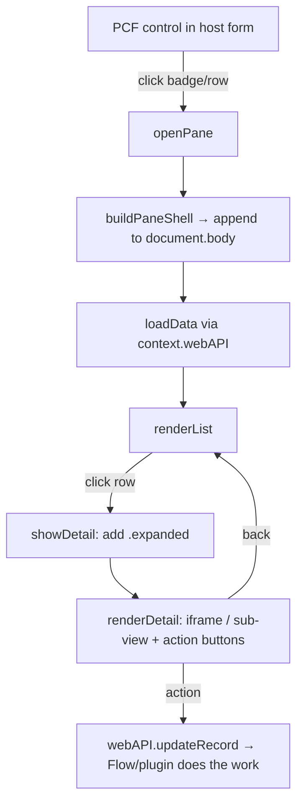

# PCF Side‑Pane Playbook · מדריך יישום כללי

> A reusable recipe for building an **Apple‑style side pane (drawer)** inside a **PCF dataset control** on Dynamics 365 / Power Apps, with a master → detail preview, localized (bilingual) labels, and "act on the record" buttons gated by configuration.
>
> מדריך לשימוש חוזר לבניית **מגירה צדדית (side pane)** בתוך **רכיב PCF** ב‑Dynamics 365 / Power Apps: רשימה → פירוט, תוויות דו‑לשוניות, וכפתורי פעולה שנשלטים לפי הגדרות. הדוגמאות מבוססות על רכיב `PayPlus.CreditCardWallet`, אבל הדפוס גנרי.

---

## 1. When to use this pattern · מתי להשתמש

Use it whenever a control needs to show **secondary, contextual content** without navigating away from the host form:

- A card / row that opens a **list of related records** (receipts, activities, files…).
- A **master → detail** flow where selecting a row expands to an inline preview (PDF, image, sub‑record).
- **Quick actions** on a record (send, cancel, approve) that must respect per‑type configuration.

Why a self‑built drawer instead of `Xrm.Navigation.navigateTo` dialogs?

| Concern | Built‑in dialog | Self‑built drawer (this playbook) |
| --- | --- | --- |
| Z‑index / stacking | Can appear **behind** your control | You own the stack — always on top |
| Look & feel | Platform chrome | Fully themed (Apple‑style, RTL) |
| Master→detail | Separate dialogs | One surface that **expands** in place |
| Lifecycle control | Limited | Full (Esc, backdrop, cleanup) |

---

## 2. Architecture at a glance · ארכיטקטורה



**Key idea:** the drawer DOM is attached to `document.body`, **not** to the control's own container. The control container is small and may be clipped/scrolled by the host form; `document.body` gives you a full‑viewport, unclipped surface.

---

## 3. The 8 building blocks · אבני הבניין

### 3.1 A dataset PCF control skeleton

```ts
export class MyControl implements ComponentFramework.StandardControl<IInputs, IOutputs> {
    private context!: ComponentFramework.Context<IInputs>;
    private container!: HTMLDivElement;
    private isRtl = false;

    public init(context, notifyOutputChanged, state, container) {
        this.context = context;
        this.container = container;
        this.isRtl = context.userSettings.languageId === 1037; // Hebrew
        this.container.dir = this.isRtl ? "rtl" : "ltr";
    }
    public updateView(context) { this.context = context; /* re-render list from dataset */ }
    public getOutputs() { return {}; }
    public destroy() { /* CRITICAL — see §3.8 */ }
}
```

### 3.2 Open the pane — append to `document.body`

```ts
private paneRoot: HTMLElement | null = null;

private openPane(ctx: MyRow): void {
    this.paneView = "list";
    this.paneDetail = null;
    this.buildPaneShell(ctx);
    void this.loadData(ctx);
}

private buildPaneShell(ctx: MyRow): void {
    this.closePane();                       // never stack two panes
    const root = document.createElement("div");
    root.className = "xx-pane-root";
    root.dir = this.isRtl ? "rtl" : "ltr";
    root.innerHTML =
        '<div class="xx-backdrop"></div>' +
        '<aside class="xx-drawer" role="dialog" aria-modal="true">' +
            '<header class="xx-head">…title / chip…</header>' +
            '<div class="xx-body"></div>' +
        '</aside>';
    document.body.appendChild(root);
    this.paneRoot = root;
    this.paneBodyEl = root.querySelector(".xx-body");

    root.querySelector(".xx-backdrop")?.addEventListener("click", () => this.closePane());
    this.paneKeyHandler = (e: KeyboardEvent) => {
        if (e.key !== "Escape") return;
        if (this.paneView === "detail") this.showList(); else this.closePane();
    };
    document.addEventListener("keydown", this.paneKeyHandler);

    requestAnimationFrame(() => root.classList.add("xx-open")); // trigger slide-in
}
```

### 3.3 Load related data — the **two‑step webAPI query**

Dataverse `$expand` across N:N or polymorphic links is limited. A robust, portable pattern is **two queries**: first collect the foreign keys, then fetch the targets by `or`‑ing their ids.

```ts
private async loadData(ctx: MyRow): Promise<void> {
    // Step 1 — link table: get target GUIDs for this context record.
    const links = await this.context.webAPI.retrieveMultipleRecords(
        "alex_paypluspaymentline",
        `?$select=_alex_receiptdocumentid_value` +
        `&$filter=_alex_creditcardid_value eq ${ctx.id} and _alex_receiptdocumentid_value ne null`
    );
    const ids = Array.from(new Set(
        links.entities.map(e => e["_alex_receiptdocumentid_value"] as string).filter(Boolean)
    ));
    if (!ids.length) { this.renderEmpty(); return; }

    // Step 2 — target table: fetch documents by OR-ing the ids (chunk if > ~15).
    const filter = ids.map(id => `alex_payplusdocumentid eq ${id}`).join(" or ");
    const docs = await this.context.webAPI.retrieveMultipleRecords(
        "alex_payplusdocument", `?$select=…&$filter=(${filter})`
    );
    this.rows = docs.entities.map(e => this.parseRow(e));
    this.renderList();
}
```

> **Tip:** For lookups, `$select` the `_field_value` form and read `e["_field_value"]`. Chunk the OR filter into batches of ~15 ids to stay within URL length limits.

### 3.4 Master → detail: expand the same drawer

Instead of opening a second dialog, **widen the drawer** and swap the body. One surface, smooth transition.

```ts
private showDetail(d: MyDoc): void {
    this.paneView = "detail";
    this.paneDetail = d;
    this.paneRoot?.querySelector(".xx-drawer")?.classList.add("xx-expanded");
    this.renderDetail(d);
}
private showList(): void {
    this.paneView = "list";
    this.paneDetail = null;
    this.paneRoot?.querySelector(".xx-drawer")?.classList.remove("xx-expanded");
    this.renderList();
}
```

```css
.xx-drawer            { width: min(440px, 92vw); transition: transform .32s, width .4s cubic-bezier(.32,.72,0,1); }
.xx-drawer.xx-expanded{ width: min(1120px, 96vw); }
```

### 3.5 Inline preview via `<iframe>` + the X‑Frame‑Options escape hatch

```ts
const raw = d.pdfUrl || d.docUrl;
const url = /^https?:\/\//i.test(raw) ? raw : "";     // guard: block javascript:/data:
body.innerHTML = url
    ? `<div class="xx-frame-wrap"><iframe class="xx-frame" src="${esc(url)}"></iframe></div>`
    : `<div class="xx-empty">No preview</div>`;
```

> **Gotcha:** some servers return `X-Frame-Options: DENY` / `Content-Security-Policy: frame-ancestors` and the iframe renders blank. **Always** provide an **"Open in a new tab"** button (`context.navigation.openUrl(url)`) as the safety net.

### 3.6 Localization: bilingual RESX + the **cache‑bust gotcha**

Keep **one key per string** with a value per language file — do not concatenate two languages into one value.

```
strings/MyControl.1033.resx   → <data name="paneBack"><value>Back to list</value></data>
strings/MyControl.1037.resx   → <data name="paneBack"><value>חזרה לרשימה</value></data>
```

```ts
private s(key: string): string { return this.context.resources.getString(key) || key; }
```

Because `getString` falls back to the **literal key** when a string is missing, a **new** key can render as its own name (e.g. the button literally shows `paneBack`). This is almost always a **cache** issue, not a code bug:

> ⚠️ **Every time you add or change a RESX string, bump the `version` attribute of the `<resx>` entry in `ControlManifest.Input.xml`.** The platform caches string bundles by that version; without a bump the browser keeps the old bundle and new keys fall through to their literal names.

```xml
<resources>
  <code path="index.ts" order="1" />
  <resx path="strings/MyControl.1033.resx" version="1.0.1" />  <!-- bump on every string change -->
  <resx path="strings/MyControl.1037.resx" version="1.0.1" />
</resources>
```

After deploy, a hard refresh (**Ctrl+Shift+R**) clears the client bundle cache.

### 3.7 Config‑gated actions: "do X, only if allowed"

Read a configuration table to decide **which** action buttons to show, then perform the action by **updating the record** — let a Flow/plugin do the real work (send email, cancel in an external system, etc.). This keeps the control thin and the side‑effects server‑side.

```ts
// 1) Resolve which channels/actions are allowed for this record type.
private async loadSendConfig(typeCode: string): Promise<SendConfig> {
    const prefix = this.billingPrefixFor(typeCode);           // type → config field prefix
    const res = await this.context.webAPI.retrieveMultipleRecords(
        "alex_payplusconfiguration",
        `?$select=${prefix}enabled,${prefix}send_email_allowed,${prefix}send_sms_allowed&$top=1`
    );
    const c = res.entities[0] || {};
    const on = c[`${prefix}enabled`] === true;
    return { email: on && c[`${prefix}send_email_allowed`] === true, /* … */ };
}

// 2) Render only the allowed buttons (async — inject after config resolves).
// 3) On click, write the request; a Flow picks it up and performs the send.
private async requestSend(d: MyDoc, channel: SendChannel): Promise<void> {
    await this.context.webAPI.updateRecord("alex_payplusdocument", d.id, {
        alex_requestedaction: 100000000,                       // "send"
        alex_requestedchannel: CHANNEL[channel],
        alex_requestedactionstatus: 100000000,                 // "pending"
        alex_requestedactionon: new Date().toISOString(),
        alex_requestedactionmessage: JSON.stringify({ source: "pcf", channel })
    });
    await this.context.navigation.openAlertDialog({ text: this.s("sendDone") });
}
```

> **Async‑render guard:** after `await`, the user may have navigated away. Before injecting buttons, re‑check state: `if (this.paneView !== "detail" || this.paneDetail?.id !== d.id || !slot.isConnected) return;`

### 3.8 Lifecycle & cleanup — the part everyone forgets

Because the drawer lives on `document.body` (outside the control), the platform will **not** clean it up for you. You must:

```ts
private closePane(): void {
    this.paneRoot?.classList.remove("xx-open");
    if (this.paneKeyHandler) document.removeEventListener("keydown", this.paneKeyHandler);
    const root = this.paneRoot; this.paneRoot = null;
    // reset view state so the next open starts on the list
    this.paneView = "list"; this.paneDetail = null;
    setTimeout(() => root?.remove(), 280);   // let the slide-out animation finish
}

public destroy(): void {
    if (this.outsideHandler) document.removeEventListener("click", this.outsideHandler);
    if (this.paneKeyHandler) document.removeEventListener("keydown", this.paneKeyHandler);
    this.paneRoot?.remove();                 // never leak a body-level node
}
```

Leaking the body node or a global `keydown` listener causes ghost drawers and double‑handled Esc after the form re‑renders. Always mirror every `addEventListener` / `appendChild(document.body, …)` with a removal.

---

## 4. Build & deploy pipeline · צנרת בנייה ופריסה

```powershell
# 1) Build the control (ALWAYS delete out/ first, and bump versions — see checklist)
cd .\pcf_wallet
if (Test-Path out) { Remove-Item -Recurse -Force out }
npm run build

# 2) Pack the MANAGED solution
cd ..\pcf_wallet_solution
dotnet build -c Release      # → bin\Release\pcf_wallet_solution.zip

# 3) Import & publish
pac solution import --path .\bin\Release\pcf_wallet_solution.zip --publish-changes --force-overwrite
```

### Pre‑deploy checklist · צ׳קליסט לפני פריסה

- [ ] Deleted `out/` before `npm run build` (stale bundles cause "my change didn't ship").
- [ ] Bumped **control `version`** in `ControlManifest.Input.xml` (e.g. `1.0.5` → `1.0.6`).
- [ ] Bumped each `<resx version>` **if any string changed** (the cache‑bust gotcha, §3.6).
- [ ] `get_errors` / `npm run build` is clean (ESLint + TS).
- [ ] After import, told the user to **Ctrl+Shift+R**.

---

## 5. Reusability checklist · להעביר לפרויקט אחר

To lift this pattern into a new control, change only:

1. **Entities & fields** in the two‑step query (§3.3) and `parseRow`.
2. **`billingPrefixFor` / config table** in the gate (§3.7) — or drop the gate if actions are unconditional.
3. **The detail renderer** (§3.5) — iframe, image, or a sub‑form of fields.
4. **RESX keys** (§3.6) — keep them per‑language, remember the version bump.

Everything else — shell, backdrop, Esc/keydown, expand transition, cleanup — is boilerplate you can copy verbatim. Prefix all drawer classes (`xx-*`) to avoid clashing with the host form's CSS.

---

## 6. Common pitfalls · מלכודות נפוצות

| Symptom | Cause | Fix |
| --- | --- | --- |
| New label shows as its key name (`paneBack`) | RESX bundle cached | Bump `<resx version>`; Ctrl+Shift+R (§3.6) |
| Drawer opens **behind** the form | Attached to control container, not body | Append to `document.body` (§3.2) |
| Iframe is blank | `X-Frame-Options` / CSP on the target | "Open in new tab" fallback (§3.5) |
| Ghost drawer after form reload | Body node / listener not removed | Cleanup in `closePane` + `destroy` (§3.8) |
| Buttons flash then wrong record | Async render raced navigation | Re‑check state after `await` (§3.7) |
| "My code change didn't deploy" | Stale `out/` or unbumped version | Delete `out/`, bump versions (§4) |

---

*Reference implementation: `pcf_wallet/CreditCardWallet` (namespace `PayPlus`, control `CreditCardWallet`). See its `README.md` for control‑specific details.*
