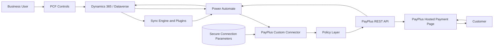
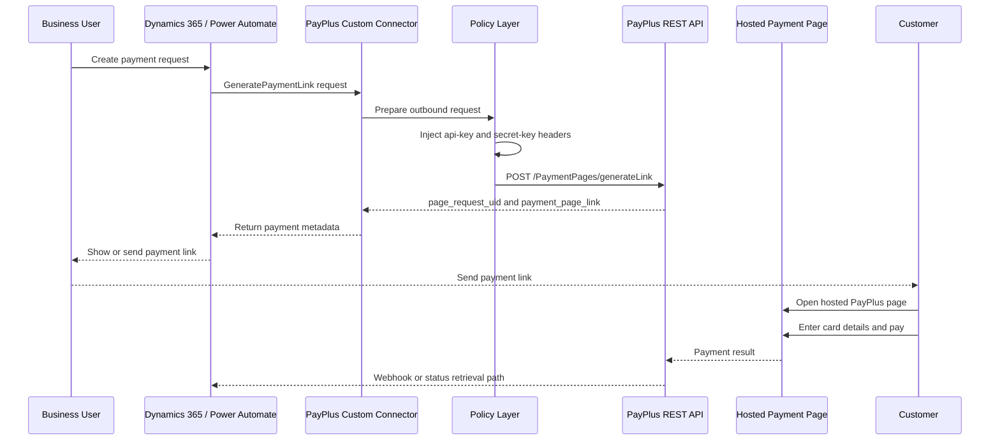
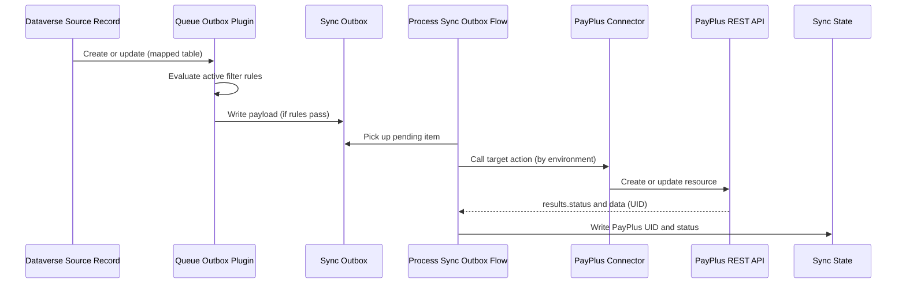
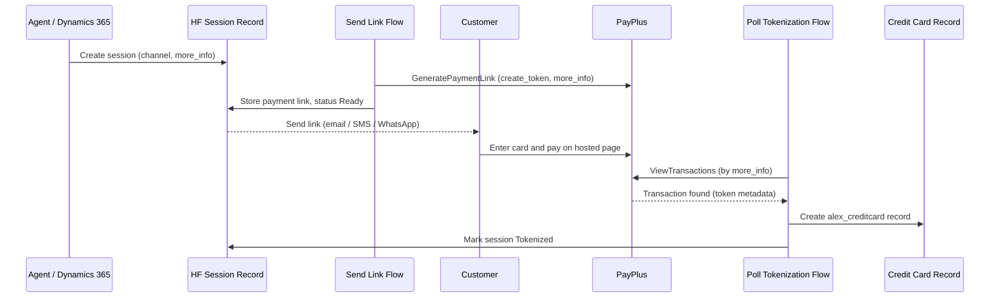

# Architecture

## Solution Overview

The solution integrates Microsoft Power Platform and Dynamics 365 with PayPlus by using a Power Platform Custom Connector. The connector exposes controlled PayPlus operations to Power Automate and Dynamics 365 processes.

The primary pattern is hosted payment page generation. Power Platform creates a request, PayPlus returns a hosted payment link, and the customer enters card details only on the PayPlus hosted page.

The solution does not process cards inside Power Platform. It redirects the customer to a PayPlus hosted payment page.

## Solution Capabilities

The solution is built on five capability pillars. The custom connector is the foundation; the other pillars build on it inside Dynamics 365 and Dataverse.

| Pillar | Purpose |
| --- | --- |
| Connector and hosted payment | Typed PayPlus API wrapper, secure credential handling, and hosted payment link generation. |
| Continuous sync engine | Configuration-driven, outbox-based synchronization of Dataverse records (customers, products, categories) to PayPlus, with field mapping, transforms, filters, and value maps. |
| PCF controls | Five Power Apps Component Framework controls: Mapping Studio (visual field mapping and sync activation), Credit Card Wallet and Bank Account Wallet (tokenized card and bank-account wallets), Payment Wizard (guided in-context payment capture), and Document Ledger / Document Preview (Invoice+ document ledger and preview). |
| In-context payment capture and Invoice+ documents | Guided Payment Wizard and one-click payment ribbons on quotes, sales orders, and invoices; hosted payment-preview flows; PayPlus Invoice+ document generation, ledger, and preview; and bank/branch and document-type reference imports. |
| Card tokenization and self-service | Hosted-fields tokenization, self-service card collection over email, SMS, and WhatsApp, and outbound polling-based tokenization detection. |

The connector layer is environment-agnostic and can be reused on its own. The remaining pillars are implemented as Dataverse tables, plugins, custom APIs, flows, and PCF controls inside the Dynamics 365 solution.

## Components

| Component | Responsibility |
| --- | --- |
| Dynamics 365 / Dataverse | Business record system, optional payment request and transaction storage, status write-back |
| Power Automate | Orchestration, validation flows, payment link creation, reconciliation processes |
| Power Platform Custom Connector | Typed PayPlus API wrapper, connection parameters, policies, action definitions |
| Connection Parameters | Secure storage of PayPlus `api-key` and `secret-key` at connection level |
| Policy Layer | Runtime injection of PayPlus authentication headers |
| PayPlus REST API | Payment page generation, terminals, payment pages, customer, transaction, token, and product operations |
| Hosted Payment Page | Cardholder-facing payment page owned by PayPlus |
| Customer | Receives link and pays on PayPlus |
| Sync Engine (Dataverse) | Sync profiles, entity and field mappings, transform and filter rules, outbox, sync state, and logs |
| Sync Plugins and Custom APIs | Queue outbox on source change, reconcile plugin steps, seed transform rules |
| PCF Controls | Mapping Studio (field mapping), Credit Card Wallet and Bank Account Wallet (tokenized card and bank-account wallets), Payment Wizard (guided payment capture), Document Ledger and Document Preview (Invoice+ documents) |
| Tokenized Card Store | `alex_creditcard` records holding non-sensitive card metadata and PayPlus tokens |

## Power Platform Custom Connector

The connector is defined as a no-auth connector from the Power Platform perspective. PayPlus still requires `api-key` and `secret-key` headers, but these are not modeled as per-action inputs and are not exposed to flow makers.

Instead, the connector uses secure connection parameters and policies:

- `apiKey`: `securestring` connection parameter.
- `secretKey`: `securestring` connection parameter.
- `setheader` policy for `api-key`.
- `setheader` policy for `secret-key`.

This keeps credentials at the connection boundary and avoids placing them in every action schema.

## Power Automate

Power Automate flows can call connector actions such as:

- `GeneratePaymentLink`
- `MyTerminals`
- `ListPaymentPages`
- `CreateCustomer`
- `ViewCustomers`
- `ViewTransactions`
- `RefundByTransaction`
- `ChargeSavedCard` when a saved PayPlus token is available and approved for use

A dedicated setup flow, `PayPlus - Import Terminals & Pages`, reads the PayPlus terminals (`MyTerminals`) and their payment pages (`ListPaymentPages`) through the connector and upserts rows into the `alex_payplus_terminal` and `alex_payplus_paymentpage` tables, keyed by environment + UID. New records get `alex_isdefault = false` initially. It runs during setup (Terminals & pages step) and can be re-run to refresh the catalog.

Additional setup and process flows extend the solution: `PayPlus - Import Banks & Branches` and `PayPlus - Import Document Types` populate reference tables; `PayPlus - Document Action Request` handles Invoice+ document send, resend, and cancel actions; and quote, sales order, and invoice payment-preview flows generate a hosted PayPlus payment link in context from the record's command bar.

Flows should enable secure inputs and secure outputs for any action that might carry sensitive values such as tokens or customer identifiers.

## Dynamics 365 / Dataverse

Dataverse is optional but recommended for implementations that need status tracking, reconciliation, auditing, or support workflows.

Recommended Dataverse usage:

- Store payment request metadata.
- Store PayPlus payment request UID and payment link.
- Store PayPlus transaction UID and business status.
- Store non-sensitive card metadata only, such as last four digits if returned and approved for storage.
- Store failure reason, correlation ID, and retry status.

Do not store PAN or CVV.

## PayPlus REST API

Known environments:

| Environment | Host | Base path |
| --- | --- | --- |
| Sandbox | `restapidev.payplus.co.il` | `/api/v1.0` |
| Production | `restapi.payplus.co.il` | `/api/v1.0` |

Known PayPlus behavior from the POC:

- `POST /PaymentPages/generateLink` returns a payment page link when a complete request is sent.
- `GET /MyTerminals` returns terminal UUID values used as `terminal_uid`.
- `GET /PaymentPages/list?terminal_uid={uuid}` returns payment page records for a terminal.
- Unknown or incomplete endpoints may return 403 or connector-wrapped errors.

## Connection Parameters

Connection parameters are created in `apiProperties.json`:

| Parameter | Type | Purpose |
| --- | --- | --- |
| `apiKey` | `securestring` | PayPlus API key |
| `secretKey` | `securestring` | PayPlus secret key |

They are entered once when creating the Power Platform connection. They are not supplied per flow action.

## Policies

The connector uses request policies:

- `setheader` `api-key` = `@connectionParameters('apiKey')`
- `setheader` `secret-key` = `@connectionParameters('secretKey')`

The POC verified that `@connectionParameters('secretParam')` resolves at runtime when injected into headers by a `setheader` policy.

## Hosted Payment Page

The hosted payment page is the core security boundary. Customers enter card details only on PayPlus infrastructure. Dynamics 365 and Power Platform receive operational metadata such as link, request UID, transaction UID, and status.

## Discovery Actions

Discovery actions support setup and designer usability:

- `MyTerminals`: retrieves terminals and returns UUIDs used as `terminal_uid`.
- `ListPaymentPages`: retrieves payment pages for a selected terminal.

During setup these actions are used by the `PayPlus - Import Terminals & Pages` flow to populate dedicated Dataverse tables (`alex_payplus_terminal` and `alex_payplus_paymentpage`) rather than only assisting designer dropdowns. The imported catalog supports default selection (`alex_isdefault`) and terminal-level and page-level policies.

Designer limitation found in POC:

- Dependent dropdowns using `x-ms-dynamic-values` can cause a 409 manifest error when the list source requires a parameter.
- A working approach was found by using `x-ms-dynamic-values` for the terminal dropdown and `x-ms-dynamic-list` for dependent payment page values.

## Setup And Installation

The setup wizard (`alex_payplus_setup.html`) drives a four-step installation:

1. **Connect** — enter and validate the PayPlus connection.
2. **Terminals & pages** — fetch all terminals and their payment pages from PayPlus, preview them, and Import them. The import creates the `alex_payplus_terminal` and `alex_payplus_paymentpage` records.
3. **Validate** — pick the default terminal and its default payment page. This writes `alex_terminaluidref` / `alex_paymentpageuidref` on the configuration and marks `alex_isdefault = true` on the chosen terminal and page records. A quick connection smoke-test (a sample hosted payment link) runs, and then a mandatory, blocking import of document types runs — the installation cannot complete until document types are imported successfully.
4. **Done** — management center, including an on-demand per-page connection test.

Two plugins keep the defaults consistent:

- `EnforceSingleDefaultTerminal` — one default terminal per environment.
- `EnforceSingleDefaultPage` — one default page per terminal + process type.

## Continuous Sync Engine

The sync engine keeps selected Dataverse records aligned with PayPlus without custom code per table. It is configuration-driven and uses a reliable outbox pattern.

### Configuration tables

| Table | Purpose |
| --- | --- |
| `alex_payplus_syncprofile` | Top-level sync package, one active profile per environment |
| `alex_payplus_entitymapping` | Maps one Dataverse source table to one PayPlus target (Customer, Product, Product Category, and more) |
| `alex_payplus_fieldmapping` | Field-level mapping including source type (direct, constant, formula, lookup, related, value map) |
| `alex_payplus_filterrule` | Optional per-mapping sync conditions evaluated with AND semantics |
| `alex_payplus_transformrule` | Reusable value transforms (for example, Dataverse state to boolean) |
| `alex_payplus_valuemapping` | Explicit source-to-target value maps |
| `alex_payplus_syncoutbox` | Pending outbound sync work items |
| `alex_payplus_syncstate` | Last known PayPlus UID and status per source record |
| `alex_payplus_synclog` | Audit trail of sync attempts and results |

### Runtime

- A plugin (`QueueSyncOutboxOnSourceChange`) runs on create or update of a mapped source table and, if the active filter rules pass, writes an outbox row with the built payload.
- A generic flow (`PayPlus - Process Sync Outbox`) picks up outbox rows, branches by environment to the correct connector (sandbox or production), calls the matching PayPlus action, validates the business envelope (`results.status == success`), and writes the returned UID and status back to sync state.
- Plugin steps are registered at configuration time by the `alex_ReconcilePayPlusSyncSteps` custom API, so no unknown customer-table steps are packaged with the solution.
- Transform rules are seeded idempotently by the `alex_SeedPayPlusTransformRules` custom API using stable rule codes, not GUIDs.

Environment note: `alex_payplus_syncprofile.alex_environment` uses Sandbox = `100000000` and Production = `100000001`. The process flow branches on this value to the matching connector.

## PCF Controls

Two Power Apps Component Framework controls provide a low-friction experience inside model-driven forms. Language follows the Dynamics user setting (Hebrew RTL or English LTR); there is no manual language toggle.

### Mapping Studio

A field-type control hosted on the sync profile form. An administrator chooses a Dynamics source table, chooses a PayPlus target, maps fields with search-driven pickers, sets per-field value types (direct, constant, formula, lookup, related, value map), defines sync conditions, and starts or stops continuous sync. It uses the model-driven form save and shows progress for background operations.

### Credit Card Wallet

A dataset control that renders tokenized cards for the current account or contact in an Apple-wallet style. It supports a 3D flip for card details, activate and deactivate actions, default-card handling, and shortcuts to trigger manual card capture or self-service card collection. It reads `alex_creditcard` records related to the parent record.

## Card Tokenization And Self-Service

Beyond one-time payment links, the solution can capture and store reusable PayPlus card tokens without ever handling raw card data.

- Hosted fields: an agent-side side pane embeds a PayPlus hosted-fields session (`hosted_fields_uuid`) so the customer enters card details on PayPlus and a token is returned.
- Self-service collection: agents can send a card-collection link over email, SMS, or WhatsApp. Each request creates a session row; a per-channel flow generates the PayPlus link and records it for delivery.
- Tokenization detection by polling: because inbound webhooks are not permitted in the target environment, a scheduled flow (`PayPlus - Poll Tokenization`) calls `ViewTransactions`, correlates by `more_info` (the session request id), and, on success, creates an `alex_creditcard` record and marks the session tokenized.
- Expiry: a daily flow marks pending sessions as expired after their validity window.

Tokens are treated as sensitive. Flows that carry tokens should use secure inputs and secure outputs, and no PAN or CVV is stored at any stage.

## Document Generation (Invoice+)

The connector also exposes PayPlus Invoice+ / Books document operations, so flows can create and retrieve tax documents. Supported document types include tax invoice receipt, tax invoice, receipt, quote, proforma invoice, payment request, credit document, delivery and return certificates, donation receipt, and purchase certificates. Read operations cover get by UID, by unique identifier, by number, list, and get by transaction UID.

## Dev And Prod

The solution keeps separate connector definitions and properties for sandbox and production. This prevents accidental calls to production during development and keeps credentials separated.

Expected promotion path:

1. Develop in a Power Platform development environment.
2. Validate in PayPlus sandbox.
3. Import managed solution to test.
4. Create environment-specific connector connections.
5. Run security and compliance approval.
6. Promote to production and bind production connection references.

## Responsibility Boundaries

| Area | Power Platform Responsibility | PayPlus Responsibility |
| --- | --- | --- |
| Payment request creation | Build request, call connector, store metadata | Validate request, create hosted page |
| Card data capture | Not handled | Hosted payment page captures card details |
| Credential storage | Secure connection parameters | Merchant API credential issuance |
| Payment processing | Not processed inside Power Platform | Authorization, charge, tokenization, refund |
| Status tracking | Store and reconcile approved metadata | Return payment and transaction status |
| PCI controls | Minimize scope, govern run history and logs | Own hosted card entry and payment processing controls |

## Architecture Diagram

## Generate Payment Link Sequence

## Continuous Sync Sequence

## Card Tokenization (Polling) Sequence

