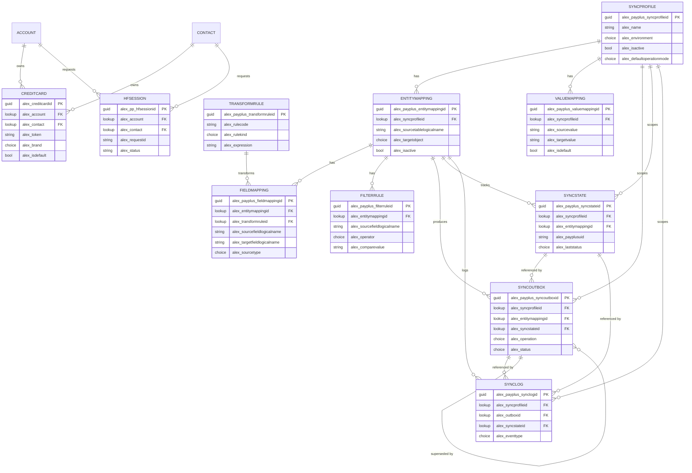

# Data Model

This document describes the Dataverse data model that supports the PayPlus solution. The tables, columns, choices, and relationships below are taken from the live Dynamics 365 environment. All tables use the `alex_` publisher prefix.

For the runtime behaviour that consumes this model, see [architecture.md](architecture.md).

## Table Catalog

| Group | Logical name | Display name | Purpose |
| --- | --- | --- | --- |
| Configuration | `alex_payplusconfiguration` | PayPlus Configuration | Connector environment, setup wizard state, discovered terminal and payment pages, self-service channel toggles, and validation status. |
| Configuration | `alex_payplus_syncprofile` | PayPlus Sync Profile | Root of a sync package. One active profile per environment; holds defaults and drives connector routing. |
| Sync mapping | `alex_payplus_entitymapping` | PayPlus Entity Mapping | Maps one Dataverse source table to one PayPlus target object. |
| Sync mapping | `alex_payplus_fieldmapping` | PayPlus Field Mapping | Field-level mapping between a source field and a PayPlus field. |
| Sync mapping | `alex_payplus_filterrule` | PayPlus Filter Rule | Optional sync conditions per entity mapping (AND semantics). |
| Sync mapping | `alex_payplus_transformrule` | PayPlus Transform Rule | Reusable value transforms referenced by field mappings. |
| Sync mapping | `alex_payplus_valuemapping` | PayPlus Value Mapping | Explicit source-to-target value maps. |
| Sync runtime | `alex_payplus_syncoutbox` | PayPlus Sync Outbox | Pending outbound sync work items (outbox pattern). |
| Sync runtime | `alex_payplus_syncstate` | PayPlus Sync State | Last known PayPlus UID and status per source record. |
| Sync runtime | `alex_payplus_synclog` | PayPlus Sync Log | Audit trail of sync attempts and results. |
| Tokenization | `alex_creditcard` | Credit Card | Tokenized card metadata and PayPlus token for an account or contact. |
| Tokenization | `alex_pp_hfsession` | Card Collection Session | Hosted-fields / self-service card capture session. |

## Entity Relationship Diagram

## Relationship Summary

| Child table | Foreign key column | Parent table |
| --- | --- | --- |
| `alex_payplus_entitymapping` | `alex_syncprofileid` | `alex_payplus_syncprofile` |
| `alex_payplus_valuemapping` | `alex_syncprofileid` | `alex_payplus_syncprofile` |
| `alex_payplus_fieldmapping` | `alex_entitymappingid` | `alex_payplus_entitymapping` |
| `alex_payplus_fieldmapping` | `alex_transformruleid` | `alex_payplus_transformrule` |
| `alex_payplus_filterrule` | `alex_entitymappingid` | `alex_payplus_entitymapping` |
| `alex_payplus_syncoutbox` | `alex_syncprofileid` | `alex_payplus_syncprofile` |
| `alex_payplus_syncoutbox` | `alex_entitymappingid` | `alex_payplus_entitymapping` |
| `alex_payplus_syncoutbox` | `alex_syncstateid` | `alex_payplus_syncstate` |
| `alex_payplus_syncoutbox` | `alex_supersededbyid` | `alex_payplus_syncoutbox` (self) |
| `alex_payplus_syncstate` | `alex_syncprofileid` | `alex_payplus_syncprofile` |
| `alex_payplus_syncstate` | `alex_entitymappingid` | `alex_payplus_entitymapping` |
| `alex_payplus_synclog` | `alex_syncprofileid` | `alex_payplus_syncprofile` |
| `alex_payplus_synclog` | `alex_outboxid` | `alex_payplus_syncoutbox` |
| `alex_payplus_synclog` | `alex_syncstateid` | `alex_payplus_syncstate` |
| `alex_payplus_synclog` | `alex_entitymappingid` | `alex_payplus_entitymapping` |
| `alex_creditcard` | `alex_account` | `account` |
| `alex_creditcard` | `alex_contact` | `contact` |
| `alex_pp_hfsession` | `alex_account` | `account` |
| `alex_pp_hfsession` | `alex_contact` | `contact` |

## Table Details

### PayPlus Configuration (`alex_payplusconfiguration`)

Single configuration record for the connector and self-service behaviour.

| Column | Type | Explanation |
| --- | --- | --- |
| `alex_name` | Text | Configuration name. |
| `alex_environment` | Choice | PayPlus environment (Sandbox / Production). |
| `alex_setupstage` | Choice | Setup wizard stage (Connect, Pages, Validate, Done). |
| `alex_setupcompleted` | Yes/No | Setup finished. |
| `alex_configvalidated` | Yes/No | Configuration validated. |
| `alex_terminaluidref` | Text | Selected PayPlus terminal UID. |
| `alex_paymentpageuidref` | Text | Selected payment page UID. |
| `alex_paymentpages` | Multiline (JSON) | Cached list of payment pages. |
| `alex_lastvalidationstatus` | Choice | Last validation status. |
| `alex_lastvalidationcode` | Whole number | Last validation result/HTTP code. |
| `alex_lastvalidationmessage` | Text | Last validation message. |
| `alex_lastvalidatedon` | Date/time | Last validated on. |
| `alex_validationrequestid` | Text | Validation request id. |
| `alex_selfservice_{email\|sms\|whatsapp}_{account\|contact}` | Yes/No | Enables self-service card collection per channel and parent type. |
| `alex_selfservice_{email\|sms\|whatsapp}_{account\|contact}_expiry` | Whole number | Link validity window in days for each channel and parent type. |

### PayPlus Sync Profile (`alex_payplus_syncprofile`)

Root of a sync package. One active profile per environment.

| Column | Type | Explanation |
| --- | --- | --- |
| `alex_name` | Text | Profile name. |
| `alex_environment` | Choice | Sandbox / Production. Drives connector routing in the process flow. |
| `alex_isactive` | Yes/No | Active profile. |
| `alex_defaultoperationmode` | Choice | Create only / Update only / Create and update. |
| `alex_defaultcurrencycode` | Text | Default currency code. |
| `alex_defaultlanguagecode` | Text | Default language code. |
| `alex_defaultretrycount` | Whole number | Default retry count. |
| `alex_retryintervalminutes` | Whole number | Retry interval in minutes. |
| `alex_failonmissingrequiredfield` | Yes/No | Fail when a required field is missing. |
| `alex_mappingstudiohost` | Text | Mapping Studio host URL. |

### PayPlus Entity Mapping (`alex_payplus_entitymapping`)

Maps one Dataverse source table to one PayPlus target object.

| Column | Type | Explanation |
| --- | --- | --- |
| `alex_name` | Text | Mapping name. |
| `alex_syncprofileid` | Lookup → Sync Profile | Parent sync profile. |
| `alex_sourcetablelogicalname` | Text | Dataverse source table logical name. |
| `alex_sourcetabledisplayname` | Text | Source table display name. |
| `alex_targetobject` | Choice | PayPlus target object (Customer, Product, Category, and more). |
| `alex_allowcreate` | Yes/No | Allow create in PayPlus. |
| `alex_allowupdate` | Yes/No | Allow update in PayPlus. |
| `alex_changehandlingmode` | Choice | Current state or stored payload. |
| `alex_coalesceupdates` | Yes/No | Collapse multiple pending updates. |
| `alex_missinguidpolicy` | Choice | Behaviour when the target UID is missing. |
| `alex_pluginstepstatus` | Choice | Registration status of the source-change plugin step. |
| `alex_isactive` | Yes/No | Active mapping. |

### PayPlus Field Mapping (`alex_payplus_fieldmapping`)

Field-level mapping between a source field and a PayPlus field.

| Column | Type | Explanation |
| --- | --- | --- |
| `alex_name` | Text | Field mapping name. |
| `alex_entitymappingid` | Lookup → Entity Mapping | Parent entity mapping. |
| `alex_sourcefieldlogicalname` | Text | Source field logical name. |
| `alex_sourcefielddisplayname` | Text | Source field display name. |
| `alex_targetfieldlogicalname` | Text | PayPlus target field name. |
| `alex_targetfielddisplayname` | Text | Target field display name. |
| `alex_sourcetype` | Choice | Source field, Constant, Formula, Lookup, Related record, Value mapping. |
| `alex_dataversetype` | Choice | Dataverse data type. |
| `alex_payplusdatatype` | Choice | PayPlus data type. |
| `alex_defaultvalue` | Text | Default value when source is empty. |
| `alex_nullhandling` | Choice | How to handle null values. |
| `alex_requiredforpayload` | Yes/No | Field is required in the payload. |
| `alex_transformruleid` | Lookup → Transform Rule | Optional transform applied to the value. |
| `alex_sortorder` | Whole number | Order in the payload. |
| `alex_isactive` | Yes/No | Active mapping. |

### PayPlus Filter Rule (`alex_payplus_filterrule`)

Optional sync conditions per entity mapping. Rules are evaluated with AND semantics.

| Column | Type | Explanation |
| --- | --- | --- |
| `alex_name` | Text | Rule name. |
| `alex_entitymappingid` | Lookup → Entity Mapping | Parent entity mapping. |
| `alex_sourcefieldlogicalname` | Text | Source field evaluated. |
| `alex_operator` | Choice | Equals, Not equals, Contains, Greater than, Less than, Empty, Not empty. |
| `alex_comparevalue` | Text | Value to compare against. |
| `alex_logicalgroup` | Text | Optional grouping label. |
| `alex_description` | Multiline | Rule description. |
| `alex_isactive` | Yes/No | Active rule. |

### PayPlus Transform Rule (`alex_payplus_transformrule`)

Reusable value transforms referenced by field mappings. Seeded idempotently by stable rule code.

| Column | Type | Explanation |
| --- | --- | --- |
| `alex_name` | Text | Rule name. |
| `alex_rulecode` | Text | Stable code used for idempotent seeding. |
| `alex_rulekind` | Choice | Transform kind (trim, lower, upper, phone normalize, and more). |
| `alex_outputtype` | Choice | Output data type. |
| `alex_expression` | Multiline | Transform expression. |
| `alex_parametersjson` | Multiline | Parameters as JSON. |
| `alex_description` | Multiline | Rule description. |
| `alex_isactive` | Yes/No | Active rule. |

### PayPlus Value Mapping (`alex_payplus_valuemapping`)

Explicit source-to-target value maps.

| Column | Type | Explanation |
| --- | --- | --- |
| `alex_name` | Text | Value mapping name. |
| `alex_syncprofileid` | Lookup → Sync Profile | Parent sync profile. |
| `alex_mappinggroup` | Text | Group name used to select the map. |
| `alex_sourcevalue` | Text | Source value. |
| `alex_targetvalue` | Text | Target value. |
| `alex_targetuid` | Text | Target UID when the map points to a PayPlus resource. |
| `alex_isdefault` | Yes/No | Default value for the group. |
| `alex_description` | Multiline | Description. |
| `alex_isactive` | Yes/No | Active mapping. |

### PayPlus Sync Outbox (`alex_payplus_syncoutbox`)

Pending outbound sync work items. Written by the source-change plugin and processed by the outbox flow.

| Column | Type | Explanation |
| --- | --- | --- |
| `alex_name` | Text | Work item name. |
| `alex_syncprofileid` | Lookup → Sync Profile | Owning profile. |
| `alex_entitymappingid` | Lookup → Entity Mapping | Owning mapping. |
| `alex_syncstateid` | Lookup → Sync State | Related sync state. |
| `alex_supersededbyid` | Lookup → Sync Outbox (self) | Newer item that replaces this one. |
| `alex_sourcetablelogicalname` | Text | Source table. |
| `alex_sourcerowid` | Text | Source record id. |
| `alex_sourceversionnumber` | Text | Source row version. |
| `alex_sourcemodifiedon` | Date/time | Source modified timestamp. |
| `alex_targetobject` | Choice | PayPlus target object. |
| `alex_operation` | Choice | Create, Update, Deactivate, Delete. |
| `alex_status` | Choice | Pending, Processing, Succeeded, Failed, Retry scheduled, Superseded, Skipped. |
| `alex_correlationkey` | Text | Correlation key. |
| `alex_payloadsnapshot` | Multiline | Built request payload snapshot. |
| `alex_responsesnapshot` | Multiline | Response snapshot. |
| `alex_attemptcount` | Whole number | Attempts so far. |
| `alex_maxattempts` | Whole number | Maximum attempts. |
| `alex_nextretryon` | Date/time | Next retry time. |
| `alex_lockeduntil` | Date/time | Processing lock expiry. |
| `alex_processingstartedon` | Date/time | Processing start time. |
| `alex_processedon` | Date/time | Processing completion time. |
| `alex_lastdetectedon` | Date/time | Last time the change was detected. |
| `alex_lasterror` | Multiline | Last error text. |

### PayPlus Sync State (`alex_payplus_syncstate`)

Last known PayPlus UID and status per source record. This is the correlation anchor between Dataverse and PayPlus.

| Column | Type | Explanation |
| --- | --- | --- |
| `alex_name` | Text | State name. |
| `alex_syncprofileid` | Lookup → Sync Profile | Owning profile. |
| `alex_entitymappingid` | Lookup → Entity Mapping | Owning mapping. |
| `alex_sourcetablelogicalname` | Text | Source table. |
| `alex_sourcerowid` | Text | Source record id. |
| `alex_correlationkey` | Text | Correlation key. |
| `alex_payplusuid` | Text | PayPlus UID of the synced resource. |
| `alex_payplusexternalnumber` | Text | PayPlus external number, when applicable. |
| `alex_lastoperation` | Choice | Last operation performed. |
| `alex_laststatus` | Choice | Last sync status. |
| `alex_lastsourceversionnumber` | Text | Last processed source version. |
| `alex_lastpayloadhash` | Text | Hash of the last payload (change detection). |
| `alex_lastsyncedon` | Date/time | Last successful sync time. |
| `alex_isactive` | Yes/No | Active state. |

### PayPlus Sync Log (`alex_payplus_synclog`)

Audit trail of sync attempts and results.

| Column | Type | Explanation |
| --- | --- | --- |
| `alex_name` | Text | Log entry name. |
| `alex_syncprofileid` | Lookup → Sync Profile | Owning profile. |
| `alex_outboxid` | Lookup → Sync Outbox | Related work item. |
| `alex_syncstateid` | Lookup → Sync State | Related sync state. |
| `alex_entitymappingid` | Lookup → Entity Mapping | Owning mapping. |
| `alex_eventtype` | Choice | Request, Response, Error, Retry, Skip, Validation, Info. |
| `alex_status` | Choice | Result status. |
| `alex_attemptnumber` | Whole number | Attempt number. |
| `alex_httpstatuscode` | Whole number | HTTP status code. |
| `alex_durationms` | Whole number | Duration in milliseconds. |
| `alex_payplusresultcode` | Text | PayPlus result code. |
| `alex_requestpayload` | Multiline | Request payload. |
| `alex_responsepayload` | Multiline | Response payload. |
| `alex_message` | Multiline | Log message. |
| `alex_occurredon` | Date/time | Event timestamp. |

### Credit Card (`alex_creditcard`)

Tokenized card metadata for an account or contact. No PAN or CVV is stored.

| Column | Type | Explanation |
| --- | --- | --- |
| `alex_name` | Text | Card record name. |
| `alex_account` | Lookup → Account | Owning account. |
| `alex_contact` | Lookup → Contact | Owning contact. |
| `alex_token` | Text | PayPlus card token. |
| `alex_paypluscustomeruid` | Text | PayPlus customer UID. |
| `alex_brand` | Choice | Card brand (Visa, Mastercard, Isracard, and more). |
| `alex_last4` | Text | Last four digits. |
| `alex_expirymonth` | Text | Expiry month. |
| `alex_expiryyear` | Text | Expiry year. |
| `alex_cardholdername` | Text | Cardholder name. |
| `alex_channel` | Choice | Capture channel (Manual, Email, SMS, WhatsApp). |
| `alex_isdefault` | Yes/No | Default card for the parent. |
| `alex_isactive` | Yes/No | Active card. |

### Card Collection Session (`alex_pp_hfsession`)

Hosted-fields / self-service card capture session used by the tokenization polling flow.

| Column | Type | Explanation |
| --- | --- | --- |
| `alex_name` | Text | Session name. |
| `alex_account` | Lookup → Account | Owning account. |
| `alex_contact` | Lookup → Contact | Owning contact. |
| `alex_channel` | Choice | Distribution channel (Manual, Email, SMS, WhatsApp). |
| `alex_requestid` | Text | Correlation id sent to PayPlus as `more_info`. |
| `alex_hostedfieldsuid` | Text | Hosted-fields session UID. |
| `alex_pagerequestuid` | Text | PayPlus page request UID. |
| `alex_paymentpagelink` | Text | Generated payment page link. |
| `alex_status` | Text | Session status. |
| `alex_message` | Text | Status or error message. |
| `alex_expireson` | Date/time | Session expiry. |

## Choice Reference

### Environment (`alex_environment`)

| Value | Label |
| --- | --- |
| 100000000 | Sandbox |
| 100000001 | Production |

### Default operation mode (`alex_defaultoperationmode`)

| Value | Label |
| --- | --- |
| 100000000 | Create only |
| 100000001 | Update only |
| 100000002 | Create and update |

### Target object (`alex_targetobject`)

35 values covering PayPlus resources, including: Customer, Product, Category, Invoice, Quote, Transaction invoice, Order, Payment request, Purchase order, Customer bank account, Company bank account, Saved card token, Recurring payment, Recurring charge, Transaction, Transactions report, Payment page, Coupon group, Coupon, Cashier, Device, Deposit, SMS contact, SMS group, SMS message, OTP request, Invoice+ expense, Invoice+ document, Banks dictionary, Branches dictionary, Terminal, Currency, Alternative payment method, Error code, Card brand. Values run 100000000–100000034.

### Field mapping source type (`alex_sourcetype`)

| Value | Label |
| --- | --- |
| 100000000 | Source field |
| 100000001 | Constant |
| 100000002 | Formula |
| 100000003 | Lookup |
| 100000004 | Related record |
| 100000005 | Value mapping |

### Filter operator (`alex_operator`)

| Value | Label |
| --- | --- |
| 100000000 | Equals |
| 100000001 | Not equals |
| 100000002 | Contains |
| 100000003 | Greater than |
| 100000004 | Less than |
| 100000005 | Empty |
| 100000006 | Not empty |

### Transform kind (`alex_rulekind`)

| Value | Label |
| --- | --- |
| 100000000 | None |
| 100000001 | Trim whitespace |
| 100000002 | Lowercase |
| 100000003 | Uppercase |
| 100000004 | Phone normalize |
| 100000005 | GUID to text |
| 100000006 | Lookup value |
| 100000007 | Value mapping |
| 100000008 | Default value |
| 100000009 | Concatenate |
| 100000010 | Currency code |

### Outbox status (`alex_status`)

| Value | Label |
| --- | --- |
| 100000000 | Pending |
| 100000001 | Processing |
| 100000002 | Succeeded |
| 100000003 | Failed |
| 100000004 | Retry scheduled |
| 100000005 | Superseded |
| 100000006 | Skipped |

### Outbox operation (`alex_operation`)

| Value | Label |
| --- | --- |
| 100000000 | Create |
| 100000001 | Update |
| 100000002 | Deactivate |
| 100000003 | Delete |

### Sync log event type (`alex_eventtype`)

| Value | Label |
| --- | --- |
| 100000000 | Request |
| 100000001 | Response |
| 100000002 | Error |
| 100000003 | Retry |
| 100000004 | Skip |
| 100000005 | Validation |
| 100000006 | Info |

### Setup stage (`alex_setupstage`)

| Value | Label |
| --- | --- |
| 100000000 | Connect |
| 100000001 | Pages |
| 100000002 | Validate |
| 100000003 | Done |

### Card brand (`alex_brand`)

| Value | Label |
| --- | --- |
| 1 | Visa |
| 2 | Mastercard |
| 3 | Isracard |
| 4 | American Express |
| 5 | Diners |
| 6 | JCB |
| 7 | UnionPay |
| 8 | Maestro |
| 9 | Private / local |
| 10 | Other |
| 11 | Discover |

### Card / session channel (`alex_channel`)

| Value | Label |
| --- | --- |
| 100000000 | Manual |
| 100000001 | Email |
| 100000002 | SMS |
| 100000003 | WhatsApp |

## Notes

- Every table also carries the standard `statecode` (State) and `statuscode` (Status reason) columns.
- Lookup columns expose a shadow `...name` text column that mirrors the parent primary name; those helper columns are omitted above.
- No table stores PAN or CVV. Only tokens and non-sensitive card metadata are persisted.
