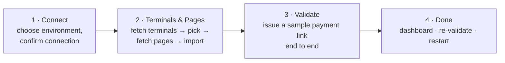

# Deployment and Administration Guide

> Hebrew version: [../he/deployment-and-administration.md](../he/deployment-and-administration.md)

This guide covers installing the PayPlus solution into a Power Platform environment, wiring the connections it needs, running the setup wizard, and the ongoing administration tasks. For the with/without-Sales decision and the two-solution model, see [integration-guide.md](integration-guide.md#the-two-solutions-and-their-dependencies).

## Prerequisites

- A Power Platform environment with **Dataverse** enabled.
- Permission to import solutions and create connections (System Administrator or System Customizer plus connector privileges).
- **PayPlus account credentials** — an `api-key` and `secret-key` for each environment you will use (sandbox and/or production). These are entered **once** in the connection dialog, never stored in a table or a document.
- If you will use the Sales-side placement: **Dynamics 365 Sales** in the same environment.

## Step 1 — Import the Solutions (in order)

The product ships as two managed solutions. **Order matters** because the extension depends on the base.

1. **Base — `alex_d365_payplus` ("PayPlus").** Import this first. It contains the custom connector, the PayPlus tables, the flows, the plugin assembly, and all PCF controls. It has **no dependency on Dynamics 365 Sales**.
2. **Sales extension — `alex_d365_payplus_sales_extended_data_model` ("PayPlus extended data model").** Import this **only if** the environment runs Dynamics 365 Sales. It adds columns, forms, views, and the document-preview / poll flows on the standard `quote`, `salesorder`, and `invoice` tables, and it depends on both the base and Sales.

> A customer **without** Dynamics 365 Sales imports **only the base** and stops here — the engine is complete on its own.

## Step 2 — Create the Connections

The flows run on three connections. Create each one in **Power Apps → Connections → New connection**, then bind the matching **connection reference** in the solution to it.

| Connection reference | Display name | What it is | Credentials |
| --- | --- | --- | --- |
| `alex_payplussandbox` | PayPlus – Sandbox Connection | The PayPlus custom connector against the sandbox host | Sandbox `api-key` + `secret-key` |
| `alex_payplusprod` | PayPlus – Prod Connection | The PayPlus custom connector against the production host | Production `api-key` + `secret-key` |
| `alex_payplus_dataverse` | PayPlus – Dataverse | The Dataverse connection the flows use to read/write PayPlus tables | A service or admin account |

Notes:

- You only need the connection(s) for the environment(s) you will use. A sandbox-only pilot needs only the sandbox connection.
- The API keys are entered in the connection creation dialog. The setup wizard and the tables never hold them.
- After binding the connection references, **turn on the flows** (they may install in a draft/off state).

## Step 3 — Run the Setup Wizard

Open the **PayPlus setup** page (the `alex_payplus_setup` web resource, surfaced from the app). It is a four-stage wizard that finishes onboarding end to end:

1. **Connect.** Choose the environment (sandbox or production) and confirm the connection reference is linked to a live PayPlus connection. If it is not, the wizard tells you to create the connection first.
2. **Terminals & Pages.** The wizard calls the *PayPlus – Fetch Options* flow to fetch your terminals, you pick a default terminal, it fetches that terminal's payment pages, and on **Confirm & Import** it imports the terminals and pages (and, in the background, the **banks & branches** and **document types**) into the PayPlus tables. The chosen terminal/page are marked as default (`alex_isdefault`).
3. **Validate.** The wizard runs the `alex_ValidatePayPlusConnection` custom API, which drives the *PayPlus – Validate Credentials* flow to issue a sample payment link end to end, and polls the result. Success sets the configuration to **Validated**.
4. **Done.** A dashboard shows validation status and last-validated time, with **Re-validate** and **Restart** actions.

### Background imports the wizard depends on

Make sure these flows are **on** before importing, or the background steps will stall:

- *PayPlus – Fetch Options* (terminals and pages)
- *PayPlus – Import Terminals & Pages*
- *PayPlus – Import Banks & Branches*
- *PayPlus – Import Document Types*
- *PayPlus – Validate Credentials*

## Step 4 — Configure Defaults and Placement

- **Account-level defaults.** The PayPlus Configuration holds the fallback terminal and payment page; per-account overrides can be set on the account.
- **PCF controls.** Place the controls you need on the relevant forms/pages — see the [PCF Controls Guide](pcf-controls-guide.md). Without Sales, place the Payment Wizard and Document Ledger on your own tables or on custom pages.
- **Sync (optional).** If you use continuous master-data sync, open the sync profile and configure it with Mapping Studio.

## Environments: Sandbox vs. Production

The solution is environment-aware. Tables such as the configuration, terminals, pages, and documents carry an `alex_environment` choice (Sandbox / Production), and the flows branch to the matching connection based on it. This lets one environment hold both sandbox and production configuration side by side during onboarding, then switch to production by validating the production connection.

## Data Loss Prevention (DLP)

The flows use the **PayPlus custom connector** and the **Dataverse** connector. Ensure your DLP policy places both connectors in the **same data group** (typically Business) so the flows are allowed to run. If the custom connector is blocked or split from Dataverse, the flows will fail to start. For the full governance and PCI posture, see [security-governance-and-compliance.md](security-governance-and-compliance.md).

## Ongoing Administration

- **Re-validate** after rotating API keys (Setup wizard → Re-validate).
- **Re-import** terminals, pages, banks, or document types when they change in PayPlus (each import step can be re-run).
- **Monitor flows** through the Power Automate run history; the sync log and document action log tables record outcomes in Dataverse.
- **Upgrade** by importing new solution versions in the same order (base, then extension).

## Related Documents

- [integration-guide.md](integration-guide.md) — with/without Sales and the two-solution model
- [pcf-controls-guide.md](pcf-controls-guide.md) — placing the controls
- [architecture.md](architecture.md) — components and flows
- [security-governance-and-compliance.md](security-governance-and-compliance.md) — DLP, governance, PCI
- [troubleshooting.md](troubleshooting.md) — diagnosing setup and flow issues
