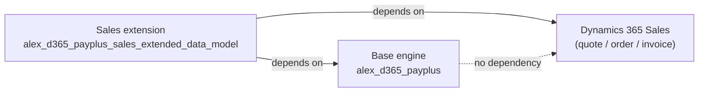
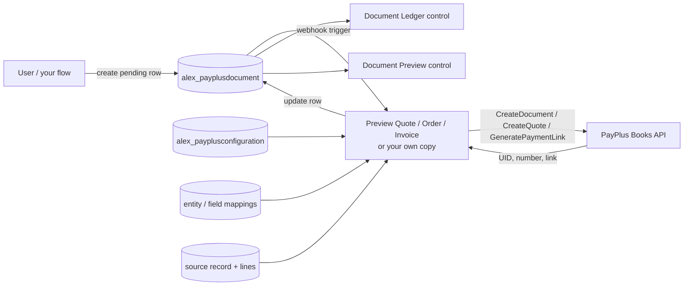
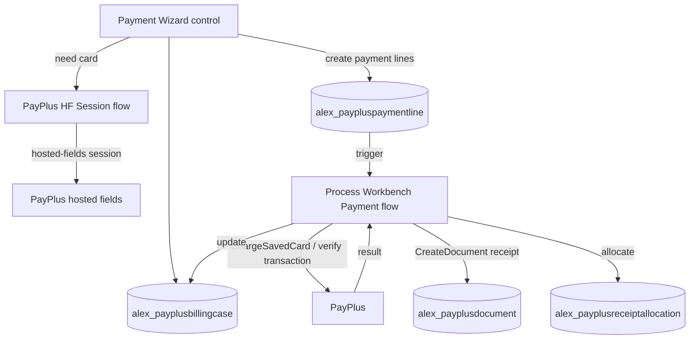
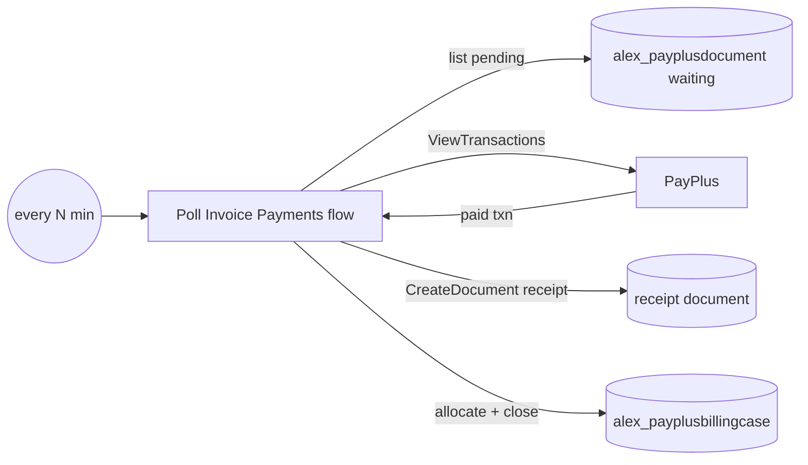
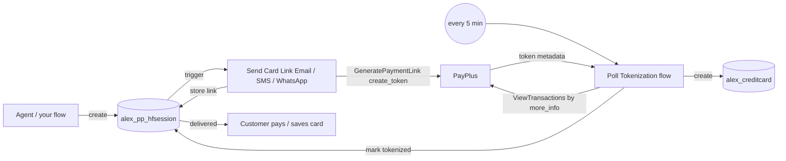
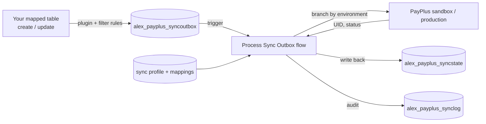

# Integration Guide — With or Without Dynamics 365 Sales

## Who This Guide Is For

This guide explains how an organization can adopt the PayPlus solution in **two very different situations**:

1. **You run Dynamics 365 Sales.** You want payments, documents, and card capture directly on the standard quote, order, and invoice records — with as little configuration as possible.
2. **You do _not_ run Dynamics 365 Sales.** You have your own Dataverse tables (or you are building them), and you want to run your own billing and collection processes on top of the payment engine that this solution already provides.

The core message is simple:

> The PayPlus payment engine — the custom connector, the PayPlus Dataverse tables, and the generic Power Automate flows — is **independent of Dynamics 365 Sales**. Sales is only one possible "front end." Any data model can drive the same engine.

## The Business Value

| Without this solution | With this solution |
| --- | --- |
| Every organization re-implements PayPlus REST calls, tokenization, retries, and document logic by hand | The payment engine is delivered once and reused |
| Card data risk is spread across custom code | Card data never touches Dynamics or Power Automate; PayPlus hosted pages and tokens are used |
| Sales-only organizations are locked in | Any Dataverse app — a custom collections app, a membership system, a tuition system — can issue documents and collect payments |
| Integrations are code projects | Integrations are **configuration and flow wiring** on a tested surface |

For a customer **without** Dynamics 365 Sales, this means they do not start from zero. They build **only their own business objects and rules**, and reuse the payment, document, tokenization, and sync machinery as-is.

## The Two Solutions and Their Dependencies

The product ships as **two solutions**, and the split is exactly the with/without-Sales boundary. Knowing which one to import — and in which order — is the first integration decision.

| Solution | Unique name | What it contains | Depends on |
| --- | --- | --- | --- |
| **Base (payment engine)** | `alex_d365_payplus` | ~28 PayPlus tables, the plugin assembly and its steps, the generic flows, all PCF controls, connection references and environment variables, web resources, and site map | **Nothing Sales-related.** Self-contained. |
| **Sales extension** | `alex_d365_payplus_sales_extended_data_model` | Custom columns, forms, and views on the standard `quote`, `salesorder`, `invoice`, and `invoicedetail` tables, plus the *Preview Quote / Sales Order / Invoice Document* and *Poll Invoice Payments* flows | **The base solution _and_ Dynamics 365 Sales.** |

### What this means in practice

- **You do _not_ run Dynamics 365 Sales.** Import **only the base solution**. You get the full engine — connector, tables, flows, plugins, and PCF controls — with **zero Sales dependency**. You then place controls such as the Payment Wizard and Document Ledger on your own tables or on custom pages, and you drive the flows from your own records. Do **not** import the Sales extension; it references `invoice`/`quote`/`salesorder`, which you do not have.
- **You run Dynamics 365 Sales.** Import the **base solution first**, then the **Sales extension**. The extension only adds the Sales-side placement (columns, forms, ribbons, and the three document-preview flows) on top of the engine. It cannot be imported on its own, because it depends on the base.

### Dependency direction (one way only)

The arrow never points the other way: **the base never depends on the extension or on Sales.** That is what makes the base a valid standalone product for a non-Sales customer, and it is the guarantee you rely on when you build your own front end.

## The Integration Surface (Reusable Regardless of Sales)

Three layers are reusable by **any** consumer, with or without Sales.

### 1. The Custom Connector

A no-auth Power Platform connector that fronts the PayPlus REST API. Any flow — Sales-driven or not — can call these operations. Highlights:

| Area | Operations |
| --- | --- |
| Payment links | `GeneratePaymentLink` |
| Charging tokens | `ChargeSavedCard`, `ChargeByTransactionUid`, `RefundByTransaction`, `CancelTransaction` |
| Recurring | `CreateRecurringPayment` |
| Transactions | `ViewTransactions` |
| Customers | `CreateCustomer`, `UpdateCustomer`, `ViewCustomers`, `RemoveCustomer` |
| Products & categories | `CreateProduct`, `UpdateProduct`, `ViewProducts`, `CreateProductCategory`, `UpdateProductCategory`, `ViewProductCategories` |
| Documents (Invoice+ / Books) | `CreateDocument` and typed variants (`CreateTaxInvoiceReceipt`, `CreateTaxInvoice`, `CreateReceipt`, `CreateQuote`, `CreateProformaInvoice`, `CreatePaymentRequest`, `CreateCreditDocument`, `CreateDeliveryCertificate`, `CreateReturnCertificate`, `CreateDonationReceipt`, `CreatePurchaseOrderCertificate`, `CreatePurchaseCertificate`) |
| Document read | `GetDocument`, `GetDocumentByUniqueIdentifier`, `GetDocumentByNumber`, `SearchDocuments`, `GetDocumentsByTransactionUid`, `GetDocumentTypes` |
| Setup | `MyTerminals`, `ListPaymentPages`, `BranchesList` |

The connector never exposes `api-key` / `secret-key` to flow makers — they are entered once on the connection.

### 2. The PayPlus Dataverse Tables

These tables are part of the solution and are **not** part of Dynamics 365 Sales. They exist even in an environment that has no Sales at all:

| Table | Role in your process |
| --- | --- |
| `alex_payplusconfiguration` | Single configuration row: connection, default terminal/page, per-document-type policies |
| `alex_payplus_terminal` / `alex_payplus_paymentpage` | Imported PayPlus terminals and pages |
| `alex_payplusdocument` | A PayPlus Invoice+ document (pending, issued, or previewed), at any level you choose |
| `alex_payplusdocumentactionlog` | Audit log of send / resend / cancel actions on a document |
| `alex_payplus_documenttype` | Imported PayPlus document-type catalog (tax invoice, receipt, etc.) |
| `alex_payplusbillingcase` | A collection case: what is owed, paid, and the open balance for a record |
| `alex_paypluspaymentline` | A single charge line inside a billing case (amount, method, card, result) |
| `alex_payplusreceiptallocation` | How a receipt is allocated across the paid items |
| `alex_payplus_syncprofile` / `alex_payplus_entitymapping` / `alex_payplus_fieldmapping` / `alex_payplus_filterrule` | Configuration-driven sync of **your** tables to PayPlus |
| `alex_payplus_syncoutbox` / `alex_payplus_syncstate` / `alex_payplus_synclog` | Reliable outbox, state, and audit for sync |
| `alex_pp_hfsession` | A card-capture / self-service session |
| `alex_creditcard` | A stored, tokenized card (no PAN/CVV) |
| `alex_bank` / `alex_bankbranch` | Imported bank and branch reference data |

See [data-model.md](data-model.md) for full details.

### 3. The Flows (authoritative list from the deployed environment)

The deployed solution contains the flows below. The important pattern is that the document flows are triggered by **pending `alex_payplusdocument` rows**, not directly by the Sales table — the Sales table is only the *source data* they read. That is why the same document engine serves any data model.

| Flow | Triggered by | Sales-coupled? | What it does |
| --- | --- | --- | --- |
| `PayPlus - Process Sync Outbox` | `alex_payplus_syncoutbox` row | **No** | Sends any queued source record to PayPlus using the mapping payload; sandbox/production routing; writes back UID & status |
| `PayPlus - Document Action Request` | `alex_payplusdocument` row | **No** | Resolves the selected link and composes the send / resend / cancel payload; logs to `alex_payplusdocumentactionlog` |
| `PayPlus - Process Workbench Payment` | Payment Wizard (`alex_paypluspaymentline`) | **No** | Charges a saved card and verifies hosted-fields transactions, then creates documents and receipts |
| `PayPlus - Poll Invoice Payments` | recurrence | **No** | Polls pending invoice documents, reconciles paid transactions, creates receipts, and closes billing cases |
| `PayPlus HF Session` | `alex_pp_hfsession` row | **No** | Creates PayPlus hosted-fields sessions for the Payment Wizard and stores `more_info` correlation |
| `PayPlus - Send Card Link (Email / SMS / WhatsApp)` | `alex_pp_hfsession` row | **No** | Generates a card-collection link and sends it on the chosen channel |
| `PayPlus - Poll Tokenization` | recurrence | **No** | Detects completed tokenizations and creates `alex_creditcard` |
| `PayPlus - Expire Pending Sessions` | recurrence | **No** | Expires stale card-collection sessions |
| `PayPlus - Import Terminals & Pages` / `Import Banks & Branches` / `Import Document Types` | config row flags | **No** | Populate setup and reference tables |
| `PayPlus - Fetch Options` / `Validate Credentials` | connector helper | **No** | Setup-wizard dropdowns and credential test |
| `PayPlus - Preview Quote Document` | pending `alex_payplusdocument` (source `quote`) | **Source only** | Builds a PayPlus quote document from the quote + mappings and updates the row for the preview control |
| `PayPlus - Preview Sales Order Document` | pending `alex_payplusdocument` (source `salesorder`) | **Source only** | Builds a sales-order preview / payment-request document from the order + mappings |
| `PayPlus - Preview Invoice Document` | pending `alex_payplusdocument` (source `invoice`) | **Source only** | Builds an invoice / proforma / payment-request document from the invoice + mappings; can also generate a payment link |

**Conclusion for a non-Sales customer:** every "No" flow is reused unchanged. The three "Source only" document flows are simply copies that read a specific Sales table; to support **your** table you add one more copy that reads *your* table and writes the same `alex_payplusdocument` row — everything after that (issue, preview, ledger, reconciliation) is reused.

## Two Ways a Non-Sales Customer Integrates

### Pattern A — Drive the engine through the PayPlus tables (low-code, recommended)

You do not call the connector yourself. Instead, your process **writes a row into a PayPlus table**, and the existing generic flow does the work. This is the safest and fastest path because you reuse tested logic.

| Your business goal | What your app/flow creates | Existing flow that fires | Result |
| --- | --- | --- | --- |
| Issue a tax invoice / receipt / payment request for your own record | An `alex_payplusdocument` row (+ an action request) | `PayPlus - Document Action Request` | Document issued in PayPlus, status logged back |
| Collect a card from a customer | An `alex_pp_hfsession` row (channel + reference) | `Self-Service` + `Send *` + `Poll Tokenization` | Link sent, token captured into `alex_creditcard` |
| Keep your customers/products aligned in PayPlus | Map your table in Mapping Studio → the plugin queues an `alex_payplus_syncoutbox` row | `PayPlus - Process Sync Outbox` | Master data continuously synced |

You are only responsible for **your own trigger** (when a document should be issued, when a card should be collected) and for filling the row. Everything downstream is reused.

### Pattern B — Call the connector directly from your own flow (full control)

When you need behavior the generic flows do not cover, build a flow on **your own table's** trigger and call connector operations yourself, exactly as the `Preview Quote / Sales Order / Invoice Document` flows do for the Sales tables. Typical shape:

1. Trigger on your table (create / update / a chosen status).
2. Read the configuration row (`alex_payplusconfiguration`) for the default terminal/page and policies.
3. Read your record + lines and map them to the PayPlus payload (use Mapping Studio rules or your own expressions).
4. Call the connector: `GeneratePaymentLink`, `CreateDocument`, `ChargeSavedCard`, `CreateRecurringPayment`, etc.
5. Validate the PayPlus business envelope (`results.status == success`).
6. Write the returned UID / link / status back to your record (and, if you want the ledger and preview controls to light up, upsert an `alex_payplusdocument` row).

The `PayPlus - Preview Quote / Sales Order / Invoice Document` flows are effectively **reference implementations** of Pattern B for the Sales tables. A non-Sales customer copies one of them and repoints it at their own table.

## Building Your Own Business Processes on the Existing Flows

The following are the common processes a non-Sales customer builds, and how each maps onto the engine.

### 1. Payment collection

- **You build:** a "Payment Request" (or reuse your order/case table) and the rule for when to collect.
- **Reuse:** call `GeneratePaymentLink` (Pattern B) or store a card via the session flows and then `ChargeSavedCard`.
- **Value:** no hosted-page, retry, or PCI handling to write.

### 2. Document issuance (Invoice+)

- **You build:** the trigger and the header/line data for your document.
- **Reuse:** create an `alex_payplusdocument` row and let `Document Action Request` issue, resend, or cancel it; the Document Ledger and Document Preview controls then work on your record with no extra code.
- **Value:** compliant Israeli tax documents (tax invoice, receipt, credit, proforma, payment request, and more) without touching the Books API directly.

### 3. Recurring / standing charges

- **You build:** the schedule or subscription entity.
- **Reuse:** `CreateRecurringPayment` with a stored token from `alex_creditcard`.

### 4. Card capture and tokenization

- **You build:** where a card should be requested from (any contact/account/custom party).
- **Reuse:** the `alex_pp_hfsession` table and the `Self-Service` / `Send *` / `Poll Tokenization` / `Expiry` flows, plus the Credit Card Wallet control.

### 5. Continuous sync of your master data

- **You build:** nothing but the choice of which of **your** tables and fields to sync.
- **Reuse:** Mapping Studio + the outbox flow push your customers, products, and categories into PayPlus continuously.

## How the Business Flows Work (Process Diagrams)

These high-level diagrams show the moving parts of the main business flows. They are intentionally engine-first: the same flows run whether the source record is a Sales quote/order/invoice or one of your own tables.

### Document issuance and preview

A pending `alex_payplusdocument` row is the single trigger. A source-specific flow builds the PayPlus document; the ledger and preview controls read the result.

### In-context payment capture (Payment Wizard)

The Payment Wizard opens a billing case, collects a card via hosted fields or a saved token, and the server flow executes each payment line and issues the accounting outcome.

### Reconciliation of open payments

A scheduled flow closes the loop for links that are paid outside the wizard (e.g. an emailed payment link).

### Card tokenization (self-service)

No inbound webhook is required; a session row drives the send flows and a poll detects the token.

### Continuous master-data sync

A plugin queues an outbox row on any mapped source change; one generic flow drains the outbox.

## Decision Guide

| Question | Dynamics 365 Sales customer | Bring-your-own-model customer |
| --- | --- | --- |
| What do I build? | Almost nothing — enable the ribbons and config | My own tables, triggers, and forms |
| How do I issue documents? | Quote/order/invoice ribbons + the preview/issue flows | Pattern A (write `alex_payplusdocument`) or Pattern B (own flow) |
| How do I collect payments? | In-context ribbons / Payment Wizard | `GeneratePaymentLink` or stored-token charge from my flow |
| How do I sync master data? | Map the Sales tables in Mapping Studio | Map my own tables in Mapping Studio |
| Which flows do I reuse? | All | All except the three Sales document flows |
| What must I not change? | The PayPlus tables and config contract | The PayPlus tables and config contract |

## The Contract You Must Not Break

Because the generic flows read and write specific tables, a custom integration must preserve:

- The **configuration row** (`alex_payplusconfiguration`) with a valid connection and default terminal/page.
- The **schema and status option-sets** of the PayPlus tables the flows depend on (`alex_payplusdocument`, `alex_payplus_syncoutbox`, `alex_pp_hfsession`, `alex_creditcard`).
- The **environment discriminator** on sync profiles (Sandbox = `100000000`, Production = `100000001`) so the outbox flow branches to the correct connector.
- The **PayPlus business-envelope check** (`results.status == success`) in any flow you author.

You are free to add your own tables, columns, forms, apps, and flows around this contract.

## Coexistence and Migration

- The engine can run **alongside** Sales or **without** it in the same tenant, in separate environments.
- A customer can start bring-your-own-model and later adopt Sales; the payment engine does not change, only new Sales-bound front-end flows are added.
- Because master data is synced through configuration (not code), onboarding a new source table is a mapping change, not a development cycle.

## Related Documents

- [architecture.md](architecture.md) — solution architecture and components
- [pcf-controls-guide.md](pcf-controls-guide.md) — binding the PCF controls, and standalone payment capture without Sales
- [deployment-and-administration.md](deployment-and-administration.md) — installing the two solutions, connections, and the setup wizard
- [data-model.md](data-model.md) — Dataverse tables
- [custom-connector-design.md](custom-connector-design.md) — connector operations and inputs
- [security-governance-and-compliance.md](security-governance-and-compliance.md) — governance and PCI posture
