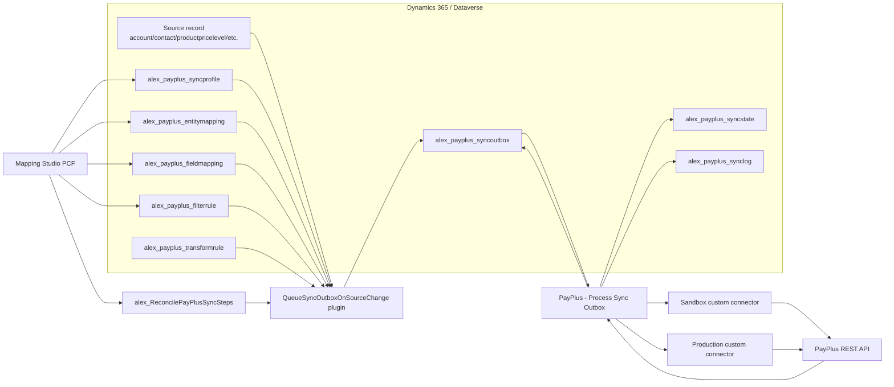
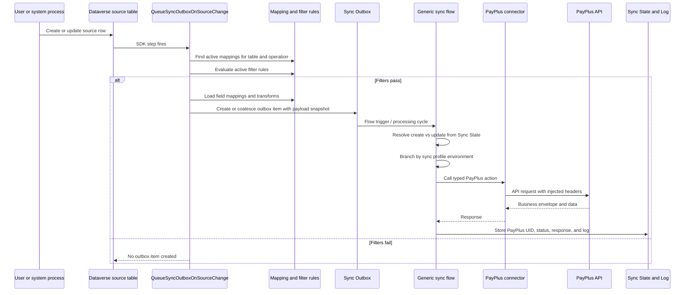
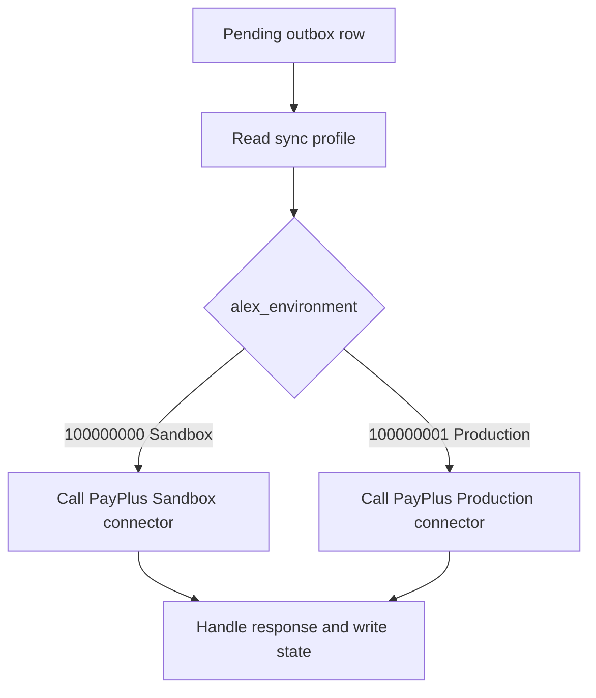

# PayPlus Continuous Sync - Architecture And Components

## Architecture Summary

The continuous sync engine is a configuration-driven outbound integration from Dataverse to PayPlus.

It is built from these layers:

| Layer | Component | Responsibility |
| --- | --- | --- |
| Configuration | Sync Profile, Entity Mapping, Field Mapping, Filter Rules, Transform Rules | Defines what can sync, from where, to which PayPlus target, and under which conditions. |
| User experience | Mapping Studio PCF | Lets admins configure mappings, field values, transforms, filters, and activation from a model-driven form. |
| Dataverse runtime | Queue Sync Outbox plugin | Runs on source table create/update, checks active mappings and filter rules, builds payload snapshots, and writes outbox rows. |
| Step management | Reconcile Sync Steps custom API | Registers or updates Dataverse SDK plugin steps for configured source tables at runtime. |
| Orchestration | Generic Power Automate outbox flow | Processes pending outbox rows, routes to sandbox or production, calls the correct connector action, validates PayPlus response, and updates state/logs. |
| Connector | PayPlus sandbox and production custom connectors | Typed PayPlus API wrapper with secure connection parameters and request policies for `api-key` and `secret-key`. |
| PayPlus | PayPlus REST API | Owns PayPlus UIDs, customer/product/category records, payments, tokens, and documents. |

## Component Diagram

## Runtime Sequence

## Dataverse Tables

| Table | Role |
| --- | --- |
| `alex_payplus_syncprofile` | Top-level sync package. The active profile controls environment routing and default sync settings. |
| `alex_payplus_entitymapping` | One source table to one PayPlus target. Contains source table, target object, create/update flags, coalescing, and plugin step status. |
| `alex_payplus_fieldmapping` | Field-level source-to-target mapping. Supports direct fields, constants, formulas/transforms, lookups, related fields, and value maps. |
| `alex_payplus_filterrule` | Per-mapping eligibility rules. All active rules must pass before an outbox item is queued. |
| `alex_payplus_transformrule` | Reusable transformation rules, seeded by stable rule code. Examples: Dataverse `statecode` to PayPlus `valid`. |
| `alex_payplus_valuemapping` | Explicit value translations when source and target values do not match directly. |
| `alex_payplus_syncoutbox` | Pending, failed, retrying, or completed outbound work. Contains source row id, operation, target, payload snapshot, and error information. |
| `alex_payplus_syncstate` | Correlation between a Dataverse source row and the PayPlus UID returned by create operations. |
| `alex_payplus_synclog` | Attempt and result history for audit and troubleshooting. |

## Plugin Responsibilities

The plugin is responsible for deciding whether a Dataverse change should enter the sync pipeline.

It does:

- Handles Create and Update messages only.
- Reads active mappings for the current source table and operation.
- Confirms the parent sync profile is active.
- Evaluates active filter rules with AND semantics.
- Builds a payload snapshot from field mappings.
- Applies transform rules and null-handling rules.
- Resolves simple related-field paths such as `product.name` or `transactioncurrencyid.isocurrencycode`.
- Creates or coalesces a sync outbox item.

It does not:

- Call PayPlus directly.
- Decide sandbox vs production connector credentials.
- Execute retries against PayPlus.
- Replace business workflow approval.
- Perform legal document issuance.

## Power Automate Responsibilities

The generic sync flow is responsible for integration execution.

It does:

- Processes outbox rows.
- Determines whether the operation is create or update based on existing sync state.
- Branches by sync profile environment:
  - Sandbox = sandbox connector.
  - Production = production connector.
- Calls typed PayPlus connector actions.
- Validates PayPlus business success by checking `results.status == success`, not just HTTP 200.
- Stores the returned PayPlus UID in sync state.
- Marks outbox rows as successful, failed, or retry scheduled.

It does not re-check business filter rules. Rows that fail filters never reach the flow.

## Environment Branching

Environment branching happens where the PayPlus connector is called.

The sync profile environment choice uses:

| Value | Meaning |
| --- | --- |
| `100000000` | Sandbox |
| `100000001` | Production |

## Step Registration Model

The solution does not package plugin steps for unknown customer tables.

Instead:

1. The administrator configures a mapping in Mapping Studio.
2. Activation calls `alex_ReconcilePayPlusSyncSteps`.
3. The custom API creates or updates SDK plugin steps for the selected source table and allowed messages.
4. Only after successful registration should the mapping be activated.

This keeps the managed solution generic and customer-safe.

## Payload Rules

Payloads are built from field mappings.

Supported source patterns include:

- Direct source field from the current row.
- Constant value.
- Formula/transform rule based on a source field.
- Lookup reference.
- Related field path for common parent lookups.
- Value mapping where explicit translation is needed.

For product sync, the recommended source table is `productpricelevel`, not `product`, because PayPlus needs a sell price and currency. Product master fields are read through related paths such as `product.name` and `product.productnumber`.

## Observability

Operational teams should inspect:

- Mapping active state and plugin step status.
- Active filter rules.
- Pending and failed outbox rows.
- Sync state rows and PayPlus UID values.
- Sync logs and last PayPlus response.
- Flow run history for connector or response-schema errors.

Useful interpretation:

- No outbox row: mapping inactive, profile inactive, filters failed, or source table step not registered.
- Existing outbox updated but no new row: coalescing is enabled and an open outbox item already exists.
- Flow ran but PayPlus record not created: check PayPlus business envelope, not only HTTP status.
- Update failed because UID missing: sync state does not yet contain the PayPlus UID; create or lookup recovery is required.
