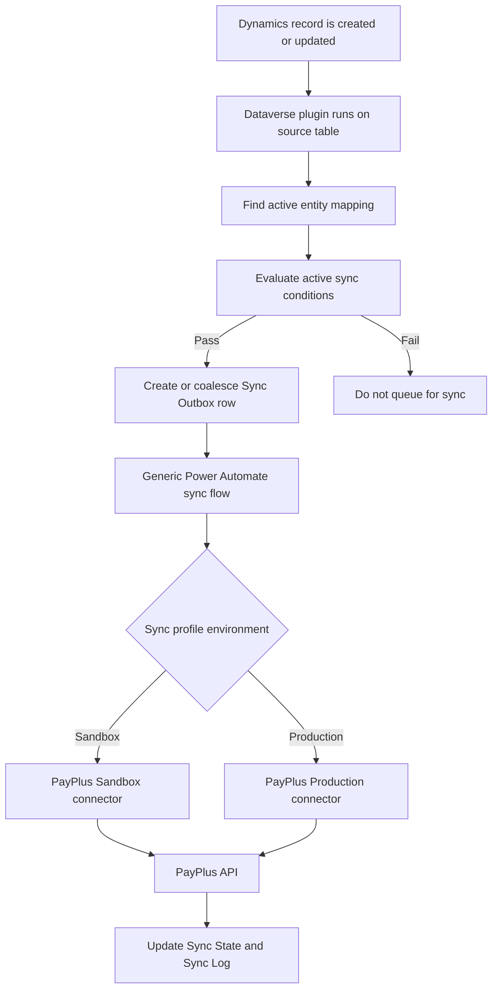

# PayPlus Continuous Sync - Solution Concept

## Purpose

The continuous sync solution keeps selected Dynamics 365 / Dataverse records aligned with PayPlus without requiring a separate custom integration project for each customer table.

The goal is not to mirror the entire Dataverse database into PayPlus. The goal is to make the PayPlus catalog and customer master data available for PayPlus operations such as payment links, saved-card charging, customer lookup, product selection, and document or transaction workflows.

## Business Position

Dynamics 365 is the business system of record. PayPlus is the payment, document, and commerce execution system.

The sync therefore follows these principles:

- Dynamics 365 owns customer and product business data.
- PayPlus owns payment processing, PayPlus UIDs, hosted payment pages, card tokenization, transaction processing, and document issuance.
- The integration sends only the data PayPlus needs to perform PayPlus operations.
- PayPlus identifiers returned by the API are stored back in Dataverse for future updates and line-item references.
- Records are not synced just because they exist in Dataverse; they are synced only when there is a clear PayPlus business target and a clear downstream process.

## What Continuous Sync Means

Continuous sync means that when an eligible source record changes in Dynamics 365, the solution automatically creates or updates the matching PayPlus record.

The sync is outbound from Dynamics 365 to PayPlus:

```text
Dynamics 365 / Dataverse -> PayPlus
```

It is not a two-way master-data replication engine. PayPlus UIDs and execution statuses are written back to Dataverse, but PayPlus is not expected to become the master source for Dynamics customer or product fields.

## Supported Business Objects

The recommended continuous sync scope is:

| Area | Dynamics source | PayPlus target | Why it belongs in continuous sync |
| --- | --- | --- | --- |
| Customers | `account` or `contact` | Customer | PayPlus needs a customer identity for payment links, saved-card operations, and documents. |
| Products | `productpricelevel` with related `product` | Product | PayPlus product catalog needs name, price, currency, VAT behavior, barcode/SKU, and active status. |
| Product categories | Dedicated category source or controlled configuration | Product Category | Products need PayPlus category UIDs; categories are stable reference data. |

Other PayPlus operations, such as invoices, quotes, orders, payment requests, recurring payments, and saved-card charges, should normally be implemented as controlled business flows rather than generic continuous table sync. They create legal, financial, or operational side effects and need explicit business triggers.

## Process Overview



## Where Filter Rules Run

Filter rules run in the Dataverse plugin before a row enters the outbox.

This is a deliberate design choice. The Power Automate flow receives only work items that already passed eligibility checks. The flow is responsible for technical orchestration: environment routing, create/update routing, connector calls, response validation, retry state, and write-back.

Example:

```text
Contact update
-> Plugin runs
-> Active mapping found
-> Filter: emailaddress1 is not null
-> If true: outbox item is created or coalesced
-> If false: no outbox item, no flow run
```

## Create And Update Behaviour

The sync uses an outbox and sync-state model:

- If no PayPlus UID exists for the source record, the flow calls a create action.
- If a PayPlus UID exists, the flow calls an update action.
- The returned PayPlus UID is stored in sync state.
- Future updates use the PayPlus UID, not the Dataverse GUID.
- For products, the business identifier sent to PayPlus is normally `barcode`, mapped from Dynamics `product.productnumber` / SKU.

For product master sync, the Dynamics product GUID is not sent as a PayPlus product field. PayPlus has its own `uid` / `product_uid`; this is generated by PayPlus and stored back in Dataverse.

## Why Use An Outbox

The outbox separates record changes from external API execution.

Benefits:

- Dataverse saves do not wait for PayPlus network calls.
- Failed PayPlus calls can be retried or investigated.
- Multiple pending updates to the same source record can be coalesced.
- Operations are auditable.
- The runtime can branch safely between sandbox and production connectors.
- The integration remains compatible with managed-solution deployment because plugin steps are registered per configured source table at runtime.

## Business Responsibilities

Before activating sync for any table, the implementation team must answer:

- What is the PayPlus target object?
- Why does PayPlus need this data?
- Which Dynamics table is the source of truth?
- What is the business identifier?
- Which records are eligible for sync?
- What happens if a previously synced record no longer meets the filter conditions?
- Is the target operation safe to run automatically on every eligible create or update?

If the business value cannot be explained clearly, the table should not be activated for continuous sync.
