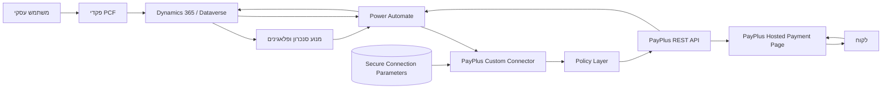
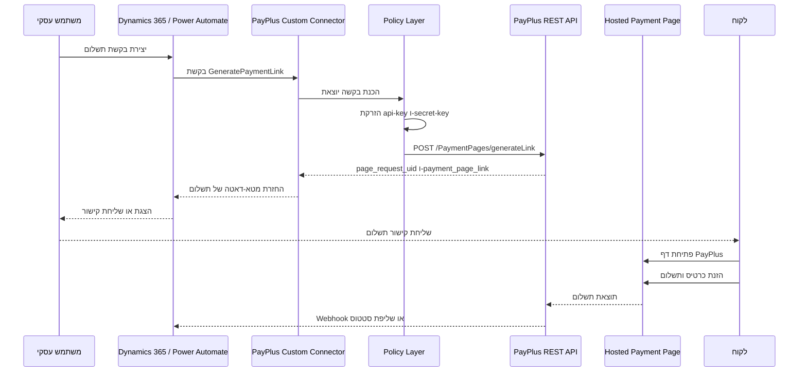
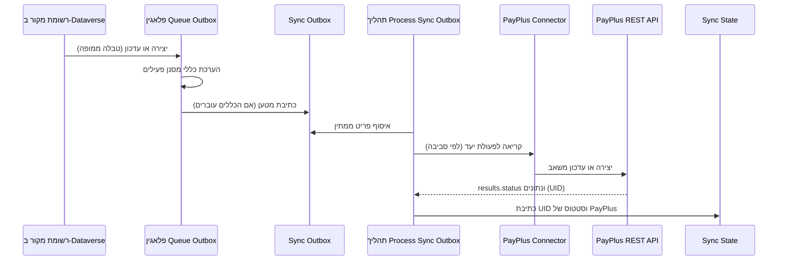
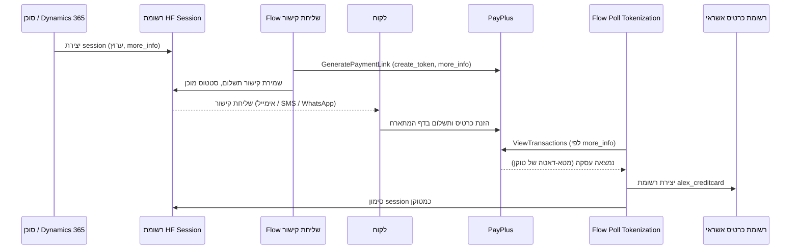

# ארכיטקטורה

## סקירת פתרון

הפתרון מחבר בין Microsoft Power Platform ו-Dynamics 365 לבין PayPlus באמצעות Custom Connector של Power Platform. המחבר חושף פעולות PayPlus מבוקרות לשימוש מתוך Power Automate ומתהליכי Dynamics 365.

הדפוס המרכזי הוא יצירת דף תשלום מתארח. Power Platform יוצר בקשה, PayPlus מחזיר קישור תשלום, והלקוח מזין פרטי כרטיס רק בדף המתארח של PayPlus.

הפתרון אינו מעבד כרטיסים בתוך Power Platform. הוא מפנה את הלקוח לדף תשלום מתארח של PayPlus.

## יכולות הפתרון

הפתרון בנוי על חמישה עמודי יכולת. ה-Custom Connector הוא הבסיס; שאר העמודים נבנים מעליו בתוך Dynamics 365 ו-Dataverse.

| עמוד | מטרה |
| --- | --- |
| מחבר ותשלום מתארח | עטיפה טיפוסית ל-API של PayPlus, ניהול מאובטח של פרטי גישה, ויצירת קישור תשלום מתארח. |
| מנוע סנכרון רציף | סנכרון מבוסס-הגדרות ו-Outbox של רשומות Dataverse (לקוחות, מוצרים, קטגוריות) ל-PayPlus, עם מיפוי שדות, טרנספורמציות, מסננים ומיפויי ערכים. |
| פקדי PCF | חמישה פקדי Power Apps Component Framework: Mapping Studio (מיפוי שדות ויזואלי והפעלת סנכרון), Credit Card Wallet ו-Bank Account Wallet (ניהול כרטיסים מטוקנים וחשבונות בנק), Payment Wizard (קליטת תשלום מודרכת בהקשר), ו-Document Ledger / Document Preview (יומן ותצוגה מקדימה של מסמכי Invoice+). |
| קליטת תשלום בהקשר ומסמכי Invoice+ | אשף תשלום מודרך (Payment Wizard) וכפתורי תשלום בלחיצה אחת בהצעות מחיר, הזמנות מכירה וחשבוניות; תהליכי תצוגה מקדימה של תשלום מתארח; יצירת מסמכי PayPlus Invoice+, יומן ותצוגה מקדימה; וייבוא נתוני ייחוס של בנקים/סניפים וסוגי מסמכים. |
| טוקניזציה ושירות עצמי | טוקניזציה ב-Hosted Fields, איסוף כרטיס בשירות עצמי באימייל, SMS ו-WhatsApp, וזיהוי טוקניזציה יוצא מבוסס-Polling. |

שכבת המחבר אינה תלוית-סביבה וניתן לעשות בה שימוש חוזר בפני עצמה. שאר העמודים ממומשים כטבלאות Dataverse, פלאגינים, Custom APIs, תהליכי Flow ופקדי PCF בתוך פתרון ה-Dynamics 365.

## רכיבי הפתרון

| רכיב | אחריות |
| --- | --- |
| Dynamics 365 / Dataverse | מערכת הרשומות העסקית, אחסון אופציונלי של בקשות ועסקאות תשלום, כתיבת סטטוס חוזרת |
| Power Automate | תזמור, תהליכי אימות, יצירת קישורי תשלום, התאמות ובקרה |
| Custom Connector | עטיפה טיפוסית ל-API של PayPlus, פרמטרי חיבור, policies והגדרת פעולות |
| Connection Parameters | אחסון מאובטח של `api-key` ו-`secret-key` ברמת החיבור |
| Policy Layer | הזרקת כותרות הזדהות של PayPlus בזמן ריצה |
| PayPlus REST API | יצירת דפי תשלום, מסופים, דפי תשלום, לקוחות, עסקאות, טוקנים ומוצרים |
| Hosted Payment Page | דף התשלום מול הלקוח, בבעלות PayPlus |
| לקוח | מקבל קישור ומשלם ב-PayPlus |
| מנוע סנכרון (Dataverse) | פרופילי סנכרון, מיפויי טבלאות ושדות, כללי טרנספורמציה ומסננים, outbox, מצב סנכרון ולוגים |
| פלאגינים ו-Custom APIs לסנכרון | הכנסת פריט ל-outbox בשינוי מקור, רישום צעדי פלאגין (reconcile), זריעת כללי טרנספורמציה |
| פקדי PCF | Mapping Studio (מיפוי שדות), Credit Card Wallet ו-Bank Account Wallet (ארנקי כרטיסים מטוקנים וחשבונות בנק), Payment Wizard (קליטת תשלום מודרכת), Document Ledger ו-Document Preview (מסמכי Invoice+) |
| מאגר כרטיסים מטוקנים | רשומות `alex_creditcard` המחזיקות מטא-דאטה לא רגיש של כרטיס וטוקנים של PayPlus |

## Custom Connector ב-Power Platform

המחבר מוגדר כ-No Auth מנקודת המבט של Power Platform. PayPlus עדיין דורש את הכותרות `api-key` ו-`secret-key`, אך הן אינן מוגדרות כקלט לכל פעולה ואינן נחשפות ליוצרי Flow.

במקום זאת, המחבר משתמש בפרמטרי חיבור מאובטחים וב-policies:

- `apiKey`: פרמטר חיבור מסוג `securestring`.
- `secretKey`: פרמטר חיבור מסוג `securestring`.
- policy מסוג `setheader` עבור `api-key`.
- policy מסוג `setheader` עבור `secret-key`.

כך פרטי הגישה נשמרים בגבול החיבור ולא מופיעים בכל סכמת פעולה.

## Power Automate

תהליכי Power Automate יכולים לקרוא לפעולות כגון:

- `GeneratePaymentLink`
- `MyTerminals`
- `ListPaymentPages`
- `CreateCustomer`
- `ViewCustomers`
- `ViewTransactions`
- `RefundByTransaction`
- `ChargeSavedCard` כאשר קיים טוקן שמור של PayPlus וקיים אישור להשתמש בו

תהליך ייעודי להתקנה, `PayPlus - Import Terminals & Pages`, קורא את מסופי PayPlus (`MyTerminals`) ואת עמודי התשלום שלהם (`ListPaymentPages`) דרך המחבר, ומבצע upsert לשורות בטבלאות `alex_payplus_terminal` ו-`alex_payplus_paymentpage`, לפי מפתח סביבה + UID. רשומות חדשות מקבלות `alex_isdefault = false` בתחילה. התהליך רץ במהלך ההתקנה (שלב מסופים ועמודי תשלום) וניתן להריץ אותו שוב לרענון הקטלוג.

תהליכים נוספים להתקנה ולתהליך מרחיבים את הפתרון: `PayPlus - Import Banks & Branches` ו-`PayPlus - Import Document Types` ממלאים טבלאות ייחוס; `PayPlus - Document Action Request` מטפל בפעולות שליחה, שליחה חוזרת וביטול של מסמכי Invoice+; ותהליכי תצוגה מקדימה של תשלום עבור הצעת מחיר, הזמנת מכירה וחשבונית יוצרים קישור תשלום מתארח של PayPlus בהקשר, מתוך שורת הפקודות של הרשומה.

מומלץ להפעיל Secure Inputs ו-Secure Outputs לכל פעולה שעלולה להכיל ערכים רגישים כגון טוקנים או מזהי לקוח.

## Dynamics 365 / Dataverse

Dataverse הוא אופציונלי אך מומלץ כאשר נדרשים מעקב סטטוסים, התאמה, ביקורת או תהליכי תמיכה.

שימושים מומלצים ב-Dataverse:

- שמירת מטא-דאטה של בקשת תשלום.
- שמירת מזהה בקשת תשלום וקישור תשלום של PayPlus.
- שמירת מזהה עסקה וסטטוס עסקי.
- שמירת מטא-דאטה שאינו פרטי כרטיס, כגון ארבע ספרות אחרונות אם PayPlus מחזיר אותן ואם אושר לשמור אותן.
- שמירת סיבת כשל, מזהה קורלציה וסטטוס ניסיון חוזר.

אין לשמור PAN או CVV.

## PayPlus REST API

סביבות ידועות:

| סביבה | Host | נתיב בסיס |
| --- | --- | --- |
| Sandbox | `restapidev.payplus.co.il` | `/api/v1.0` |
| Production | `restapi.payplus.co.il` | `/api/v1.0` |

התנהגות שאומתה ב-POC:

- `POST /PaymentPages/generateLink` מחזיר קישור לדף תשלום כאשר נשלחת בקשה מלאה.
- `GET /MyTerminals` מחזיר UUID של מסופים, המשמשים כ-`terminal_uid`.
- `GET /PaymentPages/list?terminal_uid={uuid}` מחזיר דפי תשלום עבור מסוף.
- נתיבים לא מוכרים או בקשות חסרות עשויים להחזיר 403 או שגיאות עטופות של המחבר.

## Connection Parameters

פרמטרי החיבור מוגדרים ב-`apiProperties.json`:

| פרמטר | סוג | מטרה |
| --- | --- | --- |
| `apiKey` | `securestring` | מפתח API של PayPlus |
| `secretKey` | `securestring` | מפתח סודי של PayPlus |

הערכים מוזנים פעם אחת בעת יצירת החיבור ב-Power Platform. הם אינם נשלחים כקלט בכל פעולה.

## Policies

המחבר משתמש ב-policies בבקשה היוצאת:

- `setheader` `api-key` = `@connectionParameters('apiKey')`
- `setheader` `secret-key` = `@connectionParameters('secretKey')`

ב-POC אומת כי `@connectionParameters('secretParam')` נפתר בזמן ריצה כאשר הוא מוזרק לכותרת באמצעות `setheader` policy.

## דף תשלום מתארח

דף התשלום המתארח הוא גבול האבטחה המרכזי. הלקוח מזין פרטי כרטיס רק בתשתית PayPlus. Dynamics 365 ו-Power Platform מקבלים מטא-דאטה תפעולי כגון קישור, מזהה בקשה, מזהה עסקה וסטטוס.

## Discovery Actions

פעולות Discovery מסייעות בהגדרה ובחוויית Designer:

- `MyTerminals`: שליפת מסופים והחזרת UUID המשמש כ-`terminal_uid`.
- `ListPaymentPages`: שליפת דפי תשלום עבור מסוף נבחר.

במהלך ההתקנה פעולות אלו משמשות את התהליך `PayPlus - Import Terminals & Pages` לאיכלוס טבלאות ייעודיות ב-Dataverse (`alex_payplus_terminal` ו-`alex_payplus_paymentpage`), ולא רק לסיוע לרשימות ב-Designer. הקטלוג שיובא תומך בבחירת ברירת מחדל (`alex_isdefault`) ובמדיניות ברמת המסוף וברמת העמוד.

מגבלת Designer שנמצאה ב-POC:

- רשימות תלויות באמצעות `x-ms-dynamic-values` עלולות לגרום לשגיאת Manifest 409 כאשר מקור הרשימה דורש פרמטר.
- נמצא דפוס שעובד: שימוש ב-`x-ms-dynamic-values` עבור בחירת מסוף, וב-`x-ms-dynamic-list` עבור רשימת דפי תשלום תלויה.

## התקנה והגדרה

אשף ההתקנה (`alex_payplus_setup.html`) מנהל התקנה בארבעה שלבים:

1. **חיבור** — הזנת ואימות החיבור ל-PayPlus.
2. **מסופים ועמודי תשלום** — שליפת כל המסופים ועמודי התשלום שלהם מ-PayPlus, תצוגה מקדימה, וייבוא שלהם. הייבוא יוצר את רשומות `alex_payplus_terminal` ו-`alex_payplus_paymentpage`.
3. **אימות** — בחירת המסוף ברירת המחדל ועמוד התשלום ברירת המחדל שלו. פעולה זו כותבת `alex_terminaluidref` / `alex_paymentpageuidref` על התצורה ומסמנת `alex_isdefault = true` על רשומות המסוף והעמוד שנבחרו. מתבצעת בדיקת חיבור מהירה (קישור תשלום מתארח לדוגמה), ולאחר מכן מתבצע ייבוא סוגי מסמכים משמעותי וחוסם — ההתקנה אינה יכולה להסתיים עד שסוגי המסמכים ייובאו בהצלחה.
4. **סיום** — מרכז ניהול, כולל בדיקת חיבור לפי עמוד לפי דרישה.

שני פלאגינים שומרים על עקביות ברירות המחדל:

- `EnforceSingleDefaultTerminal` — מסוף ברירת מחדל אחד לכל סביבה.
- `EnforceSingleDefaultPage` — עמוד ברירת מחדל אחד לכל מסוף + סוג תהליך.

## מנוע סנכרון רציף

מנוע הסנכרון שומר על התאמה בין רשומות נבחרות ב-Dataverse לבין PayPlus ללא קוד ייעודי לכל טבלה. הוא מבוסס-הגדרות ומשתמש בדפוס outbox אמין.

### טבלאות הגדרה

| טבלה | מטרה |
| --- | --- |
| `alex_payplus_syncprofile` | חבילת סנכרון עליונה, פרופיל פעיל אחד לכל סביבה |
| `alex_payplus_entitymapping` | ממפה טבלת מקור אחת ב-Dataverse ליעד PayPlus אחד (לקוח, מוצר, קטגוריית מוצר ועוד) |
| `alex_payplus_fieldmapping` | מיפוי ברמת השדה כולל סוג מקור (ישיר, קבוע, נוסחה, lookup, קשור, מיפוי ערך) |
| `alex_payplus_filterrule` | תנאי סנכרון אופציונליים לכל מיפוי, מוערכים בלוגיקת AND |
| `alex_payplus_transformrule` | טרנספורמציות ערך לשימוש חוזר (למשל מצב Dataverse לבוליאני) |
| `alex_payplus_valuemapping` | מיפויי ערך מפורשים ממקור ליעד |
| `alex_payplus_syncoutbox` | פריטי עבודה יוצאים ממתינים לסנכרון |
| `alex_payplus_syncstate` | ה-UID והסטטוס האחרונים של PayPlus לכל רשומת מקור |
| `alex_payplus_synclog` | תיעוד ניסיונות סנכרון ותוצאות |

### זמן ריצה

- פלאגין (`QueueSyncOutboxOnSourceChange`) רץ ביצירה או עדכון של טבלת מקור ממופה, ואם כללי המסנן הפעילים עוברים, כותב שורת outbox עם המטען שנבנה.
- Flow גנרי (`PayPlus - Process Sync Outbox`) אוסף שורות outbox, מסתעף לפי סביבה למחבר הנכון (sandbox או production), קורא לפעולת PayPlus המתאימה, מאמת את מעטפת העסק (`results.status == success`), וכותב חזרה את ה-UID והסטטוס למצב הסנכרון.
- צעדי הפלאגין נרשמים בזמן ההגדרה על ידי ה-Custom API בשם `alex_ReconcilePayPlusSyncSteps`, כך שאין צעדים על טבלאות לקוח לא ידועות בתוך הפתרון.
- כללי הטרנספורמציה נזרעים באופן אידמפוטנטי על ידי ה-Custom API בשם `alex_SeedPayPlusTransformRules` בעזרת קודי כלל יציבים, לא GUID.

הערת סביבה: `alex_payplus_syncprofile.alex_environment` משתמש ב-Sandbox = `100000000` ו-Production = `100000001`. תהליך הסנכרון מסתעף לפי ערך זה למחבר המתאים.

## פקדי PCF

חמישה פקדי Power Apps Component Framework (מרחב שמות `PayPlus`) מספקים חוויה חלקה בתוך טפסים מבוססי-מודל ועמודים מותאמים. השפה נגזרת מהגדרת המשתמש ב-Dynamics (עברית RTL או אנגלית LTR); אין מתג שפה ידני. לחיבור המדויק, ל-properties ולשימוש עצמאי, ראו [מדריך פקדי PCF](pcf-controls-guide.md).

### Mapping Studio

פקד מסוג שדה על טופס פרופיל הסנכרון. מנהל בוחר טבלת מקור ב-Dynamics, בוחר יעד PayPlus, ממפה שדות בעזרת בוחרים מבוססי-חיפוש, מגדיר סוג ערך לכל שדה (ישיר, קבוע, נוסחה, lookup, קשור, מיפוי ערך), מגדיר תנאי סנכרון, ומפעיל או עוצר סנכרון רציף. הפקד משתמש בשמירת הטופס מבוסס-המודל ומציג התקדמות לפעולות רקע.

### Credit Card Wallet

פקד dataset שמציג כרטיסים מטוקנים עבור הלקוח או איש הקשר הנוכחי בסגנון ארנק של Apple. הוא תומך ב-flip תלת-ממדי לפרטי כרטיס, פעולות הפעלה והשבתה, טיפול בכרטיס ברירת מחדל, וקיצורים להפעלת קליטת כרטיס ידנית או איסוף כרטיס בשירות עצמי. הוא קורא רשומות `alex_creditcard` הקשורות לרשומת האב.

### Bank Account Wallet

פקד dataset שמציג את חשבונות הבנק של הלקוח כארנק בסגנון Apple עם לוגו בנק, ומאפשר להוסיף חשבון דרך בוררי בנק וסניף (כולל פרטי הוראת קבע). הוא קורא את רשומות חשבונות-הבנק של הלקוח הקשורות לאב (account או contact) ומשתמש בטבלאות הייחוס `alex_bank` ו-`alex_bankbranch`.

### Payment Wizard

פקד מודרך שקולט תשלום ומפיק את התוצאה החשבונאית. הוא בנוי סביב **תיק חיוב** (`alex_payplusbillingcase`), ולא סביב חשבונית: הוא מזהה את המקור מה-inputs `sourceEntity`/`sourceId` או מהקשר הטופס/עמוד הנוכחי, מוצא או יוצר את תיק החיוב התואם, ופועל משורות התשלום והקצאות הקבלה של התיק. הוא תומך בתשלום מלא או חלקי, hosted fields או טוקן שמור, ומפיק קבלות או חשבוניות-מס-קבלה. מכיוון שתיק החיוב הוא העוגן, האשף רץ על **כל** טבלת מקור או על **עמוד מותאם** — הוא **אינו** דורש חשבונית Dynamics 365 Sales. כשהמקור הוא במקרה חשבונית, הוא קורא גם את שורות החשבונית.

### Document Ledger ו-Document Preview

שני פקדי Invoice+. **Document Ledger** הוא יומן מודע-חשבונאית ללקוח או לרשומה — סה"כ חיובים, סה"כ זיכויים, יתרה סופית וחיפוש על פני מסמכים שהופקו — מתוחם לפי ה-inputs `scope`/`recordId`/`entityLogicalName` או הרשומה הנוכחית. **Document Preview** מציג תצוגה מקדימה של מסמך `alex_payplusdocument` בודד, המזוהה לפי ה-input `documentId` או הרשומה המארחת. שניהם קוראים `alex_payplusdocument`.

## טוקניזציה ושירות עצמי

מעבר לקישורי תשלום חד-פעמיים, הפתרון יכול לקלוט ולשמור טוקנים של כרטיס PayPlus לשימוש חוזר בלי לגעת בפרטי כרטיס גולמיים.

- Hosted Fields: חלונית צד בצד הסוכן משבצת session של hosted-fields של PayPlus (`hosted_fields_uuid`) כך שהלקוח מזין פרטי כרטיס אצל PayPlus ומוחזר טוקן.
- איסוף בשירות עצמי: סוכנים יכולים לשלוח קישור לאיסוף כרטיס באימייל, SMS או WhatsApp. כל בקשה יוצרת שורת session; Flow ייעודי לכל ערוץ יוצר את קישור PayPlus ורושם אותו למשלוח.
- זיהוי טוקניזציה ב-Polling: מכיוון ש-webhooks נכנסים אינם מותרים בסביבת היעד, Flow מתוזמן (`PayPlus - Poll Tokenization`) קורא ל-`ViewTransactions`, מבצע קורלציה לפי `more_info` (מזהה בקשת ה-session), ובהצלחה יוצר רשומת `alex_creditcard` ומסמן את ה-session כמטוקן.
- תפוגה: Flow יומי מסמן sessions ממתינים כפגי-תוקף לאחר חלון התקפות שלהם.

הטוקנים נחשבים רגישים. תהליכים שנושאים טוקנים צריכים להשתמש ב-Secure Inputs ו-Secure Outputs, ואין לשמור PAN או CVV בשום שלב.

## הפקת מסמכים (Invoice+)

המחבר חושף גם פעולות מסמכים של PayPlus Invoice+ / Books, כך שתהליכים יכולים ליצור ולשלוף מסמכי מס. סוגי המסמכים הנתמכים כוללים חשבונית מס קבלה, חשבונית מס, קבלה, הצעת מחיר, חשבון עסקה (פרופורמה), דרישת תשלום, מסמך זיכוי, תעודות משלוח והחזרה, קבלה על תרומה ותעודות רכש. פעולות קריאה כוללות שליפה לפי UID, לפי מזהה ייחודי, לפי מספר, רשימה, ושליפה לפי UID עסקה.

## Dev ו-Prod

הפתרון מחזיק הגדרות מחבר נפרדות ל-Sandbox ול-Production. כך נמנעות קריאות ייצור במהלך פיתוח ונשמרת הפרדת פרטי גישה.

נתיב קידום מומלץ:

1. פיתוח בסביבת Power Platform ייעודית.
2. אימות מול PayPlus Sandbox.
3. ייבוא Managed Solution לסביבת בדיקות.
4. יצירת Connections לפי סביבה.
5. ביצוע אישורי אבטחה ותאימות.
6. קידום לייצור וקישור Connection References ל-Production.

## גבולות אחריות

| תחום | אחריות Power Platform | אחריות PayPlus |
| --- | --- | --- |
| יצירת בקשת תשלום | בניית בקשה, קריאה למחבר, שמירת מטא-דאטה | אימות הבקשה ויצירת דף מתארח |
| הזנת פרטי כרטיס | לא מתבצעת | דף PayPlus קולט פרטי כרטיס |
| שמירת פרטי גישה | פרמטרי חיבור מאובטחים | הנפקת פרטי גישה לסוחר |
| עיבוד תשלום | לא מעובד בתוך Power Platform | אישור, חיוב, טוקניזציה וזיכוי |
| מעקב סטטוס | שמירת מטא-דאטה מאושרת והתאמה | החזרת סטטוסי תשלום ועסקה |
| בקרות PCI | צמצום Scope, Governance של Run History ולוגים | בקרות דף התשלום ותהליך הסליקה |

## תרשים ארכיטקטורה

## תרשים Sequence ליצירת קישור תשלום

## תרשים Sequence לסנכרון רציף

## תרשים Sequence לטוקניזציה (Polling)

