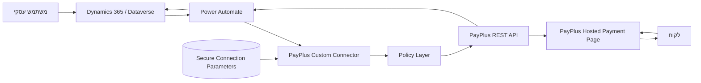
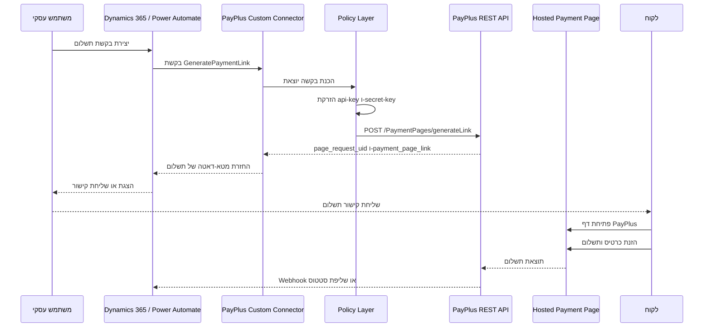

# ארכיטקטורה

## סקירת פתרון

הפתרון מחבר בין Microsoft Power Platform ו-Dynamics 365 לבין PayPlus באמצעות Custom Connector של Power Platform. המחבר חושף פעולות PayPlus מבוקרות לשימוש מתוך Power Automate ומתהליכי Dynamics 365.

הדפוס המרכזי הוא יצירת דף תשלום מתארח. Power Platform יוצר בקשה, PayPlus מחזיר קישור תשלום, והלקוח מזין פרטי כרטיס רק בדף המתארח של PayPlus.

הפתרון אינו מעבד כרטיסים בתוך Power Platform. הוא מפנה את הלקוח לדף תשלום מתארח של PayPlus.

## רכיבי הפתרון

| רכיב | אחריות |
| --- | --- |
| Dynamics 365 / Dataverse | מערכת הרשומות העסקית, אחסון אופציונלי של בקשות ועסקאות תשלום, כתיבת סטטוס חוזרת |
| Power Automate | תזמור, תהליכי אימות, יצירת קישורי תשלום, התאמות ובקרה |
| Custom Connector | עטיפה טיפוסית ל-API של PayPlus, פרמטרי חיבור, policies והגדרת פעולות |
| Connection Parameters | אחסון מאובטח של `api-key` ו-`secret-key` ברמת החיבור |
| Policy Layer | הזרקת כותרות הזדהות של PayPlus בזמן ריצה |
| PayPlus REST API | יצירת דפי תשלום, מסופים, דפי תשלום, לקוחות, עסקאות, טוקנים ומוצרים |
| Hosted Payment Page | דף התשלום מול הלקוח, בבעלות PayPlus |
| לקוח | מקבל קישור ומשלם ב-PayPlus |

## Custom Connector ב-Power Platform

המחבר מוגדר כ-No Auth מנקודת המבט של Power Platform. PayPlus עדיין דורש את הכותרות `api-key` ו-`secret-key`, אך הן אינן מוגדרות כקלט לכל פעולה ואינן נחשפות ליוצרי Flow.

במקום זאת, המחבר משתמש בפרמטרי חיבור מאובטחים וב-policies:

- `apiKey`: פרמטר חיבור מסוג `securestring`.
- `secretKey`: פרמטר חיבור מסוג `securestring`.
- policy מסוג `setheader` עבור `api-key`.
- policy מסוג `setheader` עבור `secret-key`.

כך פרטי הגישה נשמרים בגבול החיבור ולא מופיעים בכל סכמת פעולה.

## Power Automate

תהליכי Power Automate יכולים לקרוא לפעולות כגון:

- `GeneratePaymentLink`
- `MyTerminals`
- `ListPaymentPages`
- `CreateCustomer`
- `ViewCustomers`
- `ViewTransactions`
- `RefundByTransaction`
- `ChargeSavedCard` כאשר קיים טוקן שמור של PayPlus וקיים אישור להשתמש בו

מומלץ להפעיל Secure Inputs ו-Secure Outputs לכל פעולה שעלולה להכיל ערכים רגישים כגון טוקנים או מזהי לקוח.

## Dynamics 365 / Dataverse

Dataverse הוא אופציונלי אך מומלץ כאשר נדרשים מעקב סטטוסים, התאמה, ביקורת או תהליכי תמיכה.

שימושים מומלצים ב-Dataverse:

- שמירת מטא-דאטה של בקשת תשלום.
- שמירת מזהה בקשת תשלום וקישור תשלום של PayPlus.
- שמירת מזהה עסקה וסטטוס עסקי.
- שמירת מטא-דאטה שאינו פרטי כרטיס, כגון ארבע ספרות אחרונות אם PayPlus מחזיר אותן ואם אושר לשמור אותן.
- שמירת סיבת כשל, מזהה קורלציה וסטטוס ניסיון חוזר.

אין לשמור PAN או CVV.

## PayPlus REST API

סביבות ידועות:

| סביבה | Host | נתיב בסיס |
| --- | --- | --- |
| Sandbox | `restapidev.payplus.co.il` | `/api/v1.0` |
| Production | `restapi.payplus.co.il` | `/api/v1.0` |

התנהגות שאומתה ב-POC:

- `POST /PaymentPages/generateLink` מחזיר קישור לדף תשלום כאשר נשלחת בקשה מלאה.
- `GET /MyTerminals` מחזיר UUID של מסופים, המשמשים כ-`terminal_uid`.
- `GET /PaymentPages/list?terminal_uid={uuid}` מחזיר דפי תשלום עבור מסוף.
- נתיבים לא מוכרים או בקשות חסרות עשויים להחזיר 403 או שגיאות עטופות של המחבר.

## Connection Parameters

פרמטרי החיבור מוגדרים ב-`apiProperties.json`:

| פרמטר | סוג | מטרה |
| --- | --- | --- |
| `apiKey` | `securestring` | מפתח API של PayPlus |
| `secretKey` | `securestring` | מפתח סודי של PayPlus |

הערכים מוזנים פעם אחת בעת יצירת החיבור ב-Power Platform. הם אינם נשלחים כקלט בכל פעולה.

## Policies

המחבר משתמש ב-policies בבקשה היוצאת:

- `setheader` `api-key` = `@connectionParameters('apiKey')`
- `setheader` `secret-key` = `@connectionParameters('secretKey')`

ב-POC אומת כי `@connectionParameters('secretParam')` נפתר בזמן ריצה כאשר הוא מוזרק לכותרת באמצעות `setheader` policy.

## דף תשלום מתארח

דף התשלום המתארח הוא גבול האבטחה המרכזי. הלקוח מזין פרטי כרטיס רק בתשתית PayPlus. Dynamics 365 ו-Power Platform מקבלים מטא-דאטה תפעולי כגון קישור, מזהה בקשה, מזהה עסקה וסטטוס.

## Discovery Actions

פעולות Discovery מסייעות בהגדרה ובחוויית Designer:

- `MyTerminals`: שליפת מסופים והחזרת UUID המשמש כ-`terminal_uid`.
- `ListPaymentPages`: שליפת דפי תשלום עבור מסוף נבחר.

מגבלת Designer שנמצאה ב-POC:

- רשימות תלויות באמצעות `x-ms-dynamic-values` עלולות לגרום לשגיאת Manifest 409 כאשר מקור הרשימה דורש פרמטר.
- נמצא דפוס שעובד: שימוש ב-`x-ms-dynamic-values` עבור בחירת מסוף, וב-`x-ms-dynamic-list` עבור רשימת דפי תשלום תלויה.

## Dev ו-Prod

הפתרון מחזיק הגדרות מחבר נפרדות ל-Sandbox ול-Production. כך נמנעות קריאות ייצור במהלך פיתוח ונשמרת הפרדת פרטי גישה.

נתיב קידום מומלץ:

1. פיתוח בסביבת Power Platform ייעודית.
2. אימות מול PayPlus Sandbox.
3. ייבוא Managed Solution לסביבת בדיקות.
4. יצירת Connections לפי סביבה.
5. ביצוע אישורי אבטחה ותאימות.
6. קידום לייצור וקישור Connection References ל-Production.

## גבולות אחריות

| תחום | אחריות Power Platform | אחריות PayPlus |
| --- | --- | --- |
| יצירת בקשת תשלום | בניית בקשה, קריאה למחבר, שמירת מטא-דאטה | אימות הבקשה ויצירת דף מתארח |
| הזנת פרטי כרטיס | לא מתבצעת | דף PayPlus קולט פרטי כרטיס |
| שמירת פרטי גישה | פרמטרי חיבור מאובטחים | הנפקת פרטי גישה לסוחר |
| עיבוד תשלום | לא מעובד בתוך Power Platform | אישור, חיוב, טוקניזציה וזיכוי |
| מעקב סטטוס | שמירת מטא-דאטה מאושרת והתאמה | החזרת סטטוסי תשלום ועסקה |
| בקרות PCI | צמצום Scope, Governance של Run History ולוגים | בקרות דף התשלום ותהליך הסליקה |

## תרשים ארכיטקטורה

## תרשים Sequence ליצירת קישור תשלום

## שאלות פתוחות

- יש לאשר יישום מדויק של Webhook או IPN בכל פריסת לקוח.
- יש לאשר סכמות PayPlus מדויקות מול OpenAPI רשמי או תגובות Sandbox לפני הרחבת פעולות.
- יש להתאים שמות טבלאות וקשרים ב-Dataverse לאפליקציית Dynamics 365 של הלקוח.
