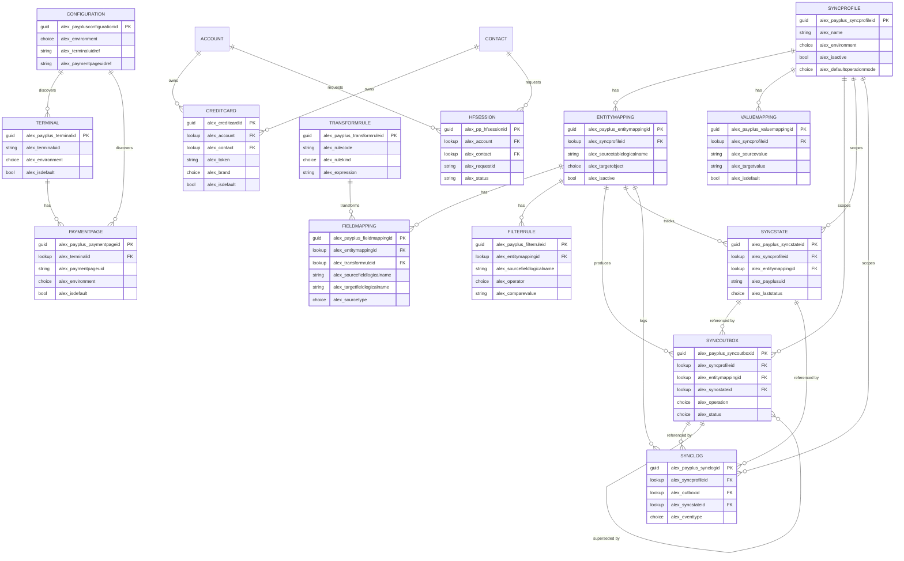

# מודל נתונים

מסמך זה מתאר את מודל הנתונים ב-Dataverse שתומך בפתרון PayPlus. הטבלאות, העמודות, ערכי ה-Choice והקשרים שלהלן נשלפו מסביבת ה-Dynamics 365 החיה. כל הטבלאות משתמשות בקידומת המפרסם `alex_`.

להתנהגות זמן הריצה שצורכת מודל זה, ראו [architecture.md](architecture.md).

## קטלוג טבלאות

| קבוצה | שם לוגי | שם תצוגה | מטרה |
| --- | --- | --- | --- |
| תצורה | `alex_payplusconfiguration` | תצורת PayPlus | סביבת המחבר, מצב אשף ההתקנה, מסוף ועמוד תשלום ברירת מחדל (fallback) ברמת החשבון, מתגי שירות עצמי וסטטוס אימות. |
| מסופים | `alex_payplus_terminal` | מסוף PayPlus | מסופי PayPlus שהתגלו עבור הסביבה, עם בחירת ברירת מחדל ומדיניות ברמת המסוף. |
| מסופים | `alex_payplus_paymentpage` | עמוד תשלום PayPlus | עמודי תשלום של PayPlus שהתגלו, כל אחד מקושר למסוף, עם בחירת ברירת מחדל והתנהגות ברמת העמוד. |
| תצורה | `alex_payplus_syncprofile` | פרופיל סנכרון PayPlus | שורש חבילת סנכרון. פרופיל פעיל אחד לכל סביבה; מחזיק ברירות מחדל ומכתיב ניתוב מחבר. |
| מיפוי סנכרון | `alex_payplus_entitymapping` | מיפוי ישות PayPlus | ממפה טבלת מקור אחת ב-Dataverse לאובייקט יעד אחד ב-PayPlus. |
| מיפוי סנכרון | `alex_payplus_fieldmapping` | מיפוי שדה PayPlus | מיפוי ברמת השדה בין שדה מקור לשדה PayPlus. |
| מיפוי סנכרון | `alex_payplus_filterrule` | כלל סינון PayPlus | תנאי סנכרון אופציונליים לכל מיפוי ישות (לוגיקת AND). |
| מיפוי סנכרון | `alex_payplus_transformrule` | כלל המרה PayPlus | טרנספורמציות ערך לשימוש חוזר שאליהן מפנים מיפויי שדות. |
| מיפוי סנכרון | `alex_payplus_valuemapping` | מיפוי ערכים PayPlus | מיפויי ערך מפורשים ממקור ליעד. |
| זמן ריצה | `alex_payplus_syncoutbox` | תור סנכרון PayPlus | פריטי עבודה יוצאים ממתינים (דפוס outbox). |
| זמן ריצה | `alex_payplus_syncstate` | מצב סנכרון PayPlus | ה-UID והסטטוס האחרונים של PayPlus לכל רשומת מקור. |
| זמן ריצה | `alex_payplus_synclog` | לוג סנכרון PayPlus | תיעוד ניסיונות סנכרון ותוצאות. |
| טוקניזציה | `alex_creditcard` | כרטיס אשראי | מטא-דאטה מטוקן של כרטיס וטוקן PayPlus לחשבון או לאיש קשר. |
| טוקניזציה | `alex_pp_hfsession` | סשן איסוף כרטיס | סשן איסוף כרטיס ב-Hosted Fields / שירות עצמי. |

## תרשים קשרי ישויות (ERD)

## סיכום קשרים

| טבלת ילד | עמודת מפתח זר | טבלת אב |
| --- | --- | --- |
| `alex_payplus_terminal` | `alex_configurationid` | `alex_payplusconfiguration` |
| `alex_payplus_terminal` | `alex_syncprofileid` | `alex_payplus_syncprofile` |
| `alex_payplus_paymentpage` | `alex_terminalid` | `alex_payplus_terminal` |
| `alex_payplus_paymentpage` | `alex_configurationid` | `alex_payplusconfiguration` |
| `alex_payplus_paymentpage` | `alex_syncprofileid` | `alex_payplus_syncprofile` |
| `alex_payplus_entitymapping` | `alex_syncprofileid` | `alex_payplus_syncprofile` |
| `alex_payplus_valuemapping` | `alex_syncprofileid` | `alex_payplus_syncprofile` |
| `alex_payplus_fieldmapping` | `alex_entitymappingid` | `alex_payplus_entitymapping` |
| `alex_payplus_fieldmapping` | `alex_transformruleid` | `alex_payplus_transformrule` |
| `alex_payplus_filterrule` | `alex_entitymappingid` | `alex_payplus_entitymapping` |
| `alex_payplus_syncoutbox` | `alex_syncprofileid` | `alex_payplus_syncprofile` |
| `alex_payplus_syncoutbox` | `alex_entitymappingid` | `alex_payplus_entitymapping` |
| `alex_payplus_syncoutbox` | `alex_syncstateid` | `alex_payplus_syncstate` |
| `alex_payplus_syncoutbox` | `alex_supersededbyid` | `alex_payplus_syncoutbox` (עצמי) |
| `alex_payplus_syncstate` | `alex_syncprofileid` | `alex_payplus_syncprofile` |
| `alex_payplus_syncstate` | `alex_entitymappingid` | `alex_payplus_entitymapping` |
| `alex_payplus_synclog` | `alex_syncprofileid` | `alex_payplus_syncprofile` |
| `alex_payplus_synclog` | `alex_outboxid` | `alex_payplus_syncoutbox` |
| `alex_payplus_synclog` | `alex_syncstateid` | `alex_payplus_syncstate` |
| `alex_payplus_synclog` | `alex_entitymappingid` | `alex_payplus_entitymapping` |
| `alex_creditcard` | `alex_account` | `account` |
| `alex_creditcard` | `alex_contact` | `contact` |
| `alex_pp_hfsession` | `alex_account` | `account` |
| `alex_pp_hfsession` | `alex_contact` | `contact` |

## פירוט טבלאות

### תצורת PayPlus (`alex_payplusconfiguration`)

רשומת תצורה יחידה עבור המחבר וההתנהגות של שירות עצמי.

| עמודה | סוג | הסבר |
| --- | --- | --- |
| `alex_name` | טקסט | שם התצורה. |
| `alex_environment` | Choice | סביבת PayPlus (Production / Sandbox). |
| `alex_setupstage` | Choice | שלב אשף ההתקנה (חיבור, מסופים ועמודי תשלום, אימות, סיום). |
| `alex_setupcompleted` | כן/לא | ההתקנה הושלמה. |
| `alex_configvalidated` | כן/לא | התצורה אומתה. |
| `alex_terminaluidref` | טקסט | מזהה המסוף שנבחר כברירת מחדל של החשבון (fallback). כל התהליכים משתמשים בו כאשר לא סופק מסוף ספציפי. נקבע בשלב האימות של האשף ומשקף את רשומת המסוף המסומנת ב-`alex_isdefault`. |
| `alex_paymentpageuidref` | טקסט | מזהה עמוד התשלום שנבחר כברירת מחדל של החשבון (fallback). כל התהליכים משתמשים בו כאשר לא סופק עמוד ספציפי. נקבע בשלב האימות ומשקף את רשומת העמוד המסומנת ב-`alex_isdefault`. |
| `alex_paymentpages` | טקסט מרובה (JSON) | שדה מורשת/מטמן של רשימת עמודי תשלום. העמודים המוסמכים שהתגלו שוכנים כעת בטבלה `alex_payplus_paymentpage`. |
| `alex_lastvalidationstatus` | Choice | סטטוס הבדיקה האחרון. |
| `alex_lastvalidationcode` | מספר שלם | קוד תוצאה/HTTP אחרון. |
| `alex_lastvalidationmessage` | טקסט | הודעת בדיקה אחרונה. |
| `alex_lastvalidatedon` | תאריך/שעה | תאריך האימות האחרון. |
| `alex_validationrequestid` | טקסט | מזהה בקשת בדיקה. |
| `alex_selfservice_{email\|sms\|whatsapp}_{account\|contact}` | כן/לא | הפעלת איסוף כרטיס בשירות עצמי לפי ערוץ וסוג אב. |
| `alex_selfservice_{email\|sms\|whatsapp}_{account\|contact}_expiry` | מספר שלם | חלון תוקף הקישור בימים לכל ערוץ וסוג אב. |

### מסוף PayPlus (`alex_payplus_terminal`)

שורה אחת לכל מסוף PayPlus שהתגלה עבור הסביבה. השורות מאוכלסות על ידי תהליך **PayPlus - Import Terminals & Pages**, לפי מפתח סביבה + מזהה מסוף. ברירת מחדל יחידה לכל סביבה נאכפת על ידי הפלאגין `EnforceSingleDefaultTerminal`.

| עמודה | סוג | הסבר |
| --- | --- | --- |
| `alex_terminaluid` | טקסט | מזהה מסוף (UUID של PayPlus). מפתח טבעי יחד עם הסביבה. |
| `alex_merchantnumber` | טקסט | מספר בית עסק. |
| `alex_legalentity` | טקסט | ישות משפטית. |
| `alex_terminaltypeid` | מספר שלם | קוד סוג מסוף. |
| `alex_activitytype` | Choice | סוג פעילות (אתר, מוקד, קמעונאות, תרומות, אחר). |
| `alex_primarycurrency` | Choice | מטבע עיקרי (ILS, USD, EUR, GBP). |
| `alex_recurring_enabled` | כן/לא | חיובים מחזוריים פעילים. |
| `alex_tokenization_enabled` | כן/לא | טוקניזציה פעילה. |
| `alex_cvv_policy` | Choice | מדיניות CVV (נדרש, לא נדרש, מותנה, לא ידוע). |
| `alex_cvv_policy_source` | Choice | מקור מדיניות CVV. |
| `alex_cvv_required_j5` | Choice | CVV נדרש בהשלמת J5. |
| `alex_cvv_required_recurring_init` | Choice | CVV נדרש באתחול מחזורי. |
| `alex_threeds_policy` | Choice | מדיניות 3D Secure (ברירת מחדל, פעיל, כבוי, מותנה). |
| `alex_settings_verified_on` | תאריך/שעה | מועד אימות ההגדרות. |
| `alex_rawjson` | טקסט מרובה | JSON גולמי של מטען המסוף מ-PayPlus. |
| `alex_lastsyncon` | תאריך/שעה | סונכרן לאחרונה. |
| `alex_environment` | Choice | סביבת PayPlus (Production / Sandbox). |
| `alex_isdefault` | כן/לא | מסוף ברירת מחדל לסביבה. נאכף יחיד-לכל-סביבה על ידי הפלאגין `EnforceSingleDefaultTerminal`. |
| `alex_isactive` | כן/לא | פעיל. |
| `alex_description` | טקסט מרובה | תיאור עסקי (מתי להשתמש). |
| `alex_configurationid` | Lookup → תצורת PayPlus | קונפיגורציה בעלים. |
| `alex_syncprofileid` | Lookup → פרופיל סנכרון PayPlus | פרופיל סנכרון בעלים. |
| `alex_approvedby` | Lookup → משתמש | אושר על ידי. |
| `alex_name` | טקסט | שם. |

### עמוד תשלום PayPlus (`alex_payplus_paymentpage`)

שורה אחת לכל עמוד תשלום של PayPlus; כל עמוד שייך למסוף. השורות מאוכלסות על ידי תהליך **PayPlus - Import Terminals & Pages**, לפי מפתח סביבה + מזהה עמוד. ברירת מחדל יחידה לכל מסוף + סוג תהליך נאכפת על ידי הפלאגין `EnforceSingleDefaultPage`.

| עמודה | סוג | הסבר |
| --- | --- | --- |
| `alex_paymentpageuid` | טקסט | מזהה עמוד תשלום (UUID של PayPlus). מפתח טבעי יחד עם הסביבה. |
| `alex_terminalid` | Lookup → מסוף PayPlus | המסוף שאליו שייך העמוד. |
| `alex_processtype` | Choice | סוג תהליך (חיוב, אישור, בדיקה, טוקן בלבד, מחזורי). |
| `alex_purpose` | Choice | מטרת העמוד. |
| `alex_audience` | Choice | קהל יעד. |
| `alex_channel` | Choice | ערוץ עיקרי (אתר, מוקד, WhatsApp, אימייל, QR). |
| `alex_tokenbehavior` | Choice | התנהגות טוקן (ללא טוקן, אופציונלי, נדרש, טוקן בלבד). |
| `alex_createtoken_default` | כן/לא | יצירת טוקן כברירת מחדל. |
| `alex_cvv_inherit_terminal` | כן/לא | ירושת CVV מהמסוף. |
| `alex_cvv_policy_displayed` | Choice | מדיניות CVV מוצגת. |
| `alex_threeds_policy` | Choice | מדיניות 3D Secure. |
| `alex_for_card_update` | כן/לא | מיועד לעדכון כרטיס. |
| `alex_for_subscription` | כן/לא | מיועד להצטרפות למנוי. |
| `alex_openamount` | כן/לא | סכום פתוח. |
| `alex_maxpayments` | מספר שלם | מספר תשלומים מרבי. |
| `alex_defaultcurrency` | טקסט | מטבע ברירת מחדל. |
| `alex_language` | טקסט | שפה. |
| `alex_identification_required` | כן/לא | שדה זיהוי נדרש. |
| `alex_cashieruid` | טקסט | מזהה קופה. |
| `alex_cashiername` | טקסט | שם קופה. |
| `alex_chargemethod` | מספר שלם | סוג פעולה מספרי. |
| `alex_selectionpriority` | מספר שלם | עדיפות בחירה. |
| `alex_startdate` | תאריך/שעה | תאריך התחלה. |
| `alex_enddate` | תאריך/שעה | תאריך סיום. |
| `alex_valid` | כן/לא | תקין ב-PayPlus. |
| `alex_rawjson` | טקסט מרובה | JSON גולמי של מטען עמוד התשלום מ-PayPlus. |
| `alex_lastsyncon` | תאריך/שעה | סונכרן לאחרונה. |
| `alex_environment` | Choice | סביבת PayPlus (Production / Sandbox). |
| `alex_isdefault` | כן/לא | עמוד ברירת מחדל למסוף שלו + סוג תהליך. נאכף יחיד-לכל (מסוף + סוג תהליך) על ידי הפלאגין `EnforceSingleDefaultPage`. |
| `alex_isactive` | כן/לא | פעיל. |
| `alex_description` | טקסט מרובה | תיאור למשתמש. |
| `alex_configurationid` | Lookup → תצורת PayPlus | קונפיגורציה בעלים. |
| `alex_syncprofileid` | Lookup → פרופיל סנכרון PayPlus | פרופיל סנכרון בעלים. |
| `alex_name` | טקסט | שם. |

### פרופיל סנכרון PayPlus (`alex_payplus_syncprofile`)

שורש חבילת סנכרון. פרופיל פעיל אחד לכל סביבה.

| עמודה | סוג | הסבר |
| --- | --- | --- |
| `alex_name` | טקסט | שם הפרופיל. |
| `alex_environment` | Choice | Sandbox / Production. מכתיב את ניתוב המחבר בתהליך. |
| `alex_isactive` | כן/לא | פרופיל פעיל. |
| `alex_defaultoperationmode` | Choice | יצירה בלבד / עדכון בלבד / יצירה ועדכון. |
| `alex_defaultcurrencycode` | טקסט | קוד מטבע ברירת מחדל. |
| `alex_defaultlanguagecode` | טקסט | קוד שפת ברירת מחדל. |
| `alex_defaultretrycount` | מספר שלם | מספר ניסיונות ברירת מחדל. |
| `alex_retryintervalminutes` | מספר שלם | מרווח ניסיון חוזר בדקות. |
| `alex_failonmissingrequiredfield` | כן/לא | כשל כאשר שדה חובה חסר. |
| `alex_mappingstudiohost` | טקסט | כתובת המארח של Mapping Studio. |

### מיפוי ישות PayPlus (`alex_payplus_entitymapping`)

ממפה טבלת מקור אחת ב-Dataverse לאובייקט יעד אחד ב-PayPlus.

| עמודה | סוג | הסבר |
| --- | --- | --- |
| `alex_name` | טקסט | שם המיפוי. |
| `alex_syncprofileid` | Lookup → פרופיל סנכרון | פרופיל האב. |
| `alex_sourcetablelogicalname` | טקסט | שם לוגי של טבלת המקור ב-Dataverse. |
| `alex_sourcetabledisplayname` | טקסט | שם תצוגה של טבלת המקור. |
| `alex_targetobject` | Choice | אובייקט היעד ב-PayPlus (לקוח, מוצר, קטגוריה ועוד). |
| `alex_allowcreate` | כן/לא | אפשר יצירה ב-PayPlus. |
| `alex_allowupdate` | כן/לא | אפשר עדכון ב-PayPlus. |
| `alex_changehandlingmode` | Choice | מצב נוכחי או Payload שנשמר. |
| `alex_coalesceupdates` | כן/לא | איחוד עדכונים ממתינים. |
| `alex_missinguidpolicy` | Choice | התנהגות כאשר UID היעד חסר. |
| `alex_pluginstepstatus` | Choice | סטטוס רישום צעד הפלאגין לשינוי מקור. |
| `alex_isactive` | כן/לא | מיפוי פעיל. |

### מיפוי שדה PayPlus (`alex_payplus_fieldmapping`)

מיפוי ברמת השדה בין שדה מקור לשדה PayPlus.

| עמודה | סוג | הסבר |
| --- | --- | --- |
| `alex_name` | טקסט | שם מיפוי השדה. |
| `alex_entitymappingid` | Lookup → מיפוי ישות | מיפוי האב. |
| `alex_sourcefieldlogicalname` | טקסט | שם לוגי של שדה המקור. |
| `alex_sourcefielddisplayname` | טקסט | שם תצוגה של שדה המקור. |
| `alex_targetfieldlogicalname` | טקסט | שם שדה היעד ב-PayPlus. |
| `alex_targetfielddisplayname` | טקסט | שם תצוגה של שדה היעד. |
| `alex_sourcetype` | Choice | שדה מקור, קבוע, נוסחה, Lookup, רשומה קשורה, מיפוי ערכים. |
| `alex_dataversetype` | Choice | סוג נתון Dataverse. |
| `alex_payplusdatatype` | Choice | סוג נתון PayPlus. |
| `alex_defaultvalue` | טקסט | ערך ברירת מחדל כאשר המקור ריק. |
| `alex_nullhandling` | Choice | טיפול בערכי null. |
| `alex_requiredforpayload` | כן/לא | השדה חובה ב-payload. |
| `alex_transformruleid` | Lookup → כלל המרה | טרנספורמציה אופציונלית לערך. |
| `alex_sortorder` | מספר שלם | סדר ב-payload. |
| `alex_isactive` | כן/לא | מיפוי פעיל. |

### כלל סינון PayPlus (`alex_payplus_filterrule`)

תנאי סנכרון אופציונליים לכל מיפוי ישות. הכללים מוערכים בלוגיקת AND.

| עמודה | סוג | הסבר |
| --- | --- | --- |
| `alex_name` | טקסט | שם הכלל. |
| `alex_entitymappingid` | Lookup → מיפוי ישות | מיפוי האב. |
| `alex_sourcefieldlogicalname` | טקסט | שדה המקור הנבדק. |
| `alex_operator` | Choice | שווה, לא שווה, מכיל, גדול מ, קטן מ, ריק, לא ריק. |
| `alex_comparevalue` | טקסט | ערך להשוואה. |
| `alex_logicalgroup` | טקסט | תווית קבוצה אופציונלית. |
| `alex_description` | טקסט מרובה | תיאור הכלל. |
| `alex_isactive` | כן/לא | כלל פעיל. |

### כלל המרה PayPlus (`alex_payplus_transformrule`)

טרנספורמציות ערך לשימוש חוזר שאליהן מפנים מיפויי שדות. נזרעות אידמפוטנטית לפי קוד כלל יציב.

| עמודה | סוג | הסבר |
| --- | --- | --- |
| `alex_name` | טקסט | שם הכלל. |
| `alex_rulecode` | טקסט | קוד יציב לזריעה אידמפוטנטית. |
| `alex_rulekind` | Choice | סוג הטרנספורמציה (ניקוי רווחים, אותיות קטנות/גדולות, נרמול טלפון ועוד). |
| `alex_outputtype` | Choice | סוג נתון הפלט. |
| `alex_expression` | טקסט מרובה | ביטוי הטרנספורמציה. |
| `alex_parametersjson` | טקסט מרובה | פרמטרים כ-JSON. |
| `alex_description` | טקסט מרובה | תיאור הכלל. |
| `alex_isactive` | כן/לא | כלל פעיל. |

### מיפוי ערכים PayPlus (`alex_payplus_valuemapping`)

מיפויי ערך מפורשים ממקור ליעד.

| עמודה | סוג | הסבר |
| --- | --- | --- |
| `alex_name` | טקסט | שם מיפוי הערך. |
| `alex_syncprofileid` | Lookup → פרופיל סנכרון | פרופיל האב. |
| `alex_mappinggroup` | טקסט | שם הקבוצה לבחירת המיפוי. |
| `alex_sourcevalue` | טקסט | ערך המקור. |
| `alex_targetvalue` | טקסט | ערך היעד. |
| `alex_targetuid` | טקסט | UID יעד כאשר המיפוי מצביע למשאב PayPlus. |
| `alex_isdefault` | כן/לא | ערך ברירת מחדל לקבוצה. |
| `alex_description` | טקסט מרובה | תיאור. |
| `alex_isactive` | כן/לא | מיפוי פעיל. |

### תור סנכרון PayPlus (`alex_payplus_syncoutbox`)

פריטי עבודה יוצאים ממתינים. נכתבים על ידי פלאגין שינוי המקור ומעובדים על ידי תהליך ה-outbox.

| עמודה | סוג | הסבר |
| --- | --- | --- |
| `alex_name` | טקסט | שם פריט העבודה. |
| `alex_syncprofileid` | Lookup → פרופיל סנכרון | הפרופיל הבעלים. |
| `alex_entitymappingid` | Lookup → מיפוי ישות | המיפוי הבעלים. |
| `alex_syncstateid` | Lookup → מצב סנכרון | מצב הסנכרון הקשור. |
| `alex_supersededbyid` | Lookup → תור סנכרון (עצמי) | פריט חדש יותר שמחליף פריט זה. |
| `alex_sourcetablelogicalname` | טקסט | טבלת המקור. |
| `alex_sourcerowid` | טקסט | מזהה רשומת המקור. |
| `alex_sourceversionnumber` | טקסט | גרסת שורת המקור. |
| `alex_sourcemodifiedon` | תאריך/שעה | חותמת זמן שינוי המקור. |
| `alex_targetobject` | Choice | אובייקט היעד ב-PayPlus. |
| `alex_operation` | Choice | יצירה, עדכון, השבתה, מחיקה. |
| `alex_status` | Choice | ממתין, בעיבוד, הצליח, נכשל, ניסיון חוזר מתוזמן, הוחלף, דולג. |
| `alex_correlationkey` | טקסט | מפתח קורלציה. |
| `alex_payloadsnapshot` | טקסט מרובה | צילום מטען הבקשה שנבנה. |
| `alex_responsesnapshot` | טקסט מרובה | צילום התגובה. |
| `alex_attemptcount` | מספר שלם | ניסיונות עד כה. |
| `alex_maxattempts` | מספר שלם | מספר ניסיונות מרבי. |
| `alex_nextretryon` | תאריך/שעה | זמן הניסיון החוזר הבא. |
| `alex_lockeduntil` | תאריך/שעה | תפוגת נעילת העיבוד. |
| `alex_processingstartedon` | תאריך/שעה | זמן תחילת העיבוד. |
| `alex_processedon` | תאריך/שעה | זמן סיום העיבוד. |
| `alex_lastdetectedon` | תאריך/שעה | הפעם האחרונה שהשינוי זוהה. |
| `alex_lasterror` | טקסט מרובה | טקסט השגיאה האחרונה. |

### מצב סנכרון PayPlus (`alex_payplus_syncstate`)

ה-UID והסטטוס האחרונים של PayPlus לכל רשומת מקור. זהו עוגן הקורלציה בין Dataverse ל-PayPlus.

| עמודה | סוג | הסבר |
| --- | --- | --- |
| `alex_name` | טקסט | שם המצב. |
| `alex_syncprofileid` | Lookup → פרופיל סנכרון | הפרופיל הבעלים. |
| `alex_entitymappingid` | Lookup → מיפוי ישות | המיפוי הבעלים. |
| `alex_sourcetablelogicalname` | טקסט | טבלת המקור. |
| `alex_sourcerowid` | טקסט | מזהה רשומת המקור. |
| `alex_correlationkey` | טקסט | מפתח קורלציה. |
| `alex_payplusuid` | טקסט | UID של המשאב המסונכרן ב-PayPlus. |
| `alex_payplusexternalnumber` | טקסט | מספר חיצוני של PayPlus, כאשר רלוונטי. |
| `alex_lastoperation` | Choice | הפעולה האחרונה שבוצעה. |
| `alex_laststatus` | Choice | סטטוס הסנכרון האחרון. |
| `alex_lastsourceversionnumber` | טקסט | גרסת המקור האחרונה שעובדה. |
| `alex_lastpayloadhash` | טקסט | Hash של ה-payload האחרון (זיהוי שינוי). |
| `alex_lastsyncedon` | תאריך/שעה | זמן הסנכרון המוצלח האחרון. |
| `alex_isactive` | כן/לא | מצב פעיל. |

### לוג סנכרון PayPlus (`alex_payplus_synclog`)

תיעוד ניסיונות סנכרון ותוצאות.

| עמודה | סוג | הסבר |
| --- | --- | --- |
| `alex_name` | טקסט | שם רשומת הלוג. |
| `alex_syncprofileid` | Lookup → פרופיל סנכרון | הפרופיל הבעלים. |
| `alex_outboxid` | Lookup → תור סנכרון | פריט העבודה הקשור. |
| `alex_syncstateid` | Lookup → מצב סנכרון | מצב הסנכרון הקשור. |
| `alex_entitymappingid` | Lookup → מיפוי ישות | המיפוי הבעלים. |
| `alex_eventtype` | Choice | בקשה, תגובה, שגיאה, ניסיון חוזר, דילוג, ולידציה, מידע. |
| `alex_status` | Choice | סטטוס התוצאה. |
| `alex_attemptnumber` | מספר שלם | מספר הניסיון. |
| `alex_httpstatuscode` | מספר שלם | קוד סטטוס HTTP. |
| `alex_durationms` | מספר שלם | משך במילישניות. |
| `alex_payplusresultcode` | טקסט | קוד תוצאה של PayPlus. |
| `alex_requestpayload` | טקסט מרובה | מטען הבקשה. |
| `alex_responsepayload` | טקסט מרובה | מטען התגובה. |
| `alex_message` | טקסט מרובה | הודעת הלוג. |
| `alex_occurredon` | תאריך/שעה | חותמת זמן האירוע. |

### כרטיס אשראי (`alex_creditcard`)

מטא-דאטה מטוקן של כרטיס לחשבון או לאיש קשר. לא נשמרים PAN או CVV.

| עמודה | סוג | הסבר |
| --- | --- | --- |
| `alex_name` | טקסט | שם רשומת הכרטיס. |
| `alex_account` | Lookup → חשבון | החשבון הבעלים. |
| `alex_contact` | Lookup → איש קשר | איש הקשר הבעלים. |
| `alex_token` | טקסט | טוקן הכרטיס של PayPlus. |
| `alex_paypluscustomeruid` | טקסט | UID לקוח PayPlus. |
| `alex_brand` | Choice | מותג הכרטיס (ויזה, מאסטרקארד, ישראכרט ועוד). |
| `alex_last4` | טקסט | ארבע ספרות אחרונות. |
| `alex_expirymonth` | טקסט | חודש תפוגה. |
| `alex_expiryyear` | טקסט | שנת תפוגה. |
| `alex_cardholdername` | טקסט | שם בעל הכרטיס. |
| `alex_channel` | Choice | ערוץ הקליטה (ידני, אימייל, SMS, WhatsApp). |
| `alex_isdefault` | כן/לא | כרטיס ברירת מחדל לאב. |
| `alex_isactive` | כן/לא | כרטיס פעיל. |

### סשן איסוף כרטיס (`alex_pp_hfsession`)

סשן איסוף כרטיס ב-Hosted Fields / שירות עצמי, המשמש את תהליך ה-polling לטוקניזציה.

| עמודה | סוג | הסבר |
| --- | --- | --- |
| `alex_name` | טקסט | שם הסשן. |
| `alex_account` | Lookup → חשבון | החשבון הבעלים. |
| `alex_contact` | Lookup → איש קשר | איש הקשר הבעלים. |
| `alex_channel` | Choice | ערוץ ההפצה (ידני, אימייל, SMS, WhatsApp). |
| `alex_requestid` | טקסט | מזהה קורלציה שנשלח ל-PayPlus כ-`more_info`. |
| `alex_hostedfieldsuid` | טקסט | UID של סשן ה-Hosted Fields. |
| `alex_pagerequestuid` | טקסט | UID בקשת הדף של PayPlus. |
| `alex_paymentpagelink` | טקסט | קישור דף התשלום שנוצר. |
| `alex_status` | טקסט | סטטוס הסשן. |
| `alex_message` | טקסט | הודעת סטטוס או שגיאה. |
| `alex_expireson` | תאריך/שעה | תפוגת הסשן. |

## מדריך ערכי Choice

### סביבה (`alex_environment`)

ה-Choice של `alex_environment` משתמש ב**שני מיפויי ערכים שונים** בהתאם לטבלה. יש להיזהר לא לבלבל ביניהם.

**סביבה — טבלאות התצורה, המסוף ועמוד התשלום** (`alex_payplusconfiguration`, `alex_payplus_terminal`, `alex_payplus_paymentpage`):

| ערך | תווית |
| --- | --- |
| 100000000 | Production |
| 100000001 | Sandbox |

**סביבה — טבלאות פרופיל הסנכרון וזמן הריצה** (`alex_payplus_syncprofile`, `alex_payplus_syncoutbox`, `alex_payplus_syncstate`, `alex_payplus_synclog`):

| ערך | תווית |
| --- | --- |
| 100000000 | Sandbox |
| 100000001 | Production |

### מצב פעולה ברירת מחדל (`alex_defaultoperationmode`)

| ערך | תווית |
| --- | --- |
| 100000000 | יצירה בלבד |
| 100000001 | עדכון בלבד |
| 100000002 | יצירה ועדכון |

### אובייקט יעד (`alex_targetobject`)

35 ערכים המכסים משאבי PayPlus, כולל: לקוח, מוצר, קטגוריה, חשבונית, הצעת מחיר, חשבונית עסקה, הזמנה, בקשת תשלום, הזמנת רכש, חשבון בנק לקוח, חשבון בנק חברה, טוקן כרטיס שמור, תשלום מחזורי, חיוב מחזורי, עסקה, דוח עסקאות, דף תשלום, קבוצת קופונים, קופון, קופאי, מכשיר, הפקדה, איש קשר SMS, קבוצת SMS, הודעת SMS, בקשת OTP, הוצאה Invoice+, מסמך Invoice+, מילון בנקים, מילון סניפים, מסוף, מטבע, אמצעי תשלום חלופי, קוד שגיאה, מותג כרטיס. הערכים נעים בין 100000000 ל-100000034.

### סוג מקור במיפוי שדה (`alex_sourcetype`)

| ערך | תווית |
| --- | --- |
| 100000000 | שדה מקור |
| 100000001 | קבוע |
| 100000002 | נוסחה |
| 100000003 | Lookup |
| 100000004 | רשומה קשורה |
| 100000005 | מיפוי ערכים |

### אופרטור סינון (`alex_operator`)

| ערך | תווית |
| --- | --- |
| 100000000 | שווה |
| 100000001 | לא שווה |
| 100000002 | מכיל |
| 100000003 | גדול מ |
| 100000004 | קטן מ |
| 100000005 | ריק |
| 100000006 | לא ריק |

### סוג כלל המרה (`alex_rulekind`)

| ערך | תווית |
| --- | --- |
| 100000000 | ללא |
| 100000001 | ניקוי רווחים |
| 100000002 | אותיות קטנות |
| 100000003 | אותיות גדולות |
| 100000004 | נרמול טלפון |
| 100000005 | GUID לטקסט |
| 100000006 | ערך Lookup |
| 100000007 | מיפוי ערכים |
| 100000008 | ערך ברירת מחדל |
| 100000009 | שרשור |
| 100000010 | קוד מטבע |

### סטטוס תור (`alex_status`)

| ערך | תווית |
| --- | --- |
| 100000000 | ממתין |
| 100000001 | בעיבוד |
| 100000002 | הצליח |
| 100000003 | נכשל |
| 100000004 | ניסיון חוזר מתוזמן |
| 100000005 | הוחלף |
| 100000006 | דולג |

### פעולת תור (`alex_operation`)

| ערך | תווית |
| --- | --- |
| 100000000 | יצירה |
| 100000001 | עדכון |
| 100000002 | השבתה |
| 100000003 | מחיקה |

### סוג אירוע בלוג (`alex_eventtype`)

| ערך | תווית |
| --- | --- |
| 100000000 | בקשה |
| 100000001 | תגובה |
| 100000002 | שגיאה |
| 100000003 | ניסיון חוזר |
| 100000004 | דילוג |
| 100000005 | ולידציה |
| 100000006 | מידע |

### שלב התקנה (`alex_setupstage`)

| ערך | תווית |
| --- | --- |
| 100000000 | Connect |
| 100000001 | Terminals & pages |
| 100000002 | Validate |
| 100000003 | Done |

### מותג כרטיס (`alex_brand`)

| ערך | תווית |
| --- | --- |
| 1 | ויזה |
| 2 | מאסטרקארד |
| 3 | ישראכרט |
| 4 | אמריקן אקספרס |
| 5 | דיינרס |
| 6 | JCB |
| 7 | יוניון פיי |
| 8 | מאסטרו |
| 9 | פרטי / מקומי |
| 10 | אחר |
| 11 | Discover |

### ערוץ כרטיס / סשן (`alex_channel`)

משמש את הטבלאות `alex_creditcard` ו-`alex_pp_hfsession`. זהו Choice **שונה** מה-Channel של עמוד התשלום שלמטה.

| ערך | תווית |
| --- | --- |
| 100000000 | ידני |
| 100000001 | אימייל |
| 100000002 | SMS |
| 100000003 | WhatsApp |

### סוג פעילות (`alex_activitytype`) — מסוף

| ערך | תווית |
| --- | --- |
| 100000000 | אתר |
| 100000001 | מוקד |
| 100000002 | קמעונאות |
| 100000003 | תרומות |
| 100000004 | אחר |

### מטבע עיקרי (`alex_primarycurrency`) — מסוף

| ערך | תווית |
| --- | --- |
| 100000000 | ILS |
| 100000001 | USD |
| 100000002 | EUR |
| 100000003 | GBP |

### מדיניות CVV (`alex_cvv_policy`) — מסוף

| ערך | תווית |
| --- | --- |
| 100000000 | נדרש |
| 100000001 | לא נדרש |
| 100000002 | מותנה |
| 100000003 | לא ידוע |

### מדיניות 3D Secure (`alex_threeds_policy`) — מסוף ועמוד תשלום

| ערך | תווית |
| --- | --- |
| 100000000 | ברירת מחדל |
| 100000001 | פעיל |
| 100000002 | כבוי |
| 100000003 | מותנה |

### סוג תהליך (`alex_processtype`) — עמוד תשלום

| ערך | תווית |
| --- | --- |
| 100000000 | חיוב |
| 100000001 | אישור |
| 100000002 | בדיקה |
| 100000003 | טוקן בלבד |
| 100000004 | מחזורי |

### מטרת העמוד (`alex_purpose`) — עמוד תשלום

| ערך | תווית |
| --- | --- |
| 100000000 | מוקד |
| 100000001 | אתר |
| 100000002 | תרומה |
| 100000003 | חשבונית |
| 100000004 | QR |
| 100000005 | מנוי |
| 100000006 | עדכון כרטיס |
| 100000007 | אירוע |
| 100000008 | אישור |
| 100000009 | מותג |
| 100000010 | לקוח עסקי |
| 100000011 | לקוח פרטי |

### קהל יעד (`alex_audience`) — עמוד תשלום

| ערך | תווית |
| --- | --- |
| 100000000 | לקוח חדש |
| 100000001 | לקוח קיים |
| 100000002 | מנוי |
| 100000003 | עסקי |
| 100000004 | תורם |
| 100000005 | פרטי |

### ערוץ (`alex_channel`) — עמוד תשלום

זהו Choice **שונה** מערוץ הכרטיס / סשן שלמעלה.

| ערך | תווית |
| --- | --- |
| 100000000 | אתר |
| 100000001 | מוקד |
| 100000002 | WhatsApp |
| 100000003 | אימייל |
| 100000004 | QR |

### התנהגות טוקן (`alex_tokenbehavior`) — עמוד תשלום

| ערך | תווית |
| --- | --- |
| 100000000 | ללא טוקן |
| 100000001 | אופציונלי |
| 100000002 | נדרש |
| 100000003 | טוקן בלבד |

## הערות

- כל טבלה נושאת גם את העמודות הסטנדרטיות `statecode` (מצב) ו-`statuscode` (סיבת מצב).
- עמודות Lookup חושפות עמודת טקסט צל בשם `...name` המשקפת את שם האב; עמודות עזר אלו הושמטו לעיל.
- אף טבלה אינה שומרת PAN או CVV. נשמרים רק טוקנים ומטא-דאטה לא רגיש של הכרטיס.
