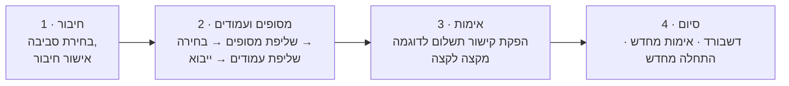

# מדריך פריסה וניהול

> English version: [../en/deployment-and-administration.md](../en/deployment-and-administration.md)

מדריך זה מכסה התקנת פתרון PayPlus בסביבת Power Platform, חיווט החיבורים הנדרשים, הרצת אשף ההתקנה, ומשימות הניהול השוטפות. להחלטת עם/בלי Sales ולמודל שני ה-Solutions, ראו [integration-guide.md](integration-guide.md#the-two-solutions-and-their-dependencies).

## דרישות מקדימות

- סביבת Power Platform עם **Dataverse** מופעל.
- הרשאה לייבא Solutions וליצור חיבורים (System Administrator או System Customizer בתוספת הרשאות מחבר).
- **פרטי חשבון PayPlus** — `api-key` ו-`secret-key` לכל סביבה שתשתמש בה (sandbox ו/או production). אלו מוזנים **פעם אחת** בדיאלוג יצירת החיבור, ולעולם לא נשמרים בטבלה או במסמך.
- אם תשתמש במיקום בצד Sales: **Dynamics 365 Sales** באותה סביבה.

## שלב 1 — ייבוא ה-Solutions (לפי הסדר)

המוצר נמסר כשני Solutions מנוהלים. **הסדר חשוב** כי ההרחבה תלויה בבסיס.

1. **בסיס — `alex_d365_payplus` ("PayPlus").** ייבא אותו ראשון. הוא מכיל את המחבר המותאם, טבלאות PayPlus, הזרימות, ה-plugin ופקדי ה-PCF. אין לו **תלות ב-Dynamics 365 Sales**.
2. **הרחבת Sales — `alex_d365_payplus_sales_extended_data_model` ("PayPlus extended data model").** ייבא אותו **רק אם** הסביבה מריצה Dynamics 365 Sales. הוא מוסיף עמודות, טפסים, views וזרימות תצוגת-מסמך/polling על הטבלאות הסטנדרטיות `quote`, `salesorder`, `invoice`, ותלוי גם בבסיס וגם ב-Sales.

> לקוח **ללא** Dynamics 365 Sales מייבא **רק את הבסיס** ועוצר כאן — המנוע שלם בפני עצמו.

## שלב 2 — יצירת החיבורים

הזרימות רצות על שלושה חיבורים. צרו כל אחד ב-**Power Apps ← Connections ← New connection**, ואז קשרו אליו את **מפנה החיבור (connection reference)** התואם ב-Solution.

| מפנה חיבור | שם תצוגה | מה זה | פרטי הזדהות |
| --- | --- | --- | --- |
| `alex_payplussandbox` | PayPlus – Sandbox Connection | מחבר PayPlus מול שרת ה-sandbox | `api-key` + `secret-key` של sandbox |
| `alex_payplusprod` | PayPlus – Prod Connection | מחבר PayPlus מול שרת ה-production | `api-key` + `secret-key` של production |
| `alex_payplus_dataverse` | PayPlus – Dataverse | חיבור ה-Dataverse שהזרימות משתמשות בו לקריאה/כתיבה של טבלאות PayPlus | חשבון שירות או מנהל |

הערות:

- צריך רק את החיבור(ים) לסביבה(ות) שתשתמש בהן. פיילוט sandbox בלבד צריך רק את חיבור ה-sandbox.
- מפתחות ה-API מוזנים בדיאלוג יצירת החיבור. האשף והטבלאות לעולם לא מחזיקים אותם.
- לאחר קשירת מפני החיבור, **הפעילו את הזרימות** (ייתכן שיותקנו במצב טיוטה/כבוי).

## שלב 3 — הרצת אשף ההתקנה

פתחו את עמוד **PayPlus setup** (ה-web resource `alex_payplus_setup`, מוצג מתוך האפליקציה). זהו אשף בן ארבעה שלבים שמשלים את ה-onboarding מקצה לקצה:

1. **חיבור.** בחרו סביבה (sandbox או production) וודאו שמפנה החיבור מקושר לחיבור PayPlus פעיל. אם לא, האשף מנחה ליצור תחילה את החיבור.
2. **מסופים ועמודים.** האשף קורא לזרימת *PayPlus – Fetch Options* לשליפת המסופים, אתם בוחרים מסוף ברירת מחדל, הוא שולף את עמודי התשלום של אותו מסוף, וב-**אשר וייבא** הוא מייבא את המסופים והעמודים (וברקע גם את ה**בנקים והסניפים** ו**סוגי המסמכים**) לטבלאות PayPlus. המסוף/עמוד הנבחר מסומן כברירת מחדל (`alex_isdefault`).
3. **אימות.** האשף מריץ את ה-custom API בשם `alex_ValidatePayPlusConnection`, שמניע את זרימת *PayPlus – Validate Credentials* להפקת קישור תשלום לדוגמה מקצה לקצה, ומבצע polling לתוצאה. הצלחה מגדירה את ההגדרה ל-**מאומת**.
4. **סיום.** דשבורד מציג את סטטוס האימות וזמן האימות האחרון, עם פעולות **אימות מחדש** ו**התחלה מחדש**.

### ייבואי הרקע שהאשף תלוי בהם

ודאו שהזרימות הבאות **מופעלות** לפני הייבוא, אחרת שלבי הרקע ייתקעו:

- *PayPlus – Fetch Options* (מסופים ועמודים)
- *PayPlus – Import Terminals & Pages*
- *PayPlus – Import Banks & Branches*
- *PayPlus – Import Document Types*
- *PayPlus – Validate Credentials*

## שלב 4 — הגדרת ברירות מחדל ומיקום

- **ברירות מחדל ברמת החשבון.** הגדרת PayPlus מחזיקה את מסוף ועמוד התשלום כברירת מחדל; ניתן לקבוע דריסה לכל חשבון.
- **פקדי PCF.** מקמו את הפקדים הנדרשים על הטפסים/עמודים הרלוונטיים — ראו [מדריך פקדי PCF](pcf-controls-guide.md). ללא Sales, מקמו את Payment Wizard ו-Document Ledger על הטבלאות שלכם או על עמודים מותאמים.
- **סנכרון (אופציונלי).** אם אתם משתמשים בסנכרון מידע-אב רציף, פתחו את פרופיל הסנכרון והגדירו אותו עם Mapping Studio.

## סביבות: Sandbox מול Production

הפתרון מודע-סביבה. טבלאות כמו ההגדרה, המסופים, העמודים והמסמכים נושאות Choice בשם `alex_environment` (Sandbox / Production), והזרימות מסתעפות לחיבור התואם על פיו. כך סביבה אחת יכולה להחזיק הגדרת sandbox ו-production זו לצד זו במהלך ה-onboarding, ואז לעבור ל-production ע"י אימות חיבור ה-production.

## מניעת אובדן מידע (DLP)

הזרימות משתמשות ב**מחבר PayPlus המותאם** וב**מחבר Dataverse**. ודאו שמדיניות ה-DLP ממקמת את שני המחברים ב**אותה קבוצת נתונים** (בדרך כלל Business) כדי שהזרימות יורשו לרוץ. אם המחבר המותאם חסום או מופרד מ-Dataverse, הזרימות ייכשלו בהפעלה. לתמונת הממשל וה-PCI המלאה, ראו [security-governance-and-compliance.md](security-governance-and-compliance.md).

## ניהול שוטף

- **אימות מחדש** לאחר החלפת מפתחות API (אשף ההתקנה ← אימות מחדש).
- **ייבוא מחדש** של מסופים, עמודים, בנקים או סוגי מסמכים כשהם משתנים ב-PayPlus (כל שלב ייבוא ניתן להרצה חוזרת).
- **ניטור זרימות** דרך היסטוריית ההרצות ב-Power Automate; טבלאות לוג הסנכרון ויומן פעולות המסמך מתעדות תוצאות ב-Dataverse.
- **שדרוג** ע"י ייבוא גרסאות Solution חדשות באותו סדר (בסיס, ואז הרחבה).

## מסמכים קשורים

- [integration-guide.md](integration-guide.md) — עם/בלי Sales ומודל שני ה-Solutions
- [pcf-controls-guide.md](pcf-controls-guide.md) — מיקום הפקדים
- [architecture.md](architecture.md) — רכיבים וזרימות
- [security-governance-and-compliance.md](security-governance-and-compliance.md) — DLP, ממשל, PCI
- [troubleshooting.md](troubleshooting.md) — אבחון בעיות התקנה וזרימות
