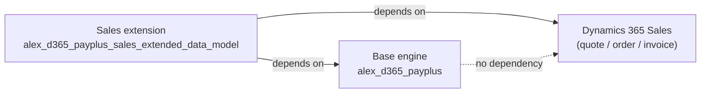
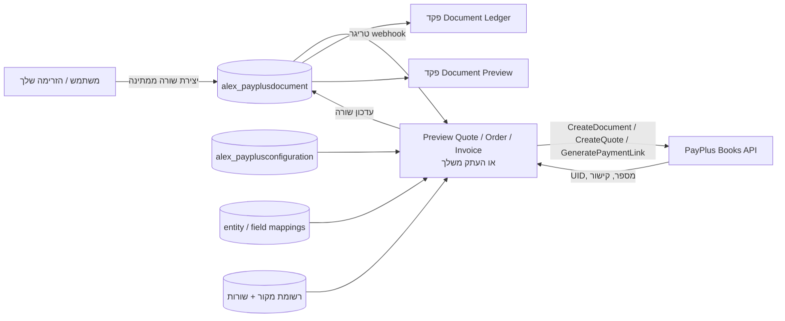
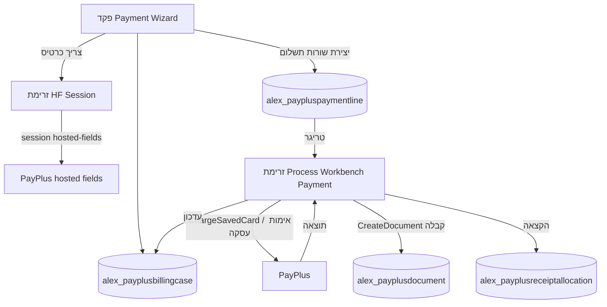
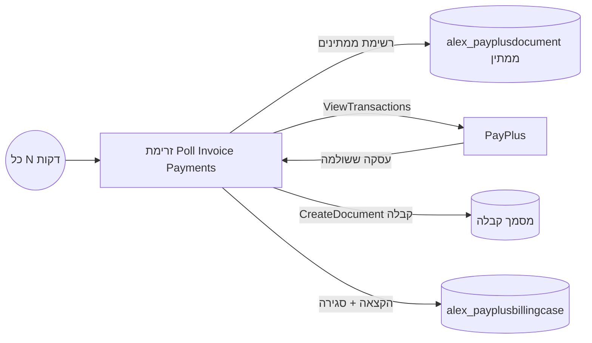
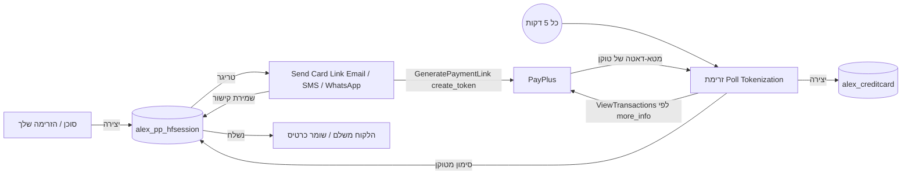
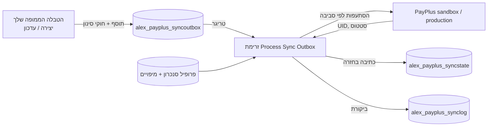

# מדריך אינטגרציה — עם או בלי Dynamics 365 Sales

## למי מיועד המדריך

מדריך זה מסביר כיצד ארגון יכול לאמץ את פתרון PayPlus **בשני מצבים שונים מאוד**:

1. **יש לך Dynamics 365 Sales.** אתה רוצה תשלומים, מסמכים וקליטת כרטיס ישירות על רשומות ההצעה, ההזמנה והחשבונית הסטנדרטיות — עם כמה שפחות הגדרה.
2. **אין לך Dynamics 365 Sales.** יש לך טבלאות Dataverse משלך (או שאתה בונה אותן), ואתה רוצה להריץ תהליכי חיוב וגבייה משלך על גבי מנוע התשלומים שהפתרון כבר מספק.

המסר המרכזי פשוט:

> מנוע התשלומים של PayPlus — המחבר המותאם, טבלאות ה-Dataverse של PayPlus, וזרימות ה-Power Automate הגנריות — **עצמאי מ-Dynamics 365 Sales**. Sales הוא רק "חזית" אפשרית אחת. כל מודל נתונים יכול להניע את אותו מנוע.

## הערך העסקי

| בלי הפתרון | עם הפתרון |
| --- | --- |
| כל ארגון מיישם מחדש ידנית קריאות REST ל-PayPlus, טוקניזציה, ניסיונות חוזרים ולוגיקת מסמכים | מנוע התשלומים נמסר פעם אחת ונעשה בו שימוש חוזר |
| סיכון נתוני כרטיס מתפזר על פני קוד מותאם | נתוני כרטיס לעולם לא נוגעים ב-Dynamics או ב-Power Automate; נעשה שימוש בעמודי PayPlus מתארחים ובטוקנים |
| ארגונים ללא Sales "נעולים" | כל אפליקציית Dataverse — מערכת גבייה, מערכת חברים, מערכת שכר לימוד — יכולה להפיק מסמכים ולגבות תשלומים |
| אינטגרציות הן פרויקטי קוד | אינטגרציות הן **הגדרה וחיווט זרימות** על משטח בדוק |

עבור לקוח **ללא** Dynamics 365 Sales, המשמעות היא שהוא לא מתחיל מאפס. הוא בונה **רק את האובייקטים והחוקים העסקיים שלו**, ועושה שימוש חוזר במנגנוני התשלום, המסמכים, הטוקניזציה והסנכרון כפי שהם.

## שני ה-Solutions והתלויות ביניהם

המוצר נמסר כ-**שני Solutions**, וההפרדה היא בדיוק על גבול "עם/בלי Sales". לדעת איזה מהם לייבא — ובאיזה סדר — היא החלטת האינטגרציה הראשונה.

| Solution | שם ייחודי | מה הוא מכיל | תלוי ב |
| --- | --- | --- | --- |
| **בסיס (מנוע התשלום)** | `alex_d365_payplus` | ~28 טבלאות PayPlus, ה-plugin וה-steps שלו, הזרימות הגנריות, כל פקדי ה-PCF, connection references ו-environment variables, web resources, ו-site map | **דבר שאינו קשור ל-Sales.** עצמאי לחלוטין. |
| **הרחבת Sales** | `alex_d365_payplus_sales_extended_data_model` | עמודות, טפסים ו-views מותאמים על הטבלאות הסטנדרטיות `quote`, `salesorder`, `invoice`, `invoicedetail`, בתוספת הזרימות *Preview Quote / Sales Order / Invoice Document* ו-*Poll Invoice Payments* | **ה-Solution הבסיס _וגם_ Dynamics 365 Sales.** |

### מה זה אומר בפועל

- **אין לך Dynamics 365 Sales.** ייבא **רק את ה-Solution הבסיס**. אתה מקבל את המנוע המלא — מחבר, טבלאות, זרימות, plugins ופקדי PCF — עם **אפס תלות ב-Sales**. לאחר מכן ממקמים פקדים כמו Payment Wizard ו-Document Ledger על הטבלאות שלך או על עמודים מותאמים, ומניעים את הזרימות מהרשומות שלך. **אל** תייבא את הרחבת ה-Sales; היא מפנה ל-`invoice`/`quote`/`salesorder`, שאין לך.
- **יש לך Dynamics 365 Sales.** ייבא תחילה את **ה-Solution הבסיס**, ואז את **הרחבת ה-Sales**. ההרחבה רק מוסיפה את המיקום בצד Sales (עמודות, טפסים, ribbons, ושלוש זרימות תצוגת-המסמך) על גבי המנוע. לא ניתן לייבא אותה לבדה, כי היא תלויה בבסיס.

### כיוון התלות (בכיוון אחד בלבד)

החץ לעולם לא מצביע לכיוון ההפוך: **הבסיס לעולם אינו תלוי בהרחבה או ב-Sales.** זה מה שהופך את הבסיס למוצר עצמאי תקף עבור לקוח ללא Sales, וזו הערובה שעליה אתה נשען כשאתה בונה חזית משלך.

## משטח האינטגרציה (לשימוש חוזר ללא תלות ב-Sales)

שלוש שכבות ניתנות לשימוש חוזר על ידי **כל** צרכן, עם או בלי Sales.

### 1. המחבר המותאם (Custom Connector)

מחבר Power Platform ללא אימות שעוטף את PayPlus REST API. כל זרימה — מונעת-Sales או לא — יכולה לקרוא לפעולות הללו. עיקרי הפעולות:

| תחום | פעולות |
| --- | --- |
| קישורי תשלום | `GeneratePaymentLink` |
| חיוב טוקנים | `ChargeSavedCard`, `ChargeByTransactionUid`, `RefundByTransaction`, `CancelTransaction` |
| הוראת קבע | `CreateRecurringPayment` |
| עסקאות | `ViewTransactions` |
| לקוחות | `CreateCustomer`, `UpdateCustomer`, `ViewCustomers`, `RemoveCustomer` |
| מוצרים וקטגוריות | `CreateProduct`, `UpdateProduct`, `ViewProducts`, `CreateProductCategory`, `UpdateProductCategory`, `ViewProductCategories` |
| מסמכים (Invoice+ / Books) | `CreateDocument` ווריאנטים ממוקדים (`CreateTaxInvoiceReceipt`, `CreateTaxInvoice`, `CreateReceipt`, `CreateQuote`, `CreateProformaInvoice`, `CreatePaymentRequest`, `CreateCreditDocument`, `CreateDeliveryCertificate`, `CreateReturnCertificate`, `CreateDonationReceipt`, `CreatePurchaseOrderCertificate`, `CreatePurchaseCertificate`) |
| קריאת מסמכים | `GetDocument`, `GetDocumentByUniqueIdentifier`, `GetDocumentByNumber`, `SearchDocuments`, `GetDocumentsByTransactionUid`, `GetDocumentTypes` |
| התקנה | `MyTerminals`, `ListPaymentPages`, `BranchesList` |

המחבר לעולם לא חושף את `api-key` / `secret-key` ליוצרי הזרימות — הם מוזנים פעם אחת על החיבור.

### 2. טבלאות ה-Dataverse של PayPlus

טבלאות אלו הן חלק מהפתרון ו**אינן** חלק מ-Dynamics 365 Sales. הן קיימות אפילו בסביבה ללא Sales כלל:

| טבלה | תפקיד בתהליך שלך |
| --- | --- |
| `alex_payplusconfiguration` | שורת הגדרה יחידה: חיבור, מסוף/עמוד ברירת מחדל, מדיניות לכל סוג מסמך |
| `alex_payplus_terminal` / `alex_payplus_paymentpage` | מסופים ועמודי תשלום מיובאים מ-PayPlus |
| `alex_payplusdocument` | מסמך PayPlus Invoice+ (ממתין, מופק או תצוגה מקדימה), בכל רמה שתבחר |
| `alex_payplusdocumentactionlog` | יומן ביקורת לפעולות שליחה / שליחה חוזרת / ביטול על מסמך |
| `alex_payplus_documenttype` | קטלוג סוגי מסמכים מיובא מ-PayPlus (חשבונית מס, קבלה וכו') |
| `alex_payplusbillingcase` | תיק גבייה: מה חייבים, מה שולם, והיתרה הפתוחה לרשומה |
| `alex_paypluspaymentline` | שורת חיוב יחידה בתוך תיק גבייה (סכום, אמצעי, כרטיס, תוצאה) |
| `alex_payplusreceiptallocation` | כיצד קבלה מוקצית בין הפריטים ששולמו |
| `alex_payplus_syncprofile` / `alex_payplus_entitymapping` / `alex_payplus_fieldmapping` / `alex_payplus_filterrule` | סנכרון מבוסס-הגדרה של **הטבלאות שלך** ל-PayPlus |
| `alex_payplus_syncoutbox` / `alex_payplus_syncstate` / `alex_payplus_synclog` | Outbox אמין, מצב וביקורת לסנכרון |
| `alex_pp_hfsession` | session של קליטת כרטיס / שירות עצמי |
| `alex_creditcard` | כרטיס מטוקן שמור (ללא PAN/CVV) |
| `alex_bank` / `alex_bankbranch` | נתוני ייחוס מיובאים של בנקים וסניפים |

ראה [data-model.md](data-model.md) לפרטים מלאים.

### 3. הזרימות (רשימה סמכותית מהסביבה המותקנת)

הפתרון המותקן מכיל את הזרימות שלהלן. הדפוס החשוב: זרימות המסמכים מופעלות על ידי **רשומות `alex_payplusdocument` ממתינות**, ולא ישירות על ידי טבלת Sales — טבלת Sales היא רק *נתוני המקור* שהן קוראות. לכן אותו מנוע מסמכים משרת כל מודל נתונים.

| זרימה | מופעלת על ידי | צמודה ל-Sales? | מה היא עושה |
| --- | --- | --- | --- |
| `PayPlus - Process Sync Outbox` | שורת `alex_payplus_syncoutbox` | **לא** | שולחת כל רשומת מקור בתור ל-PayPlus לפי מטען המיפוי; ניתוב sandbox/production; כותבת בחזרה UID וסטטוס |
| `PayPlus - Document Action Request` | שורת `alex_payplusdocument` | **לא** | פותרת את הקישור הנבחר ומרכיבה מטען שליחה / שליחה חוזרת / ביטול; רושמת ל-`alex_payplusdocumentactionlog` |
| `PayPlus - Process Workbench Payment` | אשף התשלום (`alex_paypluspaymentline`) | **לא** | מחייבת כרטיס שמור ומאמתת עסקאות hosted-fields, ואז יוצרת מסמכים וקבלות |
| `PayPlus - Poll Invoice Payments` | תזמון | **לא** | סורקת מסמכי חשבונית ממתינים, מיישבת עסקאות ששולמו, יוצרת קבלות וסוגרת תיקי גבייה |
| `PayPlus HF Session` | שורת `alex_pp_hfsession` | **לא** | יוצרת sessions של hosted-fields עבור אשף התשלום ושומרת קורלציית `more_info` |
| `PayPlus - Send Card Link (Email / SMS / WhatsApp)` | שורת `alex_pp_hfsession` | **לא** | מייצרת קישור לאיסוף כרטיס ושולחת אותו בערוץ הנבחר |
| `PayPlus - Poll Tokenization` | תזמון | **לא** | מזהה טוקניזציות שהושלמו ויוצרת `alex_creditcard` |
| `PayPlus - Expire Pending Sessions` | תזמון | **לא** | מסמנת sessions ישנים כפגי-תוקף |
| `PayPlus - Import Terminals & Pages` / `Import Banks & Branches` / `Import Document Types` | דגלים בשורת ההגדרה | **לא** | ממלאות טבלאות התקנה וייחוס |
| `PayPlus - Fetch Options` / `Validate Credentials` | עזר מחבר | **לא** | רשימות לאשף ההתקנה ובדיקת אישורים |
| `PayPlus - Preview Quote Document` | `alex_payplusdocument` ממתין (מקור `quote`) | **מקור בלבד** | בונה מסמך הצעה מ-PayPlus מההצעה + המיפויים ומעדכן את השורה עבור פקד התצוגה |
| `PayPlus - Preview Sales Order Document` | `alex_payplusdocument` ממתין (מקור `salesorder`) | **מקור בלבד** | בונה מסמך תצוגה / דרישת תשלום להזמנה מההזמנה + המיפויים |
| `PayPlus - Preview Invoice Document` | `alex_payplusdocument` ממתין (מקור `invoice`) | **מקור בלבד** | בונה מסמך חשבונית / פרופורמה / דרישת תשלום מהחשבונית + המיפויים; יכול גם לייצר קישור תשלום |

**מסקנה ללקוח ללא Sales:** כל זרימת "לא" נמצאת בשימוש חוזר ללא שינוי. שלוש זרימות המסמכים "מקור בלבד" הן פשוט העתקים שקוראים טבלת Sales מסוימת; כדי לתמוך ב**טבלה שלך** אתה מוסיף עוד העתק אחד שקורא את *הטבלה שלך* וכותב את אותה רשומת `alex_payplusdocument` — כל מה שאחרי זה (הפקה, תצוגה, ledger, יישוב) בשימוש חוזר.

## שתי דרכים שבהן לקוח ללא Sales מבצע אינטגרציה

### דפוס א' — הנעת המנוע דרך טבלאות PayPlus (Low-code, מומלץ)

אינך קורא למחבר בעצמך. במקום זאת, התהליך שלך **כותב שורה לטבלת PayPlus**, והזרימה הגנרית הקיימת עושה את העבודה. זהו הנתיב הבטוח והמהיר ביותר כי אתה עושה שימוש חוזר בלוגיקה בדוקה.

| מטרה עסקית | מה האפליקציה/הזרימה שלך יוצרת | הזרימה הקיימת שמופעלת | תוצאה |
| --- | --- | --- | --- |
| הפקת חשבונית מס / קבלה / דרישת תשלום לרשומה שלך | שורת `alex_payplusdocument` (+ בקשת פעולה) | `PayPlus - Document Action Request` | מסמך מופק ב-PayPlus, סטטוס נרשם בחזרה |
| קליטת כרטיס מלקוח | שורת `alex_pp_hfsession` (ערוץ + ייחוס) | `HF Session` + `Send *` + `Poll Tokenization` | קישור נשלח, טוקן נקלט אל `alex_creditcard` |
| שמירה על עקביות לקוחות/מוצרים ב-PayPlus | מיפוי הטבלה שלך ב-Mapping Studio → התוסף מציב שורת `alex_payplus_syncoutbox` | `PayPlus - Process Sync Outbox` | נתוני אב מסונכרנים ברציפות |

אתה אחראי רק על **הטריגר שלך** (מתי להפיק מסמך, מתי לקלוט כרטיס) ועל מילוי השורה. כל מה שבהמשך נמצא בשימוש חוזר.

### דפוס ב' — קריאה ישירה למחבר מהזרימה שלך (שליטה מלאה)

כשאתה זקוק להתנהגות שהזרימות הגנריות לא מכסות, בנה זרימה על טריגר של **הטבלה שלך** וקרא לפעולות המחבר בעצמך, בדיוק כפי שזרימות `Preview Quote / Sales Order / Invoice Document` עושות עבור טבלאות Sales. מבנה טיפוסי:

1. טריגר על הטבלה שלך (יצירה / עדכון / סטטוס נבחר).
2. קריאת שורת ההגדרה (`alex_payplusconfiguration`) למסוף/עמוד ברירת מחדל ולמדיניות.
3. קריאת הרשומה + השורות שלך ומיפוין למטען PayPlus (חוקי Mapping Studio או ביטויים משלך).
4. קריאה למחבר: `GeneratePaymentLink`, `CreateDocument`, `ChargeSavedCard`, `CreateRecurringPayment` וכו'.
5. אימות מעטפת העסק של PayPlus (`results.status == success`).
6. כתיבת ה-UID / הקישור / הסטטוס שהוחזרו בחזרה לרשומה שלך (ואם אתה רוצה שפקדי ה-ledger והתצוגה יידלקו, בצע upsert לשורת `alex_payplusdocument`).

זרימות `PayPlus - Preview Quote / Sales Order / Invoice Document` הן למעשה **מימושי ייחוס** של דפוס ב' לטבלאות Sales. לקוח ללא Sales מעתיק אחת מהן ומכוון אותה לטבלה שלו.

## בניית תהליכים עסקיים משלך על גבי הזרימות הקיימות

להלן התהליכים הנפוצים שלקוח ללא Sales בונה, וכיצד כל אחד ממופה על המנוע.

### 1. גביית תשלום

- **אתה בונה:** "דרישת תשלום" (או שימוש חוזר בטבלת הזמנה/תיק) והחוק למתי לגבות.
- **שימוש חוזר:** קריאה ל-`GeneratePaymentLink` (דפוס ב') או שמירת כרטיס דרך זרימות ה-session ואז `ChargeSavedCard`.
- **ערך:** אין עמוד מתארח, ניסיונות חוזרים או טיפול PCI לכתוב.

### 2. הפקת מסמכים (Invoice+)

- **אתה בונה:** הטריגר ונתוני הכותרת/השורות של המסמך שלך.
- **שימוש חוזר:** יצירת שורת `alex_payplusdocument` ותן ל-`Document Action Request` להפיק, לשלוח מחדש או לבטל; פקדי Document Ledger ו-Document Preview עובדים אז על הרשומה שלך ללא קוד נוסף.
- **ערך:** מסמכי מס ישראליים תקינים (חשבונית מס, קבלה, זיכוי, פרופורמה, דרישת תשלום ועוד) בלי לגעת ב-Books API ישירות.

### 3. חיובים חוזרים / הוראות קבע

- **אתה בונה:** ישות התזמון או המנוי.
- **שימוש חוזר:** `CreateRecurringPayment` עם טוקן שמור מ-`alex_creditcard`.

### 4. קליטת כרטיס וטוקניזציה

- **אתה בונה:** מהיכן יש לבקש כרטיס (כל איש קשר/חשבון/צד מותאם).
- **שימוש חוזר:** טבלת `alex_pp_hfsession` וזרימות `HF Session` / `Send *` / `Poll Tokenization` / `Expire`, בתוספת פקד Credit Card Wallet.

### 5. סנכרון רציף של נתוני האב שלך

- **אתה בונה:** כלום מלבד בחירת אילו מ**הטבלאות** ומהשדות שלך לסנכרן.
- **שימוש חוזר:** Mapping Studio + זרימת ה-outbox דוחפות את הלקוחות, המוצרים והקטגוריות שלך ל-PayPlus ברציפות.

## כיצד הזרימות העסקיות עובדות (דיאגרמות תהליך)

הדיאגרמות הבאות מציגות ברמת-על את החלקים הנעים של הזרימות העסקיות המרכזיות. הן מכוונות-מנוע במכוון: אותן זרימות רצות בין אם רשומת המקור היא הצעה/הזמנה/חשבונית של Sales או אחת מהטבלאות שלך.

### הפקת מסמך ותצוגה מקדימה

שורת `alex_payplusdocument` ממתינה היא הטריגר היחיד. זרימה ספציפית-למקור בונה את מסמך ה-PayPlus; פקדי ה-ledger והתצוגה קוראים את התוצאה.

### קליטת תשלום בהקשר (Payment Wizard)

אשף התשלום פותח תיק גבייה, קולט כרטיס דרך hosted fields או טוקן שמור, וזרימת השרת מבצעת כל שורת תשלום ומפיקה את התוצאה החשבונאית.

### יישוב תשלומים פתוחים

זרימה מתוזמנת סוגרת את הלולאה עבור קישורים ששולמו מחוץ לאשף (למשל קישור תשלום שנשלח באימייל).

### טוקניזציה של כרטיס (שירות עצמי)

אין צורך ב-webhook נכנס; שורת session מניעה את זרימות השליחה, ו-poll מזהה את הטוקן.

### סנכרון רציף של נתוני אב

תוסף מציב שורת outbox על כל שינוי במקור ממופה; זרימה גנרית אחת מרוקנת את ה-outbox.

## מדריך החלטה

| שאלה | לקוח Dynamics 365 Sales | לקוח עם מודל משלו |
| --- | --- | --- |
| מה אני בונה? | כמעט כלום — הפעלת הריבונים וההגדרה | הטבלאות, הטריגרים והטפסים שלי |
| כיצד אני מפיק מסמכים? | ריבוני הצעה/הזמנה/חשבונית + זרימות התצוגה/ההפקה | דפוס א' (כתיבת `alex_payplusdocument`) או דפוס ב' (זרימה משלי) |
| כיצד אני גובה תשלומים? | ריבונים בהקשר / Payment Wizard | `GeneratePaymentLink` או חיוב טוקן שמור מהזרימה שלי |
| כיצד אני מסנכרן נתוני אב? | מיפוי טבלאות Sales ב-Mapping Studio | מיפוי הטבלאות שלי ב-Mapping Studio |
| אילו זרימות אני משתמש בהן? | הכול | הכול חוץ משלוש זרימות המסמכים של Sales |
| מה אסור לי לשנות? | חוזה טבלאות ה-PayPlus וההגדרה | חוזה טבלאות ה-PayPlus וההגדרה |

## החוזה שאסור לשבור

מכיוון שהזרימות הגנריות קוראות וכותבות לטבלאות ספציפיות, אינטגרציה מותאמת חייבת לשמר:

- את **שורת ההגדרה** (`alex_payplusconfiguration`) עם חיבור תקין ומסוף/עמוד ברירת מחדל.
- את **הסכמה ורשימות הסטטוס** של טבלאות PayPlus שהזרימות תלויות בהן (`alex_payplusdocument`, `alex_payplus_syncoutbox`, `alex_pp_hfsession`, `alex_creditcard`).
- את **מבחין הסביבה** בפרופילי הסנכרון (Sandbox = `100000000`, Production = `100000001`) כך שזרימת ה-outbox מסתעפת למחבר הנכון.
- את **בדיקת מעטפת העסק של PayPlus** (`results.status == success`) בכל זרימה שתכתוב.

אתה חופשי להוסיף טבלאות, עמודות, טפסים, אפליקציות וזרימות משלך סביב החוזה הזה.

## דו-קיום והגירה

- המנוע יכול לרוץ **לצד** Sales או **בלעדיו** באותו tenant, בסביבות נפרדות.
- לקוח יכול להתחיל עם מודל משלו ומאוחר יותר לאמץ Sales; מנוע התשלומים לא משתנה, רק מתווספות זרימות חזית חדשות צמודות-Sales.
- מכיוון שנתוני אב מסונכרנים דרך הגדרה (לא קוד), הוספת טבלת מקור חדשה היא שינוי מיפוי, לא מחזור פיתוח.

## מסמכים קשורים

- [architecture.md](architecture.md) — ארכיטקטורת הפתרון והרכיבים
- [pcf-controls-guide.md](pcf-controls-guide.md) — חיבור פקדי ה-PCF, וקליטת תשלום עצמאית ללא Sales
- [deployment-and-administration.md](deployment-and-administration.md) — התקנת שני ה-Solutions, החיבורים ואשף ההתקנה
- [data-model.md](data-model.md) — טבלאות Dataverse
- [custom-connector-design.md](custom-connector-design.md) — פעולות המחבר וקלטים
- [security-governance-and-compliance.md](security-governance-and-compliance.md) — ממשל ותאימות PCI
