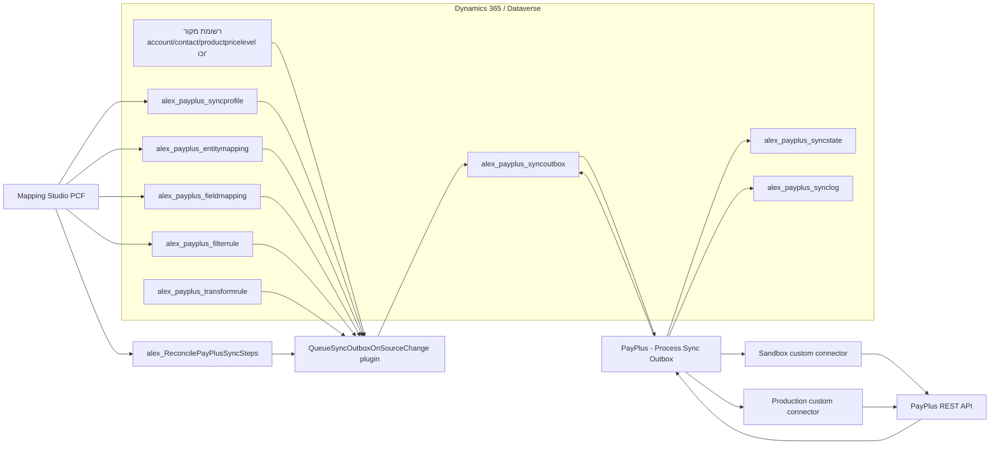
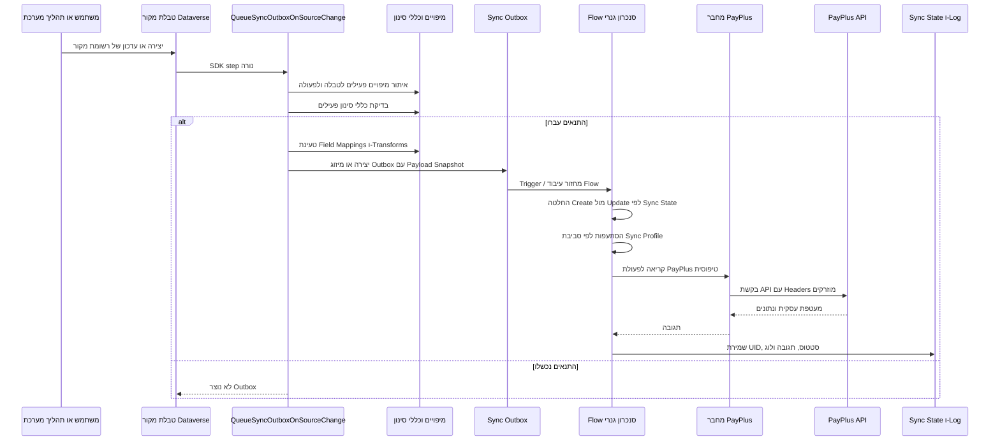
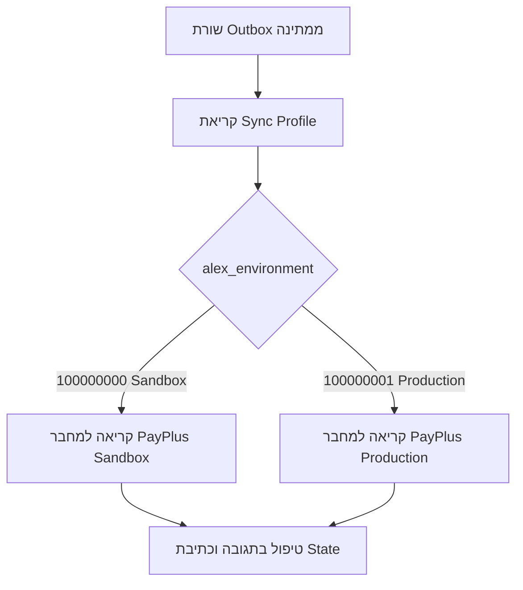

# סנכרון רציף PayPlus - ארכיטקטורה ורכיבים

## תקציר ארכיטקטורה

מנוע הסנכרון הרציף הוא אינטגרציה יוצאת מ-Dataverse אל PayPlus, מבוססת קונפיגורציה.

הוא בנוי מהשכבות הבאות:

| שכבה | רכיב | אחריות |
| --- | --- | --- |
| קונפיגורציה | Sync Profile, Entity Mapping, Field Mapping, Filter Rules, Transform Rules | מגדיר מה יכול להסתנכרן, מאיפה, לאיזה יעד PayPlus, ובאילו תנאים. |
| חוויית משתמש | Mapping Studio PCF | מאפשר למנהלים להגדיר מיפויים, ערכי שדות, טרנספורמציות, מסננים והפעלה מתוך טופס Model-driven. |
| זמן ריצה Dataverse | Queue Sync Outbox plugin | רץ על Create/Update של טבלת מקור, בודק מיפויים וכללי סינון, בונה payload וכותב Outbox. |
| ניהול Steps | Reconcile Sync Steps custom API | רושם או מעדכן SDK plugin steps עבור טבלאות מקור שהוגדרו בזמן ריצה. |
| תזמור | Flow גנרי לעיבוד Outbox | מעבד Outbox, מנתב ל-Sandbox או Production, קורא לפעולת מחבר, בודק תגובה ומעדכן State/Logs. |
| מחבר | מחברי PayPlus Sandbox ו-Production | עטיפה טיפוסית ל-PayPlus API עם פרמטרי חיבור מאובטחים ו-policies ל-`api-key` ו-`secret-key`. |
| PayPlus | PayPlus REST API | מחזיק UID של PayPlus, לקוחות, מוצרים, קטגוריות, תשלומים, טוקנים ומסמכים. |

## תרשים רכיבים

## Sequence בזמן ריצה

## טבלאות Dataverse

| טבלה | תפקיד |
| --- | --- |
| `alex_payplus_syncprofile` | חבילת סנכרון עליונה. הפרופיל הפעיל קובע סביבת יעד וברירות מחדל. |
| `alex_payplus_entitymapping` | מיפוי טבלת מקור אחת ליעד PayPlus אחד. כולל טבלת מקור, יעד, דגלי Create/Update, מיזוג ועדכון סטטוס Plugin Step. |
| `alex_payplus_fieldmapping` | מיפוי ברמת שדה. תומך בשדה ישיר, קבוע, נוסחה/Transform, Lookup, שדה קשור ו-Value Map. |
| `alex_payplus_filterrule` | כללי זכאות לכל מיפוי. כל הכללים הפעילים חייבים לעבור לפני כניסה ל-Outbox. |
| `alex_payplus_transformrule` | כללי המרה לשימוש חוזר, נזרעים לפי Rule Code יציב. לדוגמה `statecode` של Dataverse ל-`valid` של PayPlus. |
| `alex_payplus_valuemapping` | תרגומי ערכים מפורשים כאשר ערכי מקור ויעד לא זהים. |
| `alex_payplus_syncoutbox` | עבודה יוצאת במצב Pending, Failed, Retry או Completed. מכיל מזהה מקור, פעולה, יעד, Snapshot ושגיאה. |
| `alex_payplus_syncstate` | קורלציה בין רשומת מקור ב-Dataverse לבין UID של PayPlus שהוחזר מ-Create. |
| `alex_payplus_synclog` | היסטוריית ניסיונות ותוצאות לצורך ביקורת ופתרון תקלות. |

## אחריות הפלאגין

הפלאגין אחראי להחליט האם שינוי Dataverse צריך להיכנס לצינור הסנכרון.

הוא כן עושה:

- מטפל ב-Create ו-Update בלבד.
- קורא מיפויים פעילים עבור טבלת המקור והפעולה.
- מאמת שפרופיל הסנכרון האב פעיל.
- בודק כללי סינון פעילים בלוגיקת AND.
- בונה Payload Snapshot לפי מיפוי שדות.
- מפעיל Transform Rules וכללי Null Handling.
- פותר נתיבי שדה קשור פשוטים כגון `product.name` או `transactioncurrencyid.isocurrencycode`.
- יוצר או ממזג פריט Sync Outbox.

הוא לא עושה:

- לא קורא ישירות ל-PayPlus.
- לא מחליט על פרטי חיבור Sandbox מול Production.
- לא מבצע Retry מול PayPlus.
- לא מחליף אישור עסקי.
- לא מפיק מסמך משפטי או פיננסי.

## אחריות Power Automate

ה-Flow הגנרי אחראי לביצוע האינטגרציה בפועל.

הוא כן עושה:

- מעבד שורות Outbox.
- מחליט Create או Update לפי Sync State קיים.
- מסתעף לפי סביבת Sync Profile:
  - Sandbox = מחבר Sandbox.
  - Production = מחבר Production.
- קורא לפעולות PayPlus טיפוסיות.
- בודק הצלחה עסקית של PayPlus לפי `results.status == success`, ולא רק HTTP 200.
- שומר UID שחזר מ-PayPlus ב-Sync State.
- מסמן Outbox כהצליח, נכשל או מתוזמן לניסיון חוזר.

הוא לא בודק מחדש כללי סינון עסקיים. רשומות שנכשלו בסינון לא מגיעות ל-Flow.

## הסתעפות סביבה

הסתעפות סביבה מתבצעת במקום שבו קוראים למחבר PayPlus.

בחירת הסביבה בפרופיל הסנכרון משתמשת בערכים:

| ערך | משמעות |
| --- | --- |
| `100000000` | Sandbox |
| `100000001` | Production |

## מודל רישום Plugin Steps

הפתרון לא אורז Plugin Steps עבור טבלאות לקוח לא ידועות.

במקום זאת:

1. מנהל מגדיר מיפוי ב-Mapping Studio.
2. הפעלה קוראת ל-`alex_ReconcilePayPlusSyncSteps`.
3. ה-Custom API יוצר או מעדכן SDK Plugin Steps עבור טבלת המקור והודעות מורשות.
4. רק לאחר רישום מוצלח המיפוי אמור להפוך לפעיל.

כך הפתרון נשאר גנרי ובטוח לפריסה כ-Managed Solution.

## כללי Payload

Payload נבנה ממיפוי שדות.

דפוסי מקור נתמכים:

- שדה ישיר מהרשומה הנוכחית.
- ערך קבוע.
- נוסחה/Transform המבוססים על שדה מקור.
- Lookup Reference.
- נתיב שדה קשור עבור Lookups נפוצים.
- Value Mapping כאשר נדרש תרגום ערכים מפורש.

בסנכרון מוצרים, טבלת המקור המומלצת היא `productpricelevel`, לא `product`, משום ש-PayPlus צריך מחיר מכירה ומטבע. שדות מוצר נקראים דרך נתיבים קשורים כגון `product.name` ו-`product.productnumber`.

## תפעול ונראות

צוותים תפעוליים צריכים לבדוק:

- האם המיפוי פעיל ומה סטטוס Plugin Step.
- כללי סינון פעילים.
- Outbox במצב Pending או Failed.
- Sync State וערכי PayPlus UID.
- Sync Logs ותגובת PayPlus אחרונה.
- היסטוריית ריצות Flow עבור שגיאות מחבר או סכמת תגובה.

פירוש תקלות נפוצות:

- אין Outbox: מיפוי כבוי, פרופיל כבוי, כללי סינון נכשלו או Step לא נרשם.
- Outbox קיים עודכן אבל אין רשומה חדשה: Coalescing פעיל וכבר יש פריט פתוח.
- Flow רץ אבל PayPlus לא נוצר: לבדוק מעטפת עסקית של PayPlus, לא רק HTTP Status.
- Update נכשל כי UID חסר: Sync State עדיין לא מכיל UID של PayPlus; צריך Create או Lookup Recovery.
