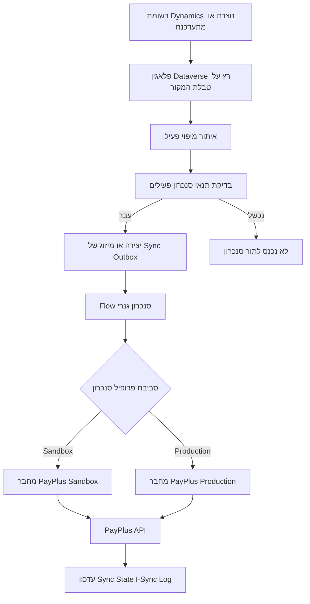

# סנכרון רציף PayPlus - תפיסת פתרון

## מטרת הפתרון

פתרון הסנכרון הרציף שומר רשומות נבחרות מ-Dynamics 365 / Dataverse מסונכרנות מול PayPlus, בלי לייצר פרויקט אינטגרציה ייעודי לכל טבלת לקוח.

המטרה אינה לשכפל את כל בסיס הנתונים של Dataverse אל PayPlus. המטרה היא להפוך נתוני לקוחות, קטלוג מוצרים וקטגוריות לזמינים ב-PayPlus לצורך תהליכים כגון קישורי תשלום, חיוב כרטיס שמור, איתור לקוח, בחירת פריטים והפקת מסמכים או עסקאות.

## עמדה עסקית

Dynamics 365 הוא מערכת המקור העסקית. PayPlus הוא מערכת ביצוע לתשלומים, מסמכים ותהליכי מסחר.

לכן הסנכרון פועל לפי העקרונות הבאים:

- Dynamics 365 מחזיק את נתוני הלקוח והמוצר כמקור אמת.
- PayPlus מחזיק עיבוד תשלומים, מזהי PayPlus, דפי תשלום מתארחים, טוקניזציה, עסקאות והפקת מסמכים.
- האינטגרציה שולחת רק את המידע ש-PayPlus צריך כדי לבצע פעולות PayPlus.
- מזהי PayPlus שמוחזרים מה-API נשמרים חזרה ב-Dataverse לצורך עדכונים עתידיים והפניות שורה.
- רשומות לא מסתנכרנות רק כי הן קיימות ב-Dataverse; הן מסתנכרנות רק כאשר יש יעד עסקי ברור ב-PayPlus ותהליך המשך ברור.

## מה המשמעות של סנכרון רציף

סנכרון רציף אומר שכאשר רשומת מקור זכאית משתנה ב-Dynamics 365, הפתרון יוצר או מעדכן אוטומטית את הרשומה המקבילה ב-PayPlus.

הסנכרון הוא יוצא מ-Dynamics 365 אל PayPlus:

```text
Dynamics 365 / Dataverse -> PayPlus
```

זה אינו מנוע רפליקציה דו-כיווני של Master Data. מזהי PayPlus וסטטוסי ביצוע נכתבים חזרה ל-Dataverse, אבל PayPlus לא אמור להפוך למקור האמת לשדות לקוח או מוצר ב-Dynamics.

## אובייקטים עסקיים נתמכים

גבול הסנכרון הרציף המומלץ הוא:

| תחום | מקור Dynamics | יעד PayPlus | למה מתאים לסנכרון רציף |
| --- | --- | --- | --- |
| לקוחות | `account` או `contact` | Customer | PayPlus צריך זהות לקוח עבור קישורי תשלום, כרטיסים שמורים, תשלומים חוזרים ומסמכים. |
| מוצרים | `productpricelevel` עם `product` קשור | Product | קטלוג PayPlus צריך שם, מחיר, מטבע, מע"מ, ברקוד/SKU וסטטוס פעילות. |
| קטגוריות מוצרים | טבלת מקור ייעודית או קונפיגורציה מבוקרת | Product Category | מוצרים צריכים מזהי קטגוריות PayPlus; קטגוריות הן Reference Data יציב. |

פעולות PayPlus אחרות, כגון חשבוניות, הצעות מחיר, הזמנות, דרישות תשלום, תשלומים חוזרים וחיובי כרטיס שמור, צריכות בדרך כלל להתממש כתהליכים עסקיים מבוקרים ב-Flow ולא כסנכרון טבלאות רציף וגנרי. הן יוצרות תוצר משפטי, פיננסי או תפעולי ודורשות Trigger עסקי מפורש.

## סקירת תהליך



## איפה רצים כללי הסינון

כללי הסינון רצים בפלאגין Dataverse לפני שהרשומה נכנסת ל-Outbox.

זו החלטת תכנון מכוונת. Power Automate מקבל רק פריטי עבודה שכבר עברו בדיקת זכאות. ה-Flow אחראי לתזמור טכני: בחירת סביבה, בחירת Create/Update, קריאה למחבר, בדיקת תגובת PayPlus, ניהול סטטוס ניסיון חוזר וכתיבה חזרה.

דוגמה:

```text
עדכון איש קשר
-> הפלאגין רץ
-> נמצא מיפוי פעיל
-> כלל: emailaddress1 אינו ריק
-> אם נכון: נוצר או מתמזג פריט Outbox
-> אם לא נכון: אין Outbox ואין ריצת Flow
```

## התנהגות Create ו-Update

הסנכרון משתמש במודל Outbox ו-Sync State:

- אם לא קיים UID של PayPlus עבור רשומת המקור, ה-Flow קורא לפעולת Create.
- אם קיים UID של PayPlus, ה-Flow קורא לפעולת Update.
- ה-UID שמוחזר מ-PayPlus נשמר ב-Sync State.
- עדכונים עתידיים משתמשים ב-UID של PayPlus, לא ב-GUID של Dataverse.
- עבור מוצרים, המזהה העסקי שנשלח ל-PayPlus הוא בדרך כלל `barcode`, שממופה מ-`product.productnumber` / SKU ב-Dynamics.

בסנכרון מוצר Master, ה-GUID של מוצר Dynamics לא נשלח כשדה מוצר ל-PayPlus. ל-PayPlus יש `uid` / `product_uid` משלו; הוא נוצר על ידי PayPlus ונשמר חזרה ב-Dataverse.

## למה להשתמש ב-Outbox

Outbox מפריד בין שינוי רשומה לבין ביצוע קריאת API חיצונית.

יתרונות:

- שמירת Dataverse לא ממתינה לקריאת רשת ל-PayPlus.
- קריאות PayPlus שנכשלו ניתנות לניסיון חוזר או בדיקה.
- ניתן למזג כמה עדכונים ממתינים של אותה רשומה.
- הפעולות ניתנות לביקורת.
- זמן הריצה יכול להסתעף בבטחה בין Sandbox ו-Production.
- האינטגרציה מתאימה לפריסה כ-Managed Solution כי צעדי הפלאגין נרשמים בזמן ריצה לפי טבלאות מקור שהוגדרו.

## אחריות עסקית

לפני הפעלת סנכרון לכל טבלה, צוות היישום חייב לענות:

- מה יעד PayPlus?
- למה PayPlus צריך את המידע הזה?
- איזו טבלת Dynamics היא מקור האמת?
- מה המזהה העסקי?
- אילו רשומות זכאיות לסנכרון?
- מה קורה אם רשומה שכבר סונכרנה מפסיקה לעמוד בתנאים?
- האם בטוח להריץ את פעולת היעד אוטומטית על כל Create או Update זכאי?

אם אי אפשר להסביר את הערך העסקי בצורה ברורה, לא מפעילים סנכרון רציף לטבלה.
