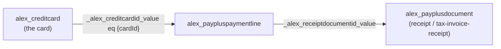

# PayPlus Credit Card Wallet — PCF Control

> ארנק כרטיסי אשראי בסגנון Apple ל-Dynamics 365, כולל חלונית צד (side pane) להצגת הקבלות ששולמו בכל כרטיס.
> An Apple-style credit-card wallet for Dynamics 365, with an in-control side pane that shows every receipt settled with a given card.

---

## 1. סקירה / Overview

`CreditCardWallet` הוא **פקד PCF מקצועי** (לא web resource) שמתארח על תת-רשת (subgrid) של כרטיסי אשראי בטופס **איש קשר / חשבון**. הוא קורא את רשומת ההורה מתוך הקשר הדף (page context) ומציג את כרטיסי ה-PayPlus השמורים של הלקוח כארנק אינטראקטיבי — עם היפוך כרטיס, הפעלה/השבתה, איסוף כרטיס חדש (ידני / שירות עצמי), וחלונית צד להצגת הקבלות.

`CreditCardWallet` is a **first-class PCF control** (no web resource involved) bound to a credit-card subgrid on the **Contact / Account** form. It reads the parent record from the page context and renders the customer's saved PayPlus cards as an interactive wallet — flip, activate/deactivate, collect a new card (manual / self-service), and an in-control receipts side pane.

---

## 2. סטאק טכנולוגי / Technology stack

| Layer | Technology |
| --- | --- |
| Framework | **Power Apps Component Framework (PCF)** — `StandardControl`, dataset-bound |
| Language | **TypeScript** (strict), compiled & bundled by `pcf-scripts` (webpack) |
| Rendering | **Vanilla DOM** — no React/virtual-DOM; hand-built `HTMLElement` trees + inline SVG icons |
| Styling | Self-contained **CSS** (`css/CreditCardWallet.css`), CSS variables, light/dark via `prefers-color-scheme`, full **RTL/LTR** |
| Data | PCF **`context.webAPI`** (OData v9.x) + PCF **`context.navigation`** |
| Localization | **RESX** — `1033` (English) + `1037` (Hebrew), resolved via `context.resources.getString` |
| Packaging | `dotnet build` of `pcf_wallet_solution` → **managed** solution zip → `pac solution import` |

The control uses **no third-party runtime dependencies** and declares `external-service-usage enabled="false"` (not premium).

---

## 3. ארכיטקטורת נתונים / Data model & the credit-card ↔ receipt path

The wallet reads three Dataverse tables:

- **`alex_creditcard`** — the saved cards (filtered by `_alex_contact_value` / `_alex_account_value`, `alex_isactive`, token present).
- **`alex_paypluspaymentline`** — payment lines; a token/saved-card charge links back to its card via **`alex_creditcardid`** and to its issued document via **`alex_receiptdocumentid`**.
- **`alex_payplusdocument`** — the fiscal documents (receipt / tax-invoice-receipt / …).

There is **no direct card field on the document**, so "which receipts were paid with this card" is resolved in two hops:



**Two-step query** (avoids depending on an uncertain `$expand` navigation-property name):

1. `alex_paypluspaymentline?$select=_alex_receiptdocumentid_value&$filter=_alex_creditcardid_value eq {cardId} and _alex_receiptdocumentid_value ne null`
2. `alex_payplusdocument?$select=…&$filter=(alex_payplusdocumentid eq {id1}) or (…)`

> **Coverage note.** Only **saved-card / token** charges link the payment line to the card (`createTokenPaymentLine` sets `alex_creditcardid@odata.bind`). A one-time **new-card (Hosted Fields)** charge does *not* link, and the very first charge that *created* a saved card (hosted + "save card") predates the card record, so its receipt will not appear. Since the wallet only lists saved cards, every subsequent token charge is fully covered.

---

## 4. חוויית משתמש / UX

### 4.1 Wallet cards
- Apple-style flippable cards (ISO ID-1 ratio), deterministic gradient per card, EMV chip, masked number + last-4.
- Status badge doubles as an **activate / deactivate** button (with confirm dialog).
- Header actions: **Manual update** and a **Self-service** menu (Email / SMS / WhatsApp) that reuse the shared PayPlus ribbon globals (`alex_payplus_opencardpane.js`).

### 4.2 "פרטים / Details" → receipts side pane
- A **Details** badge sits next to the active/inactive badge on each card.
- Clicking it opens an **Apple-style drawer** that slides in from the inline-end edge (right in LTR, left in RTL) over a dimmed backdrop.
- The drawer shows a **summary strip** (document count + total settled) and a tappable list of receipts (type · number, date · status, amount).

### 4.3 Master → detail (expand-to-preview)
- Tapping a receipt row **expands the drawer** (`440px → min(1120px, 96vw)`, animated `width` transition) and renders the document **inline** in an `<iframe>` (the PDF), instead of opening a competing Dynamics dialog behind the pane.
- Detail toolbar: **Back** (collapses to the list), **Open in a new tab**, and **Full preview** (opens the existing `alex_payplusdocumentpreview_b4f29` custom page with quick actions).
- `Esc` steps back (detail → list → close). Only `http(s)` URLs are embedded (guards against `javascript:` / `data:` URLs).

---

## 5. מחזור חיים ושחרור משאבים / Lifecycle & cleanup

- The drawer DOM is appended to **`document.body`** so its `position: fixed` overlay is never clipped by the subgrid container, but it is created, updated and destroyed entirely within the control's lifecycle.
- `destroy()` removes the outside-click and `keydown` listeners, clears reload timers, and removes the pane root — no leaks.

---

## 6. לוקליזציה / Localization

All user-facing text is in RESX and resolved with `context.resources.getString`:
- `strings/CreditCardWallet.1033.resx` (English)
- `strings/CreditCardWallet.1037.resx` (Hebrew)

Direction is derived from `context.userSettings.languageId === 1037`. Document-type labels use an inline `he/en` map (`inv_receipt`, `inv_tax_receipt`, `inv_tax`, `inv_refund`, `inv_proforma`). Money uses `Intl.NumberFormat`; dates use `toLocaleDateString`.

---

## 7. בנייה ופריסה / Build & deploy

```powershell
# 1) build the control (always clean out/ first, bump ControlManifest version)
cd pcf_wallet
Remove-Item -Recurse -Force out -ErrorAction SilentlyContinue
npm run build

# 2) package the managed solution
cd ..\pcf_wallet_solution
dotnet build -c Release

# 3) import & publish
pac solution import --path .\bin\Release\pcf_wallet_solution.zip --publish-changes --force-overwrite
```

> Bump `version` in `CreditCardWallet/ControlManifest.Input.xml` on every deploy so the app reloads the new bundle/CSS. Current: **1.0.5**.

---

## 8. מבנה קבצים / File layout

```
pcf_wallet/CreditCardWallet/
├── ControlManifest.Input.xml     # control + dataset "wallet" + resources
├── index.ts                      # all logic (wallet + receipts side pane)
├── css/CreditCardWallet.css      # Apple-style theme (.pp-* wallet, .ppw-* drawer)
└── strings/
    ├── CreditCardWallet.1033.resx  # English
    └── CreditCardWallet.1037.resx  # Hebrew
```

Key methods in `index.ts`:

| Method | Responsibility |
| --- | --- |
| `load` / `parseCard` | Load & shape the customer's saved cards |
| `buildCard` / `buildBack` | Render the flippable wallet card + badges (incl. **Details**) |
| `openPane` → `buildPaneShell` | Open the drawer shell (backdrop, header, card chip) |
| `loadReceipts` → `parseDoc` | Two-step card → payment-line → document query |
| `renderPaneBody` / `buildReceiptRow` | Summary strip + tappable receipt list |
| `showReceiptDetail` / `renderPaneDetail` / `showReceiptList` | Expand-to-preview master↔detail with inline PDF iframe |
| `openReceipt` | "Full preview" via the DocumentPreview custom page |
| `closePane` / `destroy` | Teardown & listener cleanup |
